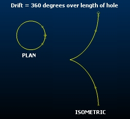
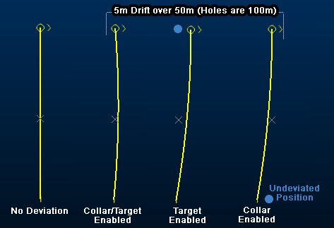
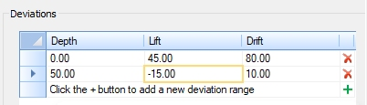
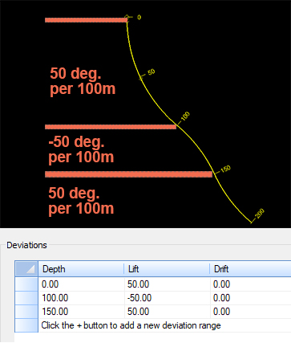
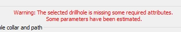

# Drillhole Deviation Planning

[Drillhole Planner](<DrillholePlannerDialog.md>) lets you plan drillhole deviations down the hole.

Depending on the type of drilling, the drill rig operator and the physical nature of the rocks that are being drilled through, you can potentially end up with the final drillhole segments being off the planned target. 

The controls in this section allow you to plan these deviations into your project. Deviations can be applied at any depth down the hole and multiple deviations down the hole are permitted.   
  
Lift and Drift deviations are defined in degrees. You can choose the amount of deviation, and the distance over which the deviation will be applied (for example, a lift deviation of 1m over each 100m of the hole). You can use a combination of **Lift** and **Drift** deviations in the same hole and both can be positive or negative values.  
  
Lift is the change in the dip of the hole, and drift is the change in the azimuth. From the collar to the Start depth down the hole, the segments will have an azimuth and dip matching that defined previously. 

For any distance past the start depth, the azimuth and dip have the drift and lift added respectively. The direction of Lift matches that of the dip, and is controlled by the Positive downwards setting.  
  
Although it's a nonsensical outcome, one way to visualize Lift and Drift is to imagine a vertical hole viewed from in an East-West orientation. 

Applying a 360 degree Lift over the exact length of the hole will result in the hole forming a circle, with coincident collar and target positions - this is an extreme representation of Lift. Starting with the same vertical hole and applying a Drift over the full length of the hole makes the hole appear as a circular outline in plan view but a corkscrew shape in an isometric view:

The resultant trajectories for different combinations of starting azimuth and dip may be very different, even with the same drift and lift combinations. For example, vertical holes would not be affected by changes in azimuth resulting from drift, but horizontal holes would be impacted quite significantly.  
  
Where deviations are applied, Drillhole Planner will attempt to maintain the Collar coordinate if that check box is enabled, or the Target coordinate if that check box is enabled. If both of these check boxes are enabled, deviations will be applied whilst attempting to maintain the position of both target and collar (within the set tolerance - see below). If neither check box are enabled, drift and lift cannot be applied to the selected hole.

;>)

Multiple lifts and drifts can be set down a hole, using the supplied Deviations table, all deviations are defined using the supplied table, and to the selected hole. A hole ID must appear in the Hole name field before deviations can be defined.

;>)

You add a new deviation to the currently selected hole by clicking +. The first deviation record will be placed at the collar position (**Depth** , **Lift** and **Drift** will be zero). You can edit any of the specification fields and add as many deviations as you need down the hole. Deviations will be applied at the set depth and either until the end of the hole or the next deviation in a downhole direction.

Note: Remove any deviation from the table using X.

For example, in the image below, 3 deviations are applied. The first extends from 0 to 100m, with a lift of 50 degrees every 100m. The next deviation is applied from 100 to 150m with -100 degrees per 100m and finally, from 150 to 200m, the original deviation 50 degrees per 100m is set:

;>)

##  Lift and Drift Scope

By default, lift and drift settings (degrees) will be set per 100 measurement units. You can change this independently for Lift and Drift using the Show lift per and Show drift per settings. 

When you are specifying Lift or Drift degrees values in the Deviations table, the deviation will be applied based on the current Show lift per and Show drift per settings.

Subsequently adjusting the Show lift per and Show drift per values will automatically update the table values (not the drillhole data) to show the new Lift and Drift values with the altered distance(s). All Drift and Lift values in the table are shown based on the currently set distance values (for example, double the Show lift per value will also double all Lift values shown in the table).

## How Deviation Data is Stored

Holes that have been created by Drillhole Planner will include information about Drift, Lift and Start depth settings, if any were previously specified.

Where holes have been loaded from other sources, Drillhole Planner will estimate the deviation values of each hole based on their relative orientation. These estimated values are purely for guidance and don't necessarily represent a definitive 'truth', but can be considered a 'best guess' from which to apply further deviations if required. Where deviation values have been estimated, you will see the following message:

Any Drillhole Table created or modified in Drillhole Planner will automatically be extended to include these additional deviation attributes.  
  
You can add more than one equally-spaced deviation record to the table by selecting **Add Rows**. This will display the **[Add Multiple Deviations](<DrillholePlannerAddRowsDialog.md>)** screen.

Tip: Copy and paste deviation values from Excel into the **Deviations** table. 

Related topics and activities

  * [Add Multiple Deviations](<DrillholePlannerAddRowsDialog.md>)

  * [Drillhole Planner](<DrillholePlannerDialog.md>)

  * [Drillhole Planner: Create Holes](<DrillholePlanner-Create-New.md>)

  * [Edit Planned Drillholes](<DrillholePlanner-Edit.md>)

  * [Save Drillhole Tables](<DrillholePlannerSaveDialog.md>)

  * [Advanced Drillhole Planner Settings](<DrillholePlannerAdvancedDialog.md>)