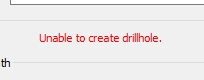

# Advanced Drillhole Planner Settings

[Drillhole Planner](<DrillholePlannerDialog.md>) is an excellent tool for designing drill plans. The following settings relate to advanced use:

Fitting tolerance |  How accurately target and collar positions of new or modified holes must match coordinate values that are locked. The default is 1, meaning that your hole target and/or collar must be within 1 measurement unit of locked values.  For example, considering the X coordinate of a collar alone, and a Lift deviation is applied to an existing hole. If Target coordinate is checked, an attempt is made to match the current target position within 1 measurement unit. Reduce this tolerance to ensure a more accurate fit, but an increasing tendency for a failure to create a hole in particularly complex data sets.  
---|---  
Maximum number of passes |  Drillhole Planner makes multiple attempts to find and refine the optimum fit for your drillhole settings.  By default, 10 attempts are made to design a hole that falls within the given **Fitting Tolerance** (see above) for both target and collar positions (whilst maintaining all other settings).  Increase this value if a hole solution cannot be found for your settings, but be aware that doing so can increase the time taken to provide a result.  
Maximum hole length allowed |  In extreme cases where a sensible solution cannot be found, a hole may be created of an arbitrarily long type, for example, if lift and drift settings make it impossible to return a practical result for a new hole. You can limit the maximum hole length permitted using this value. If a hole cannot be created below the specified length, an error message displays:   
  
Related topics and activities

  * [Drillhole Planner](<DrillholePlannerDialog.md>)

  * [Drillhole Planner: Create Holes](<DrillholePlanner-Create-New.md>)

  * [Edit Planned Drillholes](<DrillholePlanner-Edit.md>)

  * [Drillhole Deviation Planning](<DrillholePlanner-Lift-Drift.md>)

  * [Add Multiple Deviations](<DrillholePlannerAddRowsDialog.md>)

  * [Drillhole Planning](<Drillhole_Planning_Concept.md>)