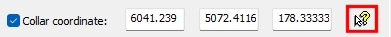
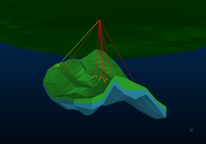
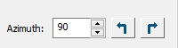
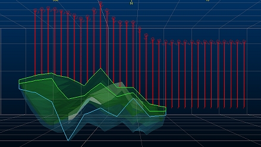
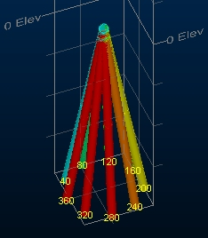

# Drillhole Planner

To access this screen: 

  * **Sample Analysis** ribbon **> > Plan >> Drillhole Planning**.
  * Using the **[command line](<Command_Toolbar.md>)** , enter "plan-drillholes"

  * Use the quick key combination "pdh".

  * Display the **[Find Command](<findcommand.md>)** screen, locate **plan-drillholes** and click **Run**.

The Drillhole Planner is used to interactively plan exploration, infill and production drilling patterns. It can be used to create new plans or can modify existing plans, using a combination of interactive tools and fine-tuning controls. Drillhole Planner requires at least one [static drillhole](<Drillhole%20Representation%20in%20Studio.md>) file to be loaded.

There's some background information about drillhole planning [here](<Drillhole_Planning_Concept.md>).

Drillhole Planner provides a collection of tools for you to position, orient and modify holes. You can either create a new hole using interactive position (either onto the current 3D section or by snapping to any existing data. You can create hole data that starts or stops at a given surface or volume, or you can use two bounding wireframes to determine the collar and end-of-hole positions. You can also create a fan drilling design using a single collar and specifying multiple targets.

If hole data exists, you can offset any selected hole (using either the collar or target position, or both, as reference) to create a new hole. In this way, it's simple to build up a grid plan, say, for an initial exploration project on a greenfield site. Infilling for higher resolution data and getting your data over the inferred-indicated barrier, is just as easy.

If you know the dip, azimuth, sample/hole length and/or lift/drift deviation of your holes in advance, you can specify them and let Studio construct the hole for you. Otherwise, you can set the deviation (or deviations), target and/or collar positions and let Studio work out the starting dip/azimuth and path. 

Existing holes are analyzed to determine their average lift/drift values, or if holes designed with Drillhole Planner are loaded, previously-specified values are retrieved and reported.

Any or all holes can be selected independently and modified (or removed), including setting an Overdrill distance. There is even a facility to record hole-specific comments.

## Interactive Hole Design

One approach is to pick the location of a key part of the hole, and it is added, honouring other parameters.

The general workflow for this method is

  1. In the **Add New Hole** section, **select the Interactively pick location**. 

  2. In this mode, Add new hole(s) acts as a toggle to start or stop the digitizing session (click to start, digitize as many holes as you need, click to stop). This mode honours [snapping settings](<Ribbon_Home.md>).

     * To digitize the **collar** position of the new hole, ensure Collar coordinate is checked in the Hole collar and path group below. 

     * Alternatively, you can digitize the target (**end of hole**) position by selecting the Target coordinate instead. Add new hole(s) will then allow you to digitize a new hole or hole collar or target position.   

In the above scenarios, the Hole length determines the length of the new hole (either down from the collar or up from the target).

     * If both Collar coordinate AND Target coordinate are checked, you will digitize the collar position of the new hole.

Using left-clicking to digitize will add the collar or target position to align with the currently active section. Right-clicking can also be used to snap the new collar or target position to existing data, depending on your snapping settings. The [snap-to-wireframe-data-on](<../command_help/snap-to-wireframe-data-on.md>) option can be particularly useful for snapping onto a wireframe surface. If both Collar coordinate and Target Coordinate are selected, clicking will define the collar position.

If Snap elevation to surface displays a loaded wireframe file (either a surface or a solid volume), new collar or target digitized points have their elevations vertically projected onto the wireframe surface.

To define one or more target or collar positions simultaneously using loaded points, select From selected points option and ensure at least one point is selected and highlighted in any 3D window.

## Fan Patterns

To create a fan of holes from a single collar position, you would typically digitize or load the points representing the EOH positions and a single collar position would be selected in the 3D window using the pick button of the Collar coordinate control group, for example:  
  

Select Use target and Collar coordinate .  
  
Making sure the EOH positions are selected, click Add new hole(s) to generate a drillhole trace between the single collar position and all Target points, generating a unique BHID for each automatically.  
  
The converse (setting multiple collars from a single Target), whilst unlikely, is also possible by selecting a Target position, then enabling **Collar coordinate** , selecting collar points and using Add new hole(s).  
  

## Offset Holes

To define a hole at an offset position from another hole, check Offset from current collar/target. This lets you create a new hole at a given distance from the collar and/or target position currently shown . This will usually be the currently selected hole, but can also be from a previous session, if restored using the Restore button. This can be useful when planning a grid or fence of holes.  
  
Select the Azimuth and distance (Offset spacing). Clicking Add new hole(s) adds a clone of the current hole at the predefined distance and direction from the current hole. At this point, the new hole becomes the current hole, allowing you to set up a row/grid of holes really easily.

  * You can offset the current collar position of a hole, or the target position by selecting either the Collar coordinate or Target coordinate. If both are checked, the specified offset applies to both target and collar.

Note: No digitizing is needed here. Add new hole(s) automatically positions the next hole based on your current Offset spacing and Azimuth settings. As such, there is no opportunity to snap to loaded data, other than a loaded wireframe surface, if one is already specified in Snap elevation to surface.

  * Rotate the Azimuth by 90 degrees clockwise or anticlockwise using the left and right arrow icons next to the Azimuth field. This can be useful when reaching the end of a row and offsetting to the next row.

You can also use Azimuth spin buttons to incrementally adjust the angle.

  * If the Snap elevation to surface drop-down list contains _< none>_, new collar or target positions are aligned with the currently active 3D section (depending on whether Collar coordinate or Target coordinate is checked - if both are selected, the collar is positioned).

  * If Snap elevation to surface contains a loaded wireframe surface, new holes are projected vertically onto it. Where this means the hole would move outside the boundary of the selected wireframe, the elevation of the previous hole are used instead. 

In the example, below, a series of holes at 100m spacing have been added from East-West, snapping the target to the volume's upper surface. The final holes are position at the same elevation. The wireframe is shown with front clipping and an overlaid intersection line:

The Offset from current collar option is particularly useful for producing holes with shared collar positions (say, as part of an underground fan drilling program). By setting the Offset spacing at 0 (zero), you can add a new hole then select (only) Collar coordinate, then change the dip or azimuth of the new hole. The resulting hole shares the collar coordinates of the original.

For example, in the image below, a collar position is shared by 12 holes of equal length, varying by 40 degrees in Azimuth between successive holes (and a dip of 80 degrees for all):

## Adding Hole Data

Warning: Modifying the orientation, deviation settings, length or position of a hole will remove other attributes such as grade from the selected hole (as the position of the hole has changed, those values are no longer valid). That said, if you have access to current model data, you can load that model and quickly re-apply the estimated values to the loaded holes.