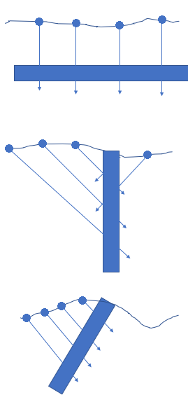
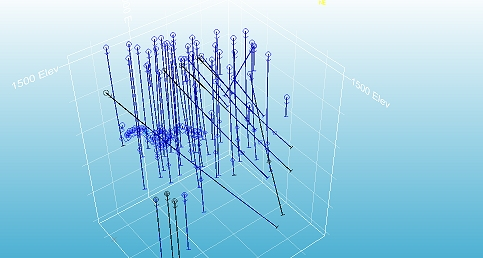

# Drillhole Planning

  
The **Drillhole Planner** is an interactive tool for planning exploration, infill, and production drilling patterns. It can create new plans or modify existing ones using interactive tools and fine-tuning controls. To use the Drillhole Planner, at least one static drillhole file must be loaded.

Geological drilling programs aim to confirm anomalies in geological data and enhance knowledge of a deposit. This is crucial for discovering new deposits or delineating existing mineral resources. Anomalies can arise from geochemical, geophysical, geological mapping data, or wider-spaced drilling data. By adding new data points between existing ones, drilling helps fill gaps in the model, providing a better understanding of anomalies. 

Geological drilling involves extracting core or chips from the drilling path, allowing physical identification and sampling of rocks containing anomalies. Without this "ground truth," investing in an expensive drilling program becomes uncertain, as accuracy in determining what lies beneath the ground is crucial.  

## The Challenge of Drillhole Planning

There are numerous strategies for how to plan drillholes, some of which are dependent on the type of drilling that is being carried out. 

The amount of drilling you can do is usually constrained by a budget. If there were no limits on spending and time, you could gain near-perfect knowledge of an orebody. Because of cost or time constraints, you need to make an informed decision about each drillhole you place and make sure you are getting the most extensive and detailed information for the money that is being invested.  

## Exploration Drilling

In the case of investigating a new anomaly you would typically try to target the drilling perpendicular to the strike of the orebody, to gain the maximum exposure of the ore body and ensure that data contributes towards constructing an accurate structural and grade model. Depending on the orientation of the ore body, you might angle the drilling. If an orebody is vertical (or near-vertical), angled holes would give maximum exposure. For a flat ore body, vertical holes would provide the best intercepts. Interim alignments may be best served by drilling angles biased from horizontal or vertical, for example:  
  

Areas that contain insufficient geological information are a good place to target drilling, particularly if other sources indicate there might be continuity of the geological anomaly into that area. Having more drilling in that area would update your geological knowledge and provide certainty where there was previously a lack of knowledge. Extending your existing plan, say as part of an infilling operation, can be achieved quickly and easily in [Drillhole Planner](<DrillholePlanner-Create-New.md>).

## Resource Delineation Drilling

For each phase of Resource Definition (from an Inferred Resource, to Indicated Resource, to Measured Resource), the amount of drilling data that you have needs to be increased so you have a higher level of certainty and confidence in the prediction of the resource. For deposits with consistent grade and clear geological continuity, less drilling is required. For deposits with high grade variability over a short distance, closer spaced drilling is required. 

The exact spacing and amount of drilling required is dependent on the geological characterization of the ore body, and the Mineral Resource Codes (JORC, Samrec, Perc, N143101) should also be considered. Targeting areas where there is insufficient geological information improves the confidence in the geology and de-risks future mining operations. 

Resource definition holes should often be aligned to fit a current drilling program, designed for maximum exposure to the ore body. This might mean laying out holes on same burden, spacing and orientation as the current drilling or filling a grid with a tighter spaced grid, for example:

   

#### Hints for successful drill planning: 

A geologist typically lays out drill holes on a grid or along lines of drilling. For geostatistical reasons, the grilling grid should be regular to provide equal support to each drillhole. 

  * Each drillhole should fully pass through the orebody (drilled as far as to fully pass through the ore body and to expose waste rock on the other side of the orebody). 
  * Every second rock of the grid could be offset, but this is not required and the choice would come down to the specific geology. 
  * Holes that do not have good interceptions of ore are also very useful and this information should always be kept and included in your geological model! 

## Drilling methods

There are numerous types of drilling. This will often depend on the available budget and types of rocks that need to be drilled. 

The size of the hole will also depend on the type of rock that is being drilled, how large the samples should be (generally, the bigger the sample the better) and how much budget is available for your operation, whether it be diamond holes, reverse circulation, percussion rotary airblast or other method.  

## Surveying Drillholes

The deeper the drillhole, the greater the need for downhole surveys. Drilling can veer off course with even a small drift or lift. 

Depending on the type of drilling, the drill rig operator and the physical nature of the rocks that are being drilled through, you can potentially end up with the final/actual target being tens of meters to hundreds of meters (for very long holes) from the planned target. [Drillhole Planner](<DrillholePlanner-Create-New.md>) makes it simple to plan these lift and drift deviations into your design dynamically.

For this reason, it important to include information about the planned deviations when designing a drilling program; and to measure the actual drill hole path (usually recorded by a surveyor) after drilling.

Related topics and activities

  * [Drillhole Planner](<DrillholePlanner-Create-New.md>)

  * [Desurvey Methods Introduction](<Drillhole%20Representation%20in%20Studio.md>)

  * [Drillhole Importer](<DrillholeImporter-screen.md>)