# Dynamic Evaluation Reports

Evaluation is the process whereby block models or drillholes are evaluated to determine summary volumes, tonnes and grades (any numeric field) within a defined volume or area. This evaluation is typically done for specific grade ranges, ore categories or within mineral resource or mine planning limits. 

Evaluations are always carried out according to instructions 'issued' by a particular type of legend, known as an 'evaluation legend'.

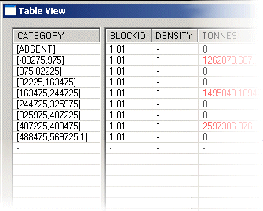

An evaluation report showing tonnes and grades by reserves category

Your application supports a dynamic evaluation option, where a block model can be evaluated according to a string projected in the Z direction or orthogonal to the current section to define a volume to be evaluated. Using this function, you can update the size/shape of the evaluation zone, recording the results instantly in a dynamic table. You access the dynamic string evaluation by:

  * running the command dynamic-evaluation-report from the command line

  * activating the Report ribbon and selecting Evaluate Dynamic | Strings

Instead of projecting a string to form an evaluation volume, you can specify a preformed wireframe volume instead, using these menu entries:

  * running the command wireframe-dynamic-evaluation from the command line

  * activating the Report ribbon and selecting Evaluate Dynamic | Wireframes

The important aspect of these commands is that they are dynamic. This allows the implications of changes to be instantly seen, and thereby increases the speed and efficiency with which designs can be made and evaluated. As strings or wireframes are modified, or selected and de-selected the evaluation report is updated. This means that during pit design for example, when a contour is created (and made the only selected string), the tonnes and grade contained within it can be instantly seen. This function allows for very rapid evaluation without the need of calculating intermediate wireframes.  

## Static Evaluation Commands

Your product hosts a range of other commands, known as 'static' evaluation commands. These are useful where there is no requirement to interactively edit the bounding string or wireframe data containing the model data to be evaluated. As before, both string and wireframe data can be used to determine the evaluation zone.

Static evaluation commands can be accessed using the command line:

  * [evaluate-1-string](<../command_help/evaluate-1-string.md>)
  * [evaluate-2-strings](<../command_help/evaluate-2-strings.md>)
  * [evaluate-all-strings-plane](<../command_help/evaluate-all-strings-plane.md>)
  * [evaluate-all-strings](<../command_help/evaluate-all-strings.md>)
  * [evaluate-current-wireframe](<../command_help/evaluate-current-wireframe.md>)
  * [evaluate-set-of-wireframes](<../command_help/evaluate-set-of-wireframes.md>)
  * [evaluate-wireframe](<../command_help/evaluate-wireframe.md>)

## Evaluation Zone Design

Note that you can perform this operation regardless of the orientation of the view plane, but the evaluation 'zone' will only ever be created according to a projected string limit in the Z direction (for non-rotated models - if the model is rotated, the projection will honour the block model's K direction, which may deviate from the world Z axis), hence, the first stage of creating a dynamic evaluation report is to define a set of strings representing the required evaluation zone limits. The evaluation string must be closed and the string points should not extend outside the terminal boundaries of the outermost model cells.

It is possible to design more than one evaluation boundary, in fact, there is no limit to the number of distinct block areas that can be made the subject of an evaluation report. For multiple-block reports, you can choose whether to combine the results of the selected string zones or show each area as a separate group of records (see Viewing the Dynamic Results \- below).

String creation and editing can take place before or during the display of a Dynamic Evaluation Report - full access to string creation and editing commands is sustained throughout the process.

 |  Evaluation strings can be created and edited without having to close either theEvaluation SettingsorTable Viewdialogs.  
---|---  
  
#### Considerations when defining an evaluation boundary:

  * All evaluation string boundaries should be closed strings. If an open string is selected, your system will attempt to 'close the gap' between the first and last string points (although this will happen in memory, and for evaluation purposes only - no adjustment will be made to the underlying string object).

  * If multiple strings are selected, they should not overlap at any point - this is to ensure that the same evaluation is not performed on the same zone twice, corrupting the evaluation results.

  * Single strings should not cross over themselves \- as this may also result in including the same model volumes more than once in the same evaluation process.

  * If using Absolute elevation settings for string projection, and both Minimum and Maximum values are identical, no evaluation will be performed.

## Evaluation Settings

The second stage in dynamic evaluation report creation is to define how the control string is to be projected, which model to evaluate, the evaluation legend and so on. These settings can have a significant impact on the evaluation results, so facilities have been incorporated to control precisely how an evaluation volume is created, and support for multiple strings is included, even to the extent that each block of evaluated results can be identified in a saved results file, if required. For more information on these settings, please refer to the Help for the [Dynamic Evaluation Settings](<Evaluation2DStringsPropertiesDialog.md>) screen.

## Dynamic Results

The read-only Table View dialog quickly analyses all currently selected string data, and makes the necessary projection(s) to define the relevant evaluation volume(s). Once this has been calculated, the cells falling within the evaluation zone are analysed in relation to all of the important fields selected in the Dynamic Evaluation Settings screen. Results for **TONNES** and **VOLUME** will always be displayed alongside the relevant BLOCKID. If additional fields were selected for evaluation, such as **PHASE** , **SEQUENCE** , **VALUE** , average **AU** grade and so on, these are also shown for each table record:

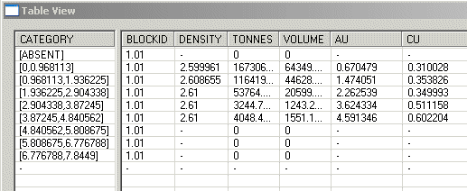

The [Table View](<Evaluation2DStringsTableViewDialog.md>) screen consists of a series of three data windows showing the various categories (a category relates to an interval in an evaluation legend, as selected on the settings screen - more information about evaluation legends can be found in your Legends Help File). For each evaluation category a table record row is displayed showing the results of the standard and additional model fields. This data relates to all selected string data in the data window, regardless of whether the individual strings belong to a single object, or multiple objects (see Studio Concepts for more information on data objects).

Tip: Reorder the columns shown in the table view by dragging and dropping the grey title cells.

The data shown in the table is dynamic by default; edits to the selected evaluation boundary strings (projected upwards/downwards to create the evaluated volume) are displayed each time a point, segment or string is edited. This is controlled by the Dynamic Evaluation toggle. If checked, evaluation occurs each time the geometry of the selected evaluation string(s) is changed.

If the Dynamic Evaluation option is not selected, the table will only be updated when the Recalculate Now button is clicked.

The summary totals for each of the reported rows will always be displayed in the Totals window at the bottom of the table:

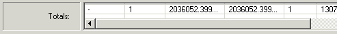

## Combining Block Results

If more than one string is selected, you have a choice as to how your results are displayed; either as a list of values for each zone, or as combined values for all zones:

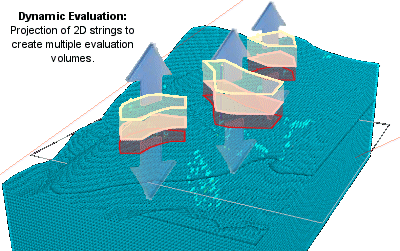

Note: String projection can be applied in a vertical direction or orthogonal to the currently active section.

With multiple evaluation zones defined and selected, the Table View window can be viewed in either of these states, controlled by the Combine Block Results toggle button. If this button is selected (pressed) results will be shown as an average of all fields in all zones, and no BLOCKID will be assigned to the results (only one set of results can ever be generated with this option selected):

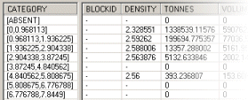

However, if the Combine Block Results option is not selected (raised), individual result 'sets' will be shown for each selected string, for example:

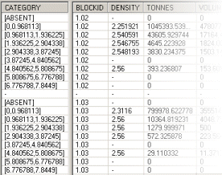

## Dilution Volumes

If you wish, if your evaluation zone (either a projected string or wireframe volume) extends outside the loaded model, you can include the volume in the void in the output report. You can activate dilution reporting by selecting the Include volume outside model in report check box.

Dilution volume will be included as a category within the results and you can define the category name as part of the evaluation process.

## Updating Evaluation Data with Results

Both string and wireframe dynamic evaluation functions provide an option to update your input string or wireframe data with per-block evaluation results. This writeback functionality could be useful, for example, if you need to share mine planning solids with other teams (such as the operational team) or as a guide for design reviews.

To enable this behaviour, select the **Write results back to** option in the evaluation settings screen, such as on the Evaluation 2D Strings Properties screen:

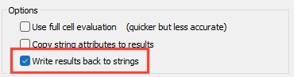

Following dynamic evaluation processing, the input string or wireframe data is appended with additional attributes, depending on which Grade Columns were selected above, for example:

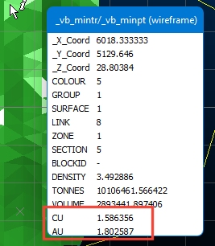

## Color-Coded Reports

By default, table text is rendered in black only. However, to assist in the interpretation of the data within the Table view and quickly determine whether results are within the required range, it is possible to use a color table to automatically colour the results shown.

Each row present in a color table will color an entry in the table view which corresponds to the **CATEGORY** and **FIELD** specified.

  * any data values falling below the stated MIN value will be colored blue,

  * any values above the MAX value will be red,

  * all "safe" values between the two ranges will be green. 

  * any table view entries which are not controlled by the color table will remain the default text color.

For example, the table below shows the fields required for a Color table: CATEGORY, FIELD, MIN and MAX:

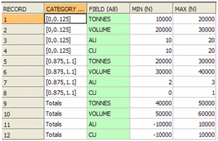

The CATEGORY field lists the evaluation interval (commensurate with the loaded evaluation legend) to which the particular color 'rule' applies. In the first record of the table above, the ore grade category representing all ore grades between zero and 0.125 g/t is made subject to a color rule; for the selected category, if the reported tonnage (combined or otherwise) exceeds 20000 tonnes, the result is to be displayed in red, and if it falls below 10000 tonnes, it is to be displayed in blue. For the same category, other rules are dictated for the VOLUME, AU and CU fields.

The remainder of the table represents colour rules for the remaining categories and for the same four fields in each.

To color-code your totals, you will need to use the description 'Totals' in the CATEGORY column of your table - this will automatically apply itself to the Totals fields on the Table View.

Color tables are simple to create using the Table Editor; you can create a table by:

  1. Select the Add New File to Project icon on the Project Files control bar

  2. Select the Table option

  3. Enter a table name and select a folder (the current project folder is displayed by default).

  4. The Table Editor is then displayed automatically, allowing you to add the four columns (CATEGORY, FIELD, MIN and MAX).

  5. Save your table and load it into memory.

You do not have to close any Dynamic Evaluation screens to access this functionality. For more information on using the Table Editor, please refer to your Table Editor help file.

When a table has been created, you can apply it to the current report by clicking the Color Results button in the Table View screen. Doing so reveals the Choose a Color Table screen. This will show all colour lookup tables currently in memory (can't see one? check the Project Files control bar - if your table is not listed, it has not been added to the project. If it is listed, but not viewable in the chosen screen, you will need to drag the colour table from the Project Files control bar into the 3D window to load it into memory - then, reopen the Choose a Color Table screen).

For more information on the Choose a Color Table screen, see [Choose a Color Table](<ChooseColorTableDialog.md>).

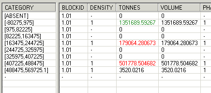

## Report Summary

The Table View screen reports on the estimated vs. calculated volumes of the selected evaluation volume(s).

Providing the difference is less than 2%, the results are regarded as within acceptable limits, however, if the difference exceeds 2% a warning is given:

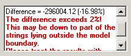

A common cause of this error is that one or more points lie outside the boundary of the geological modelling, when viewed in the Z direction (or K direction for rotated models). Another common reason for seeing this message is that (one of) the evaluation string(s) is not closed \- this is essential for a successful evaluation.

Related topics and activities

  * [Dynamic Evaluation Settings](<Evaluation2DStringsPropertiesDialog.md>)

  * [Dynamic Evaluation Table View](<Evaluation2DStringsTableViewDialog.md>)

  * [Dynamic Evaluation: Choose a Color Table](<ChooseColorTableDialog.md>)

  * [Wireframe Dynamic Evaluation](<EvaluationWireframePropertiesDialog.md>)