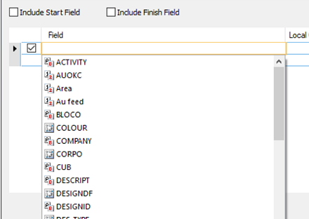

# DTS Synchronization Options

To access this screen:

  * DTS ribbon >> Synchronize >> Options

Control, on a per-object basis, which parameters within the selected data object are synchronized with DTS when 'linked to DTS" using the right-click context menu in the Sheets control bar. 

Map any Datamine column name in a data object to a custom field as defined in the Crosstab control bar of the DTS system.

You can add a new data 'map' using the "+" symbol at the bottom of the table, or delete existing entries using the corresponding X.

The main part of the screen is a table detailing the local name(s) of data attributes as held within the data object, and the custom field to which it is attributed in the connected/linked DTS system. As each DTS field can potentially contain both a start and an end date (to define the duration of the date range over which the corresponding tonnages/grades are relevant), you can optionally select to include one or both of these attributes in the loaded data object, and visualize this information in both a static and animated format.

To define DTS synchronization options:

  1. Launch **Datamine Task Scheduler** with an appropriate project loaded.

  2. Display the **DTS Synchronization Options** screen.

  3. Check Include Start Field to include the start datetime in the synchronization of data between your product and DTS.

  4. Similarly, check or uncheck the Include Finish Field.

  5. for the linked data object, select the custom DTS Field (must exist within the connected project) that you wish to synchronize with a local Datamine data attribute. fields are listed (including production, core and text fields) in alphabetical order. The icons alongside each item represent the same icons found in the **DTS Fields** list (as defined in the DTS **Project Settings**), for example:

  6. Select the **Local Column** to 'map' to the DTS custom field.

Related topics and activities

  * [Datamine Task Scheduler (DTS)](<V14_CONCEPT_EPS_Overview.md>)

  * [Animate a DTS Schedule](<V14%20InTouchEPS%20-%20Animation.md>)

  * [The Crosstab Control bar](<V14%20InTouchEPS%20-%20Crosstab.md>)

  * [Filtering DTS Schedule Data](<v14%20intoucheps%20-%20filtering%20schedule%20data.md>)

  *