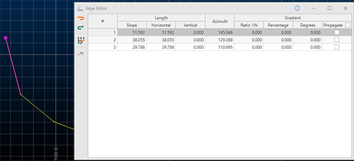
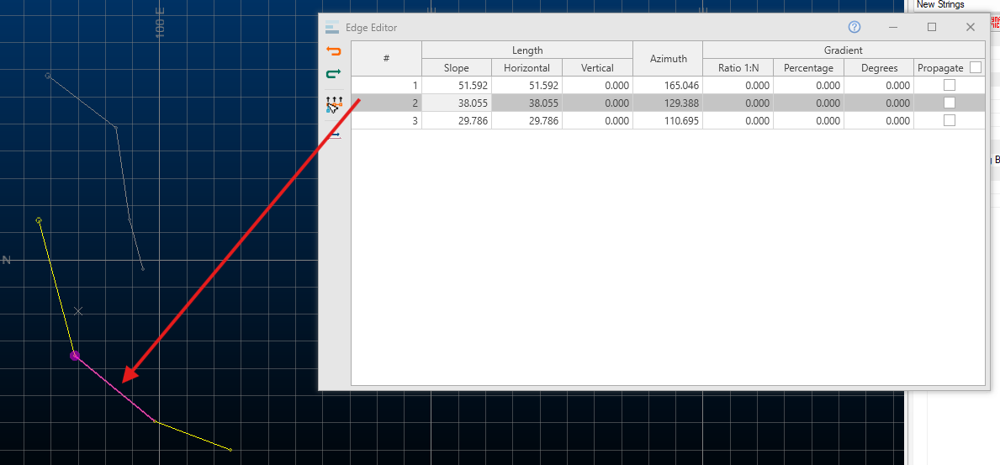

# Edge Editor

To access this screen: 

  * Using the **[command line](<Command_Toolbar.md>)** , enter "edge-editor"

  * Display the **[Find Command](<findcommand.md>)** screen, locate **edge-editor** and click **Run**.

The Edge Editor lets you modify string design data in a **3D** window. Specially, this tool lets you adjust the properties of the straight line segment (the "edge") between string points (vertices).

Pick a string, then review its edge coordinate and orientation data, then edit accordingly and precisely. Data can be selected before or after the screen is opened. If string selection changes whilst the screen is displayed, its contents update automatically.

Strings can be edited on an edge-by-edge basis, or you can choose the point at which a transformation should start and then adjust all subsequent edges along the design string in the same way. 

The currently selected string is represented in the main table with one table row representing one edge (an edge is the straight line between two string points).

Each string edge is defined in terms of its **Length** (**Slope** , _Horizontal_ , _Vertical_), its **Azimuth** and its **Gradient** (_Ratio_ , _Percentage_ and _Degrees_).

Selecting a row in the table will highlight the corresponding string edge in the 3D window. Each edge of the target string is represented as a table row. Moving the cursor or stylus over the table rows automatically highlights the associated string segment, for example (click image to expand):

;>)

Once an edge is selected, you can change any or all of its edge definitions. Depending on which data is changed, this may affect neighbouring edge information.

To make an edit to any edge property, position the mouse over a row in the table, then edit a field, remembering to press <ENTER> after each change. String data will update automatically in the 3D window as changes are made.

By default, edge properties are calculated from the start to the end of the edge. You can change this using the **Reverse Active String** toggle. This automatically updates the values in the table to reflect the new direction of measurement.

Note: **Edge Editor** displays the edge properties of the _first_ selected string. If you have selected multiple string traces (in the same or different objects), only one trace table displays. If you have used box or swipe selection, the string nearest the original cursor position displays.

### Edge Editor Toolbar

The Edge Editor toolbar contains the following commands:

 | Undo the most recent string edit.  
---|---  
 | Redo the most recently undone string edit.  
 | Toggle whether to shift the remainder of the string relative to the edge being adjusted.  
 | Reverse the direction of the target string, updating the table values.  
  
### Shifting Leading Edges

When adjust string edges, you can either adjust only the target edge, or you can shift all 'following' edges (according to the direction of the string) to preserve their comparative shape. This is useful, say, when adjusting one aspect of a ramp string whilst maintaining the same relative gradient of edges that come after it.

**Shift Leading Edges** can be toggled on or off at any time. If active, all string edges after the adjusted edge will be modified accordingly providing their **Propagate** status is checked. If inactive, (or if a particular edge's **Propagate** status is unchecked) no subsequent edge changes are performed. 

### Edit a String with Edge Editor

To edit the edge(s) of loaded string data:

  1. Create or load string data. Be sure you can see it in a 3D window.

  2. Display the **Edge Editor**.

  3. Select (only) one string trace (a trace is an independent set of connected vertices).

The **Edge Editor** table displays a row for each edge of the target string.

  4. Hover over the table. The highlighted table row is shown on the 3D string data as a pink edge and the start of the edge has a large pink symbol. For example (click the image to expand it):

  
;>)

  5. Decide what effect, if any, the changes to the edge will have on subsequent string edges (taking into account the direction of the string):

     * Uncheck **Shift Leading Edges** to adjust the current edge and also lengthen or shorten the leading (following) edge to accommodate the change.

     * Check **Shift Leading Edges** and enable **Propagate** for _all_ string edges to edit the existing string edge but shift all leading edge(s) to accommodate the change.

     * Check **Shift Leading Edges** and enable **Propagate** for selected edges to permit the edge adjustment to impact these edges only.

Tip: Use **Reverse String** to reverse the predecessor and successor string edges in the table.

  6. Edit any string edge value in the table (it can be the selected edge or otherwise) by entering new values for:

     * _Slope_ The 'full' length of the edge in 3D, regardless of edge orientation.

     * _Horizontal_ The horizontal distance from start to end of the string edge. If the gradient is zero, this will equal the _Slope_ distance.

     * _Vertical_ The vertical distance separating the start and end of the string edge. This will be zero if the gradient is also zero.

     * _Azimuth_

     * _Ratio 1:N_ , _Percentage_ and _Degrees_ The gradient of the string edge in the corresponding [gradient convention](<GradientConvention_Dialog.md>).

  7. Dismiss **Edge Editor** using **X**.

Related topics and activities

  * [String Data](<concept_studio%203%20strings.md>)

  * [Create Alignment Strings](<../VR_Help/Strings_Digitize%20and%20Edit.md>)

  * [Editing String Data](<String%20Editing.md>)

  * [Projecting String Data](<projecting%20strings.md>)

  * [Conditioning String Data](<Conditioning%20Strings.md>)

  * [Create Centerlines from Selected Outlines](<Create_Centrelines.md>)

  * [Command Line Coordinates](<Coordinates_Command%20Line.md>)

  * [Gradient Convention](<GradientConvention_Dialog.md>)