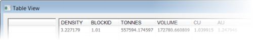
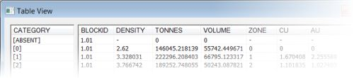

# Evaluate Wireframe

To access this screen:

  * Run the [wireframe-dynamic-evaluation](<../command_help/wireframe-dynamic-evaluation.md>) command from the command line or;

  * Activate the Report ribbon and select Evaluate Dynamic >> Wireframes

Define the block model and wireframe object, evaluation legend, density, block identifier, mined value, grade columns and other options before evaluating the wireframe using the block model. You can also report tonnes falling outside of the model if you wish, as a separate dilution reporting category.

You can evaluate tonnes and grades either within an enclosed volume or above or below a DTM.

**Note** : A block model and wireframe must be loaded before you can evaluate.

## Evaluation Legends

You can determine your own evaluation categories by specifying an evaluation legend.

This determines the categories (the **CATEGORY** field in the output evaluation results) for evaluation. By default, the current display legend for the loaded object (if there is one) is used, but you can override this either by picking another legend, or setting the default in Project Settings >> Mine Design. This has no effect on the display of loaded data, only the categorization of evaluation results.  
  
Selecting <none> results in an evaluation with no individual categories. In this case the results table contains a single evaluation record for all material within the selected volume, as shown below:  
  
  
  
Selecting an evaluation legend results in an evaluation according to the defined legend intervals (categories). The results table can contain multiple entries, one for each category, as shown below:  
  
  
  
Any values outside of the evaluation legend categories are identified using a category named Unmatched.

## Block Identifiers

This section of the screen only becomes important where multiple wireframes are to be used for the purposes of the same evaluation and when those results are not combined. When there are multiple wireframes to be evaluated, and you have chosen not to combine the results, the Block Identifier field can be used to identify the source of evaluation data in the resulting results file (saved using the [Table View](<Evaluation2DStringsTableViewDialog.md>) screen).

If you do not intend to use multiple mining blocks during the evaluation, or you wish only to combine the results of all evaluation zones into a single set of records, this group of controls is not relevant and can be ignored.

See [Dynamic Evaluation Reports](<Dynamic%20Evaluation%20Report%20Introduction.md>) for more information on the impact of combining evaluation block results.  
  
Each wireframe used in the evaluation can be referenced in the report using its block identifier column/field; this can be any existing numeric or alphanumeric field suitable for identifying the existing wireframe 'blocks'. 

Activity steps:

  1. Load a block model and either closed volume or DTM wireframe.

  2. Either accept the default **Model****Name** or select another block model object from the drop-down; the selected model will be used for the evaluation. The current block model is displayed by default.

  3. If Include volume outside model in report? is checked, the volume represented by your project evaluation string (either vertically or with respect to the currently active section) will report sub-volumes that fall outside of the model. If dilution is reported, you can choose a dilution reporting Category Name (see below).

  4. Choose a **Wireframe** object **Name** , or accept the current default object.

  5. An **Evaluation Legend** can be used to define the categories within which tonnes and grades are reported. See Evaluation Legends, above. Pick a Legend and Column to define your reporting categories.

  6. It's important to define how product density is set, to ensure accurate results. To do this, configure the following:

     * Default Define a global density value (default '1') to be used for evaluation. This value will be used where no density Column has been specified, or absent values are found within that column/field in the block model.

     * Column Select a block model field which contains density information. The standard density column/field is 'DENSITY', if present in the selected block model, is automatically detected and selected.

  7. Configure your **Block Identifier** settings. See Block Identifiers, above.

     * Default Accept the default start identifier value, or define a new one; this value is incremented by '0.01', by default, for each mining block. The default start ID is '1.01'.

     * Increment For each wireframe which is evaluated, the block identifier is increased by the amount specified in this box. The default is '0.01'.

     * Overwriting Existing IDs Check to overwrite any existing records in the results table; use this option when updating evaluation results as a result of either new block model information, or if the wireframe(s) has been modified.

     * Column Accept the default or select another column to identify and store Block ID values; this column exists on the wireframe and is saved to the results table.

  8. Consider including unmined and **Mined Value** s in your evaluation.

     * Decide if a mined-out **Column** should be updated during evaluation. The standard field is MINED and if present in the block model, will automatically be detected and listed as the default (default <None>). Block model cells that have a MINED value of '0' are treated as having been unmined. 

A value of '1' indicates that the block model cell has been completely mined out. Values between '0' and '1' indicate the portion (fraction) of the block that has been mined. If this option is selected then the proportion of the cell that is included in the results is the MINED value multiplied by the volume of the cell contained within the wireframe.

Note: If a MINED field is chosed, the model values in this field will be rewritten according to the option selected (see below). If left blank, no changes are made to the model object.

If a MINED column is picked, choose how values are calculated and stored:

       * Incremental Incremental Mined mode assumes that where the block has been mined before, the current mined volume includes the previous mined volume (the previous volume has expanded). The largest of the previous and current mined percentages is stored in the MINED field, and the difference between the two is used for the evaluation.

       * Additive Additive Mined mode assumes that where the block has been mined before, the current mined volume does not include the previous mined volume (for example, they are adjacent). The value stored in the MINED files is the sum of the previous and current mined volume, and the current volume is used in its entirety for the evaluation.

  9. Choose the **Grade Columns** to report.

     * Select (only) the required grade fields from the list.

Note: By default, BLOCKID, DENSITY, TONNES,MINED and VOLUME are checked if they are detected. 

For each selected grade column, choose how the grade column is treated, select from :

       * _Tonnes Weighted_ Calculate an average grade or value where each data point is weighted according to the tonnage it represents. This ensures that larger-tonnage blocks or zones have a proportionally greater influence on the average than smaller-tonnage ones.

Note: Ore deposits are rarely uniform. Different parts of an orebody may have different grades (e.g. % metal content), and different volumes (tonnages). Simply averaging the grades without considering the tonnage could give misleading results.

       * _Volume Weighted_ This mode represents a similar concept as "tonnes weighted," but the weights are based on the volume of each unit (for example, block, sample, or zone) rather than its mass (tonnes).

       * _Field Weighted_ In this case, calculate the average grade where each data point is weighted according to the content of another field. This field is specified in the Weight Col.

       * _Volume * Field Weighted_ Where the weighting field (Weight Col) is a factor, not an absolute value, use this mode to multiply the volume of each unit by a factor when considering weighting.

       * _Tonnes * Field Weighted_ As above, but this time use the weighting column as a factor for tonnage.

Note: If _Field Weighted_ , _Tonnes * Field Weighted_ or _Volume * Field Weighted_ is selected, This weighting field must be present in the input model. If values for the weighting field (or the input grade field) are absent the resulting evaluated value for that record is absent.

       * _Accumulated_ Field values are accumulated and no weighting is calculated (for example, a field containing values for time may be selected to use this option). This is the method used to calculate the values for VOLUME and TONNES.

       * _Dominant Value_ \- The most dominant value, by volume, is used as the result of the evaluation. 

Note: This is the only permissible method used for alphanumeric fields.

       * _Tonnes Dominant Value_ \- The most dominant value, by tonnage, is used as the result of the evaluation. 

  10. Select general evaluation Options:

     * Wireframe Type: select one of the two wireframe type options:

       * Closed Volume: select this option if the wireframe object contains closed wireframe volume(s).

       * DTM: select this option if the wireframe object contains open wireframes e.g. DTMs.

     * If you are evaluating against an open surface (DTM), choose which data to evaluate, either the Volume Above DTM or Volume Below DTM. 

       * In either case, define the upper or lower elevation using To. If set to zero (the default) all data above or below is considered when evaluating.

     * Verify wireframe Check to perform an integrity check on the wireframe prior to evaluation (checked by default and recommended).

     * Use full cell evaluation If **checked** , then the centroid of the subcell is checked to see whether it is inside the wireframe. If the centroid is inside, then 100% of the subcell volume is used for the evaluation; if the centroid is outside then 0% of the subcell volume is used. Leaving this option **unchecked** means that the true volume of the subcell within the wireframe will calculated and used for the evaluation. Full cell evaluation is faster, but less accurate.

     * Write results back to wireframe Update your input wireframe data with per-block evaluation results. An attribute will be added to the input wireframe data for each Grade Column selected above. This writeback functionality could be useful, for example, if you need to share mine planning solids with other teams (such as the operational team) or as a guide for design reviews.

  11. Click **OK** to evaluate the wireframe object using the parameters set. This opens the [Table View](<Evaluation2DStringsTableViewDialog.md>) screen, displaying the dynamic evaluation report.

Related topics and activities

  * [Dynamic Evaluation Reports](<Dynamic%20Evaluation%20Report%20Introduction.md>)

  * [Dynamic Evaluation Table View](<Evaluation2DStringsTableViewDialog.md>)

  * [String Dynamic Evaluation](<Evaluation2DStringsPropertiesDialog.md>)