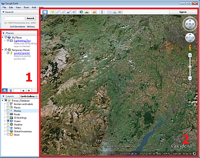
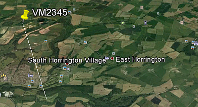
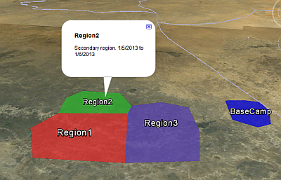
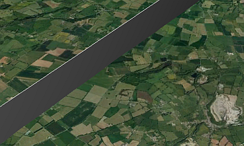
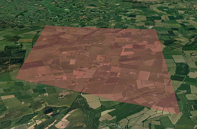

# Export to Google Earth

Your application provides a KML Google Earth driver which allows strings or points data to be exported to Google Earth. A rich set of functionality is provided to control the visual formatting and labelling of the exported data - providing an excellent way of using Datamine data in a highly-accessible format when communicating with stakeholders. The following information describes the prerequisites for the export process - describing the coordinate system required by Google Earth - and outlines the procedures for exporting points and strings data.

The areas in Google Earth referred below are highlighted in the following image:

  1. Places Bar

  2. 3D Viewer

## Data Preparation

Your application uses an XYZ cartesian coordinate system where:

  * X coordinates increase towards the East

  * Y coordinates increase towards the North

  * Z coordinates increase upwards.

The latitude value in a points or strings file is consequently represented by its Y value, and the longitude value is represented by its X value

Before exporting, the relevant points or strings data must use the **WGS84** coordinate system required by Google Earth. This system uses degrees latitude and longitude, and metres elevation.

Tip: Use the [transform-coordinates](<../command_help/transform-coordinates.md>) command to display the [Transform Coordinates](<Transform_Coordinates_Dialog.md>) screen. The procedure for running this command is outlined below:

  1. In any 3D window, load the relevant points or strings file.

  2. In the main menu, run the transform-coordinates command

  3. Using the Transform Coordinates screen, define the Source File and Target File names and parameters.

  4. Define the Source Coordinate System and Target Coordinate System parameters.

  5. Click OK. 

A new file is created using the specified coordinate system, and can be exported to Google Earth.

## Export Points Data

The export of points data is achieved using the Export Google Earth KML - Points screen which is launched as follows:

  1. Load a points file containing data to transform.

  2. **Data** ribbon >> **Export >> External**.

This displays the Object to Export screen.

  3. Select the points file to export and click **OK**.

The **Data Export** screen displays.

  4. Select the _Google Earth KML_ **Driver Category**.

  5. Select the _Points_ Data Type.

  6. Enter a file name.
  7. Click **Save**.

The **Export Google Earth KML - Points** screen displays.

  8. Enter a Group Name and Group Description. This text is shown in the **Places** bar in Google Earth.

  9. You can optionally derive a name and description from data attribute values (which can vary within the data object). To do this, pick a Name Field and **Description Field**.

  10. Choose how Z coordinates relate to the **Elevation** of each point in Google Earth. 

     * Absolute Z values represent the elevation above sea level.

     * **Relative to Surface** Z values are the surface in Google Earth. Essentially these values are the height above or below the surface stored in Google Earth.

     * **Fixed to Surface** Ignore Z coordinates and project the points onto the Google Earth surface.

  11. Choose an Icon image to represent the point data in Google Earth if required. Several image formats are supported.

     * Choose how to colour the icon:

       * Select a Fixed Colour Double-click the bar to display a colour chooser, or choose a Colour Field  This matches the Datamine colour codes against numeric field values to provide context-sensitive point colouring.

       * Set the Opacity of the icon point symbol.

       * Set the Scale of the icon.

  12. If the **Elevation** method is either **Relative to Surface** or **Absolute** (see above), you can connect point data to the surface with a vertical line by checking Extrude to Surface. For example:

## Export String Data 

The export of string data to Google Earth is very similar to points. The differences are:

  * When the Data Export screen displays, pick the _Strings_ **Data Type** (not _Points_).

  * The Name Field and Description Field can be used to identify individual strings in the Google Earth 3D Viewer. Click on the string to display its values, for example:

  * In the Google Earth properties screen, the following fields appear:

    * Appearance of strings, and areas bounded by strings The color and transparency of a string or area contained within a closed string, as well as the string width can be configured. Either select a fixed color, or select a color field in the string which references the Datamine COLOUR legend.

    * Link string data to the surface As points data, but in this situation a vertical 'sheet' appears below the string. This can be useful to simulate a 3D barrier between key topographical regions, for example:

    * If you have used the **Fixed to Surface** elevation option, the line representing the string can be modified using Tessellate on Surface to follow the terrain surface. This avoids the possibility of the lines passing through elevated parts of the terrain surface, or being hidden by the curvature of the earth.

    * Fill closed strings Closed strings can be drawn with filled interiors, and you can also set the Color and Opacity, for example:

Related topics and activities

  * [transform-coordinates ("tco")](<../command_help/transform-coordinates.md>) (command)

  * [Transform Coordinates](<Transform_Coordinates_Dialog.md>) (screen)

  * [Understanding Coordinate Systems](<Coordinate%20Systems%20Concept.md>)

  * [Export Google Earth KML - Points](<ExportKMLPoints.md>)

  * [Export Google Earth KML - Strings](<ExportKMLStrings.md>)