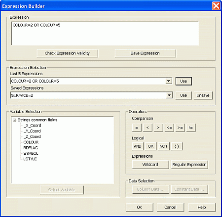

# Expression Builder

This page provides an overview of the Expression Builder dialog and introduces the filter expression syntax and the related field naming convention restrictions. A filter is an English-like expression that is used to make selections from point, string, drillhole, plane, wireframe or block model data. Filters may be applied to any defined ATTRIBUTE fields. The filter 'grammar' allows relational tests and regular expression (or wildcard) matching for alphanumeric data.

Use the **Expression Builder** to formulate logical expressions for the filtering of data. Expressions are created using a specific structure and allow you to create rules of varying complexity that can be used to control the data flow from external files, during an import/loading process.

Expressions can be applied to a data type (points, strings, wireframes etc) using theFormatribbon's variousFilteroptions.

;>)

The Expression Builder showing a simple expression to isolate data with particular colours

### Relational Expressions

The syntax of a relational expression can be any of the following:

[FIELD]   
name |  operator |  [CONSTANT]   
value  
---|---|---  
[FIELD]   
name |  |  [FIELD]   
name  
[CONSTANT]   
value |  operator |  [FIELD]   
name  
  
The keywords FIELD and CONSTANT are optional (as indicated by the square brackets), and need only be specified where necessary to avoid confusion. For example, if the data being filtered contains two alphanumberic fields called "ROCKTYPE" and "T2", the filter expression:
    
    
    ROCKTYPE == T2

... is ambiguous. If can mean either "compare the value of the ROCKTYPE field to the constant value T2" or "compare the value or the ROCKTYPE field to the field T2". In such a case, you could use either of these alternatives:
    
    
    ROCKTYPE==FIELD T2
    
    
    ROCKTYPE==CONSTANT T2

The operator can be of the six relational operators (">", ">=", "==", "<=", "<" or "!=". For testing equality and inequality, "=" and "<>" are also recognised.

### Pattern Matching Expressions

The syntax of a pattern matching expression is

field |  MATCHES  |  pattern  
---|---|---  
field |  [REGEXP] |  pattern  
  
If the keyword REGEXP is missing, a "pattern" may consist of literal characters to be matched, or one of the following elements:

  * ? Any single character.

  * * A group of zero or more characters.

  * [...] Any one of the characters enclosed in the square brackets. The shorthand notation "a-z" means any lowercase letter.

  * [^...] Any character except one of these.

The special meaning of a character (e.g. "*") is lost if the character is preceded by "\", hence to match a literal "*", use "\\*". Note in particular that if your field name or constant value begins with the first three characters of a keyword then it should be prefixed with "\" to disambiguate it (see note on parser error 120 at end of examples section).

More on [logical expressions](<logical%20expressions.md>).

Quotes (double or single) may be used to enclose patterns if desired.

If the keyword REGEXP is included, the pattern may be a full regular expressions. Regular expressions allow advanced users to make more complex selections than are possible by using the pattern elements specified above. A regular expression may contain the following elements:

  * % Matches the beginning of the field value.

  * $ Matches the end of the field value.

  * * Zero or more occurrences of the preceding pattern element.

  * ? As above.

  * [...] As above.

  * [^...] As above.

### Wildcards in the MATCHES and REGEXP Statements

Wildcard |  Meaning in MATCHES |  Meaning in REGEXP  
---|---|---  
? |  Any single character |  Any single character.  
+ |  n/a |  Matches the preceding pattern element one or more times.  
* |  Matches the preceding pattern element one or more times. |  Matches the preceding pattern element zero or more times.  
  
Wildcards have slightly different, but important differences when used in the MATCHES and REGEXPR statements. In the following example, retrieving a subset of drillholes using a wildcard would yield different results:

  * The original list of drillholes: VB2675, VB2737, VB2812, VB2813, VB283, VB4272

  * The expression `BHID REGEXPR "VB28*"` results in the following subset: VB2675, VB2737, VB2812, VB2813 & VB2832. Here, all drillholes with a BHID starting with 'VB2' are retrieved.

  * Using `BHID MATCHES "VB28*"` and `BHID REGEXPR "VB28+"` results in the following subset: VB2812, VB2813 & VB2832. Here, all drillholes with a BHID starting with 'VB28' are retrieved.

### Concatenating expressions

Multiple expressions can be joined (concatenated) using the operators "AND", "OR" and "NOT" (can also be described as "!")

  * Two or more expressions may be concatenated by using the "AND" or "OR" operators.

  * The "NOT" operator inverts the meaning of the expression. 

For example, if you wished to use the earlier example of matching the first four characters of the BHID field, but wanted to exclude any results that related to a drillhole segment that were shorter than 200 meters in length, you would use the following expression: `BHID MATCHES "DH28*" AND LENGTH < 200`

When using the AND and OR operators, it is useful to remember the following statements:

  * When using AND, only results that match ALL of the statements that are conjoined will be permitted. If results match either of the expressions, but not all, then they will not be permitted.

  * When using OR, any result that matches any of the statements made will be permitted.

  * When using a combination of AND and OR statements, think of the AND as an argument separator. Any conditions on either side of the AND, if conjoined by OR statements, will be thought of as a single condition.

It is important to remember that the descriptions 'BHID' and 'LENGTH' are both column names in the file being analyzed (filtered).

**Tip** : If you are familiar with regular expressions, you can use this format of data matching using the `REGEXP `opening statement instead of `MATCHES`. Alternatively, use the Regular Expression button.

### Operator precedence

Operators have an order of precedence which is adhered to when a filter expression is evaluated. The operators are listed below in their order of precedence, from highest to lowest:

  1. ( ), !, NOT

  2. <, <=, =, >, >=, <>

  3. AND

  4. OR

In an expression using more than one operator, the precedence determines the order in which the operations should be performed.

### Ambiguity Resolution

Some expressions can be ambiguous, for instance:

My Field = ABC

In this case is difficult for the parser to know with string refers to the Field Name and which refers to the Value. Therefore, the parser has a default behaviour to deal with this ambiguity and also extra commands to override it:

  * Default Behaviour: Treat the Left Hand Side as the Field Name and the Right Hand Side as the Value

  * Override behaviour: Precede a string with the literal expression "FIELD" to treat it as a Field Name, or "CONST" to treat it as Value. Only one side can have the "FIELD" or "CONST" literal (comparisons between two Fields Names or Values are not accepted). For example, the expression:
        
        CONST "My Field" = FIELD "ABC"

... is the reverse of the initial example, treating "My Field" as the value to be applied to a field named "ABC".

### Expressions and Field Naming Conventions

Care should be taken when using defining field names that may be subject to filtering or general field transformations. Generally, if you are defining field names, you should:

  * ensure they are not longer than 24 characters,

  * ensure they do not include illegal characters,

  * avoid starting a field name with a character (although this is valid if a specific expression syntax is used - see below).

If a field name to be used within an expression starts with a number, it is necessary to wrap that name in speech marks and preface it with an explicit FIELD qualifier.

For example, the expression MYFIELD could form part of the following valid expression:
    
    
    MYFIELD == MYFIELD2

However, the expression:
    
    
    MYFIELD ==2MYFIELD

is not valid, as the second field name begins with a numerical character. To ensure the second field name is parsed correctly, you must use the following expression syntax:
    
    
    MYFIELD == FIELD "2MYFIELD"

Here are some other examples of **invalid** syntax:

  * FIELD BHID  ==  FIELD 2MINE

  * FIELD "BHID" ==  FIELD "2MINE"

  * FIELD "BHID" == FIELD "MINE2"

  * FIELD BHID == FIELD MINE2

  * FIELD BHID = FIELD MINE2

  * FIELD "BHID" = FIELD "MINE2"

  * 2MINE > 2 

  * 2MINE = "RC002" 
        		  

...and examples of **valid** syntax:

  * FIELD "2MINE" = "RC002"

  * FIELD "2MINE" > 2   

Please note that additional syntax options are permitted when using the **EXTRA** process for general field transformations. See [EXTRA](<Expression%20Translator2.md>).

To create a filter expression using the Expression Builder:

  1. If you are familiar with filter expression syntax, you can simply type your logical **Expression** in full. 
  2. Alternatively, or as well as manually entering a partial expression, use the expression building options to automatically insert **Expression** text:
     * Variable Selectionif the **Expression Builder** screen was opened with reference to a specific object or object type, you can select the attribute(s) of loaded object(s) to add to the expression above. If the screen is opened without any data context, this list is empty. 

**Note** : where more than one object of the same type is being filtered, when using (for example, using the **[filter-strings](<../command_help/filter-strings.md>)** command on multiple string objects, thhe fields common to all objects are listed (since the filter is applied to all the objects, only common fields are valid filter variables).

     * Operatorsoperators are the parts of a logical expression that compare values, combine statements and/or allow wildcards and regular expressions to be specified:
       * **Comparison operators** this set of operators (also known as 'conditional operators') is used to compare one condition with another, and the following options are available:

Element| Meaning  
---|---  
=| Equal to  
>| Greater than  
<| Less than  
>=| Greater than or equal to  
<=| Less than or equal to  
!=| Not equal to  
       * Logical Operatorscombine conditions (or sets of conditions) to create more complex expressions:

Element| Meaning  
---|---  
AND|  All statements before and after the operator must be satisfied for data to 'pass' the declared filter.  
OR| If any conditions are met, before and after the operator, data will be allowed 'through' the filter.  
NOT| Use this operator to explicitly declare where a condition is not permitted. Any data matching a condition after this operator will not be permitted, and will be filtered.  
()| Use brackets to ensure that a set of conditions (possibly combined) are treated as a single expression.  
       * Expressionsyou can also enhance your expression with the following sub-expressions:

Element| Meaning  
---|---  
Wildcard| Adding a wildcard allows you to specify an area of variable data. Wildcards can be used to declare part of a value's name.  
Regular Expression| If you are familiar with regular expressions, you can use this format of data matching. The syntax `REGEXP` is added to the Expression Text area, and you can type your regular expression between double quotes (" ")  

Related topics and activities

  * [Expression Translator - EXTRA](<Expression%20Translator2.md>)

  * [Logical Expressions](<logical%20expressions.md>)