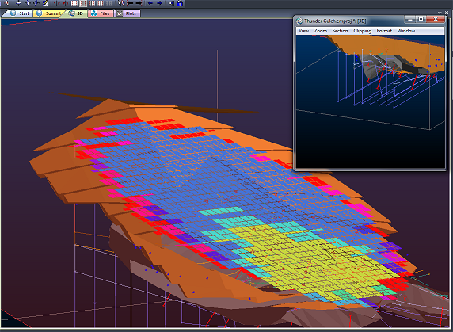

# External 3D Views

Note: A Datamine [eLearning course](<https://datamine.learnupon.com/>) is available that covers functions described in this topic. Contact your local Datamine office for more details.

Your application allows you to 'float' 3D views of your data outside of the main application. These views remain linked to each other and can be used for visualization and digitizing, using a sub-set of the functions available within the core application.

**Note** : You can also create independent (unlinked) external 3D windows, supporting their own formatting. See [Independent 3D Windows](<Independent_3D_Windows.md>).

You can have one or more external views (the limit is only determined by the capability of your hardware). All of these windows are linked to your project and all other active windows.  

External 3D Views can be used for:

  * Visualization (independent)
  * Environment formatting (will automatically update all other views)
  * Digitizing (linked to other views)
  * Setting global properties such as section position, clipping etc.
  * Object formatting (linked to other views)

**Note** : An external 3D view cannot be locked - only views that reside within the main application may be locked.

;>)

Studio EM showing inset external 3D window

## External 3D View Menus

Each external 3D window supports an independent menu system that captures some of the functionality available in the main view. The commands accessible from the external window are a replica of those available on the parent ribbon system.

Expand a menu below for more information:

  * [View Menu: expand to show commands](<javascript:void\(0\);>)

Pan: Pan the view by clicking and dragging the cursor.

Zoom: Zoom in and out by clicking and moving the cursor vertically up (zoom in) or down (zoom out).

Spin: Spin the view by moving the cursor.

FloatingSwitch on and off between using a floating viewpoint.

LookAt (toggle): Look at the next object that is clicked by centering the view around the clicked point. (Middle mouse button can also be used).

Perspective (toggle): Enable/disable perspective/orthogonal mode in all active 3D views.

Clip: Adjust global clipping planes using front and back slider controls..

Level: Temporarily align the view plane so that it is perpendicular to the active section plane. Note that this does not lock the view and will be applied only to the currently active 3D view.

  * [Zoom Menu: expand to show commands](<javascript:void\(0\);>)

Zoom Area: Zoom in by defining a rectangle with the cursor.

Zoom Fit: Adjust the display to show all the currently filtered data.

Plan: Adjust the display to show all the data in a plan projection.

North: Adjust the view to show all the data looking towards the North (West to East is left to right across the view)

East: Adjust the view to show all the data looking towards the East (North to South is left to right across the view).

South: Adjust the view to show all the data looking towards the South (East to West is left to right across the view).

West: Adjust the view to show all the data looking towards the West (South to North is left to right across the view).

  * [Section Menu: expand to show commands](<javascript:void\(0\);>)

Interactive Editor: Show the interactive section editor ("widgets") to adjust the orientation of the active section

Single Point: Set the active section orientation by defining it around a single selected point.

End Points: Set the active section orientation by defining it around a line defined by two selected points.

3 Points: Set the active section orientation by specifying three points on its plane.

Snap to Plane: Adjust the section position by selecting a point. The section orientation is not changed but its position is moved so the selected point lies on it. [More...](<../command_help/snap-to-plane.md>)

Horizontal: Change the current section to plan, keeping the same mid-point

North South: Change the current section to a North-South section, maintaining the current mid-point

East West: Change the current section to a East-West section, maintaining the current mid-point

Define: Displays theSection Propertiesdialog to permit custom configuration of the active section. [More...](<../VR_Help/Section%20Properties%20Dialog.md>)

Widen Limits: Make the section width wider. The section width is used for clipping data.

Narrow Limits: Make the section width narrower. The section width is used for clipping data.

Move: move the current section a predefined distance in the direction indicated by the cursor. [More...](<../command_help/move-plane.md>)

Backward: Move the section plane back by an amount equal to its defined total width.[More...](<../command_help/move-plane-backward.md>)

Forward: Move the section plane forward by an amount equal to its defined total width.[More...](<../command_help/move-plane-forward.md>)

Previous: Move to the previous parallel section.

Next: Move to the next parallel section.

Align: More...

Lock: More...

  * [Clipping Menu: expand to show commands](<javascript:void\(0\);>)

Disable all Clipping: temporarily disable the clipping for the current external window. Previous clipping values will be preserved and reapplied if this option is disabled.

None: Turn off clipping on the active section.

Front: Set the clipping of the active section to just the front of the section plane

Back: Set the clipping of the active section to just the back of the section plane.

Outside: Set the clipping of the active section to be both front and back.

Secondary: Apply secondary clipping

  * [Format Menu: expand to show commands](<javascript:void\(0\);>)

Scales: contains the following commands:

Heading: Show or hide the heading scale along the top of the display area.

Pitch: Show or hide the pitch scale along the left of the display area.

Roll: Show or hide the roll scale along the right of the display area.

Indicators: contains the following commands:

Axis Indicator: Show or hide the non-interactive Axis Indicator tool. [More...](<../VR_Help/Axis_Indicator.md>)

Axis Controller: Show or hide the Axis Controller tool. [More...](<../VR_Help/axes%20control%20tool%20overview.md>)

View Controller: Show or hide the View Controller tool. [More...](<../VR_Help/view_controller.md>)

Set Cursor...: displays the [Custom Cursors](<CursorEditor.md>) dialog for creating and editing bespoke cursor shapes for the active 3D window.

  * [Window Menu: expand to show commands](<javascript:void\(0\);>)

Split Horizontally: Split the active window into 2 separate vertically-aligned panes with separate view controls.

Split Vertically: Split the active window into 2 separate horizontally-aligned panes with separate view controls.

## Multiple 3D Windows

Your application supports multiple, linked 3D windows.

These additional windows can be additional representations of the current window (and linked to it), either by splitting the screen [horizontally and/or vertically](<../VR_Help/Split_Windows.md>), or can be an 'external' floating view that is connected to your primary 3D window data and formatting options. All of these views are linked to a single data source and formatting settings.

Each window is supported by its own Sheets control bar sub-menu.

Independent 3D windows are also available. These allow you to set your own window-specific formatting of overlays, sections, grid and many other scene controls. Independent windows can either be embedded or external/floating.

Related Topics and Activities

  * [About the 3D Window](<../VR_Help/VR_Introduction.md>)
  * [Independent 3D Windows](<Independent_3D_Windows.md>)
  * [Splitting Windows](<../VR_Help/Split_Windows.md>)
  * [Section Locking](<Section_Locking.md>)
  * [View Ribbon (3D)](<Ribbon_View_VR.md>)