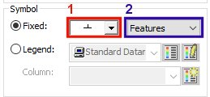
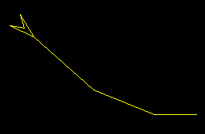
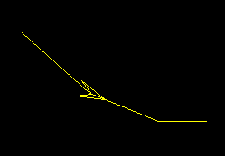
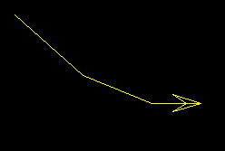
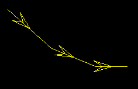
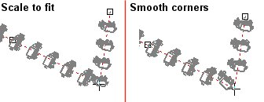
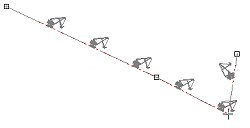
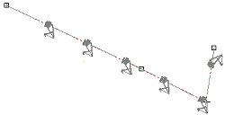
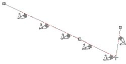
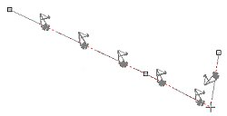

# Format Display: Feature

Note: These settings relate to the format of data object overlays in 2D plot projections. See [Projection Overlay Types](<../PLOTS_LOGS/Projection%20Overlay%20Types.md>).

To access this screen:

  1. Display the [Format Display](<Format%20Overlays%20Dialog.md>) screen.

  2. Select a string overlay.

  3. On the Style tab, select the Lines display style. The **Feature** tab is then shown.

  4. Select the **Feature** tab.

Format your line data so that symbols (selected from either the new features or [standard](<Symbol%20List.md>) symbol lists) are placed at specified points along it. This could be to generate an arrowhead symbol on one end of the line, or to add contour symbols along a topography string. 

There are several options available for single or multiple symbols, and control is granted over how they are rotated. You can also decide whether you wish to show the line, the symbols or both at the same time.

Note: The Feature tab is available whenever string overlays are selected, and the **Display as** [style](<Format%20Display%20Dialog_Overlays_Style.md>) is set to Lines. 

Activity steps:

  1. Display the **Feature** screen.

  2. Check Show Feature to apply one or more features on a line. 

     * Click New to add a new entry to the **Features** list, or just edit the default entry ("Feature 1").

     * Click Delete to remove a feature definition from the current set.

Note: Features in the set are saved with your project, so don't forget to save it when you have the look you want.

  3. Select feature **Color** settings:

     * Use trace color The symbol for the selected feature inherits its colour from the current line edge colour.
     * Fixed Set a fixed colour for all symbols on the feature, using the colour chip picker.

     * Legend Use data column values to set the colour for symbols, using the Column and Legend lists. The tool collection also lets you view and edit your legend (using the Legends Manager). You can also set the default legend for the selected attribute.

Note: If setting a default legend, if one already exists for the selected Column, it is automatically set. If no default legend exists for the column, one is created automatically using default settings (based on the contents of the selected column, including automatically sized bins for numeric columns.

  4. Choose the Symbol shape using one of these options:

     * Check Fixed to assign an unchanging symbol shape to the line, based on the selection made in the drop-down list provided (1). Symbols from the selected feature set (2) will be displayed. These entries represent a list of all symbol collections currently defined for your system. By [default](<Symbol%20List.md>), _Features_ and _Symbols_ collections are available.

     * Check Legend to choose a column in the underlying data object that contains symbol ID values. You can also preview, edit and select the default legend for the selected data column.

  5. Choose the feature **Size** settings. This is either the **Fixed** screen size in millimeters for the selected symbols, or a data attribute that contains scaling information (using the Legend option).

  6. Choose the feature Position settings:

     * Points Show the selected symbol at specific positions on the selected line overlay. You can select from the following options (one or more selections are permitted):

Start point | Show a symbol at the first line node position only (for example, an arrowhead) | ;>)  
---|---|---  
Mid Point | Place a single feature at the centre position of the line only | ;>)  
End Point | Place a feature at the end of the line (final node). | ;>)  
Segments |  Show a symbol at the centre point of each line segment (half-way between line nodes) | ;>)  
% Along | Set a value to position a single symbol at a percentage distance of the overall line length. The % represents the distance from the string start position along the line in the line direction.  
     * Intervals Specify a measured gap between symbols. Feature symbols will be placed at the specified distance apart. This can either be a distance as it appears on the screen, or a true 'virtual' distance that is represented by the **Plots** window view.

       * Intervals Specify a distance here, in mm if Drawing Units are being used, or meters if Data Units are used (see below).

       * Data Units Select this option to add a symbol at the preset interval, using the current 'world' measurements, or;

       * Drawing Units Show features at preset intervals according to the current screen dimensions.

     * Continuous  Show line features along the entire length of the line, without gaps. There are two mutually exclusive options available:
       * Scale to fit Select this option to automatically scale the symbol size for the selected line overlay, so that there are no uneven placing of symbols at the start or end of each line segment.

       * Smooth Corners Calculate the shape of a smoothed line, based on the current line on which to add feature symbols. This is particularly useful if the **Rotated** option is set (see below) and a more gradual change in symbol direction is required than that dictated by the shape of the line.

;>)

  7. Check Hide Line: to only display the feature symbols, not string edges. The default setting is to display both line edges and symbols (unchecked).

  8. Choose feature **Rotation** options:

     * Align with edges Features are oriented to the angle of the string segment with which they are associated. By default, the symbol will face in the same direction as the line, at the same gradient. 

You can align a feature in one of four different ways, depending on the combination of selected check boxes to the right, for example:

Not rotated, not flipped  
  
| ;>)  
---|---  
Rotated | ;>)  
Flipped | ;>)  
Rotated and flipped  
  
| ;>)  
     * Fixed Apply a fixed rotation in degrees along the line for all symbols.

     * Dip Pick an attribute containing numeric values. These will be applied per-symbol to adjust the dip of the symbol in 3D. You can also select a dip direction attribute using the lower drop-down list.

       * Optionally, pick a field to orient the **Dip Direction** of features along the string.

  9. If using a [**display template**](<Data%20Display%20Templates.md>) and wish to store your feature settings, click **Update Template**.

  10. Click **OK** to update the Plot sheet overlays.

  11. Save your project.

Related topics and activities:

  * [Format Display Screen](<Format%20Overlays%20Dialog.md>)

  * [Format Display: Overlays](<format%20display%20dialog_overlays.md>)

  * [Symbol List - standard](<Symbol%20List.md>)

  * [Format Display: Templates](<Data%20Display%20Templates.md>)