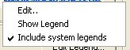

# Format Display: Color

To access this screen:

  * Display the Format Display screen and select the Color tab.

Choose the colour used to display a [plot projection overlay](<../PLOTS_LOGS/projection%20properties.md>).

Select an overlay in the Overlays list on the left of the screen to show its current colour settings. 

Colours can then be set using one of the following methods:

  * Specifying a static colour or;

  * Specifying a legend, that will be used to interpret colour values based on the value of a particular field within a database table.

## Linestyle Properties

This screen is also used to specify line style properties for plot projection string overlays. The line style refers to the format in which a line is drawn. To apply a line style legend, you must ensure that the data object to which it is to be applied contains a column for the line style property, and corresponding line style integers (for example, 1001, 1002, 1003 and so on) to represent the way in which they are to be drawn. This is interpreted by the applied legend.

  * The top section of this screen deals with the global object legend. Settings made here are reflected in the general display of the object.

  * The lower section of the screen deals with linestyle legends.

## Colouring with Display Legends

Display legends are a useful way of applying conditional formatting to data overlays. In essence, a legend contains the information that dictates which data value(s) will be assigned to which display property. Each legend interval (or 'bin') is dictated either as a unique value, a range or a filter expression.

Wherever a data column value is found that matches a particular interval, that data will be drawn using the assigned properties. For example, if a legend bin is defined as being a gold grade of 1-1.5 ppm and that particular legend item is set as being drawn in yellow, that particular range legend would be applied to the AU column using the Format Display screen. Once set, the next time the data is redrawn, all data rows that carry an AU value between 1 and 1.5 will be coloured in yellow.

## Working with RGB Data

Design and Plots window overlays support the display of embedded RGB colour information in your loaded data.

If the data columns "R", "Red", "G", "Green", "B" or "Blue" are found in the incoming file, an attempt will be made to colour the loaded points on these values. Any colour depth can be managed, e.g. 256 colours for an 8-bit colour depth and so on.

You can also assign your own attributes as RGB fields using this screen. You do not need to know the colour depth (the full range of values) of the attributes in advance as your application will calculate the setting based on the minimum and maximum numeric values found. 

## Handling Absent Data

All automatically-generated legends (that is, those created using the Legend Wizard) will contain a default bin that will be assigned to absent values. Absent values are special values in data tables, normally associated with the character "-" (hyphen). This setting is determined by the Data Conversions screen.

If absent data is interpreted, it will be assigned a display format according to that automatically generated bin.

However, in some cases, no match can be made at all. For example, if a legend contains several bins extended from the value 1 through to, say, 3.5 inclusive, and data values are intercepted above 3.5, those values are regarded as 'unmatched'.

Unmatched data can be drawn using which Fixed Color is currently assigned for the overlay by checking Draw unmatched data. In the case of drillholes, this will be the On-Section colour. Therefore, it is possible to set up the display format for all data rows that can be interpreted by a legend and also to determine what is shown when a value cannot be matched.

TL:DR Unmatched data uses the Fixed Color for the overlay.

## Global Legends

Fixed : display object using a single fixed color. Note that this also dictates the color of data where a legend is in use, and a corresponding data row cannot match any of the legend intervals within it. Note that this color can also be used to show any data that cannot be matched to a selected legend interval (see "Draw Unmatched Data", below).

Legend: vary the object color by a field value or attribute. For more information on setting up legends, see Related Topics.  
  
Select a legend. Note that you can access additional functions by right-clicking this combo box (in an unopened state), to see the following context-sensitive menu:  
  

Use the Column drop-down list to vary the object color by a field value or attribute. Note that every legend column can have an associated 'default' legend \- this will be the legend that is automatically selected each time the Column is chosen. If no default legend exists for the column that is selected, you will be given the option to create one automatically.

 |  When viewing a legend's description that is longer than the width of this drop-down list, you can hover your cursor over the list item to see the full description shown as a tooltip.  
---|---  
  
## Define Colouring Settings

To configure the selected plot projection overlay colouring format:

  1. Display the **Color** screen.

  2. Select a **Color** formatting type:

     * Fixed  Pick a colour. It is used for all visible data of the selected overlay.

     * Legend  The selected legend is matched to data **Column** values. You can also **View** , **Edit** and **Set or Select a Default Legend** for the chosen attribute.

     * **RGB** Pick **R Column** , G Column and **B Column** details. Depending on the scope of numeric values in the selected fields (upper and lower bounds), you can set the Maximum Value accordingly, otherwise it is calculated automatically.

  3. For closed strings, choose if they are Filled or not. If checked, you flood-fill the enclosed area of closed strings (open strings aren't affected).

  4. By default, a single attribute is used for colouring, size and line style. Check Color by Edge to determine the colour, size and line style of each string edge based on its individual data attributes.

  5. Choose **Line Style** settings:

     * As with the **Color** options above, select either Fixed or Legend styling. The same principles apply to both areas, although in this case, a linestyle legend contains linestyle codes to determine the pattern of dots and dashes (by default, this is called **LSTYLE** , but can be any numeric column.

       * If you have chosen the **Fixed** formatting option, select a line Width.

  6. Optionally, store all colouring settings in the selected **Template**.

  7. Click **OK** to update your plot projection overlay colours.

  8. Save your project.

Related topics and activities:

  * [Format Display](<Format%20Overlays%20Dialog.md>)

  * [Formatting Object Overlays](<Formatting%203D%20Objects.md>)

  * [The Overlays tab](<format%20display%20dialog_overlays.md>)