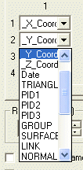
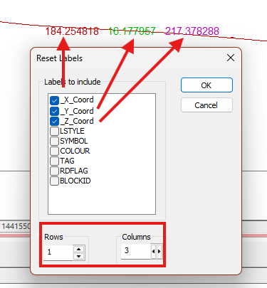
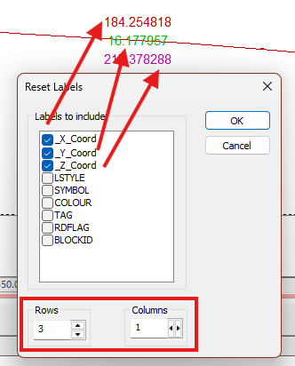

# Reset Labels

To access this screen:

  * [Format Display](<Format%20Overlays%20Dialog.md>) screen **> > Labels** tab **> > Reset**.

Specify how your [plot projection overlay](<../PLOTS_LOGS/Plots-overlays.md>) or downhole column label is to be formatted (columns and rows) and the values to be used for each label field. When you have added the relevant fields, they will be displayed on both the [Contents](<Format%20Display%20Dialog_Overlays_Labels.md>) and [Style](<Format%20Display%20Dialog_Overlays_Labels.md>) tabs, and if the number of fields is to be increased due to your actions on this screen, you are asked to confirm this.

When a field has been added, the associated database column can be changed at a later date without going through the reset process; you can simply change the column name on the contents tab using the drop down menu associated with the specified field, for example:

Activity steps:

  1. Display the **Reset Labels** screen.

  2. Select one or more Labels to include. The list shows all attributes found in the target overlay's object database.

  3. Choose how many **Rows** and **Columns** comprise the table used to display labels. Consider the following examples, where coordinate fields are laid out horizontally and vertically (the colouring was applied using the **Style** tab after the **Reset**).

(Click an image to expand it)

;>)

;>)

  4. Click OK to return to the **Labels** screen.

Related topics and activities:

  * [Format Display](<Format%20Overlays%20Dialog.md>)

  * [Formatting Object Overlays](<Formatting%203D%20Objects.md>)

  * [Format Display: Labels](<Format%20Display%20Dialog_Overlays_Labels.md>)

  * [Format Display: Overlays](<format%20display%20dialog_overlays.md>)