# 3D Rendering Options

**Note** : 3D Rendering mode is largely superseded by **[3D projection](<../PLOTS_LOGS/Projection%20Overlay%20Types.md>)** formatting options. Consider creating a 3D projection instead.

3D wireframe and block model data drawn in 2D plot projections can be enhanced using 3D Rendering options.

Warning: It is possible to display more than one object in 3D rendering (such as a wireframe and a block model). There are, however, limitations when plotting or printing. Only one object may be plotted and, if other data is required, it should be rendered normally with the drawing order set to draw after the 3D rendered object.

The following table outlines some of the affects that can be achieved with specific Shading and Drawing Mode combinations when drawing a wireframe object. With some combinations (say, if _Points_ is selected) the 3D rendering options are not available. Objects are drawn in the currently specified [colour](<Format%20Display%20Dialog_Overlays_Color.md>) (fixed or legend):

Display As |  Shading  
(3D Rendering) |  Draw Mode  
(3D Rendering) |  Example (click to expand)  
---|---|---|---  
Points |  - |  - |  [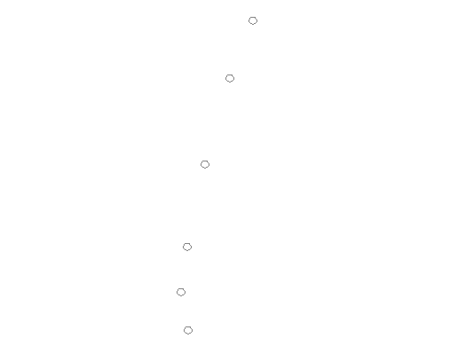](<javascript:void\(0\);>)  
The selected overlay will be shown as point data only, if this type of data exists within the selected database table.  
Labels Only |  - |  Normal |  ;>)  
If [labels](<Format%20Display%20Dialog_Overlays_Labels.md>) have been defined, this option will show the overlay as a series of labels only.  
Lines |  - |  - |  [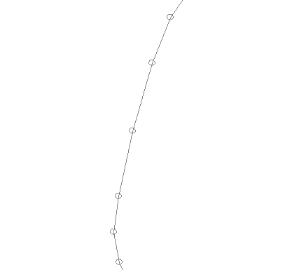](<javascript:void\(0\);>)  
Display the current overlay as lines. Note that this option only applies to string objects, and is not available for other data types. 3D rendering options and draw modes are disabled with this option.  
Faces |  - |  - |  [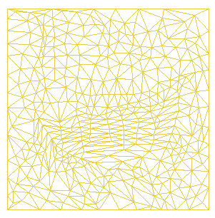](<javascript:void\(0\);>)  
Display a wireframe as a two-dimensional colored area. This selection is only available for wireframe objects.  
Faces |  None |  Highlighted Edges |  [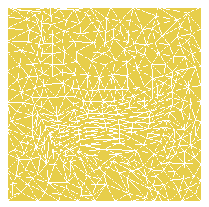](<javascript:void\(0\);>)  
Display outlines of wireframe triangles in the selected, fixed or legend color. This selection is only available for wireframe objects. The Highlighted edges option is only available if the Filled option is selected on the Color tab.  
Faces |  None |  Display Hull |  [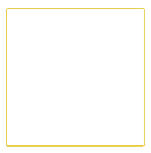](<javascript:void\(0\);>)  
Display perimeter of wireframe in the selected or legend color. This selection is only available for wireframe objects.  
Faces |  Flat |  Normal |  [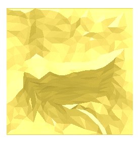](<javascript:void\(0\);>)  
Display each face as a single shade of the selected or legend color. Each face is a different shade from an adjacent one. This selection is only available for wireframe objects. Note that with the 3D Rendering option enabled, you can also change the light source.  
Faces |  Smooth |  Normal |  [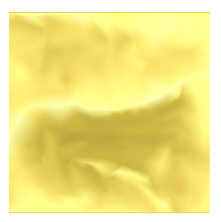](<javascript:void\(0\);>)  
Display faces with graduated shading between one face and the next. This selection is only available for wireframe objects. The smooth option is best appreciated when the wireframe triangles are Filled, as specified on the Color tab (as in the example image). This option is best appreciated when the wireframe triangles are Filled, as specified on the Color tab (as in the example image), and compared with the Smooth option below.  
Faces |  Smooth |  Highlighted Edges |  [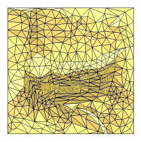](<javascript:void\(0\);>)  
Display faces with graduated shading and with triangle outlines superimposed. This selection is only available for wireframe objects.  
Blocks |  None |  Normal |  [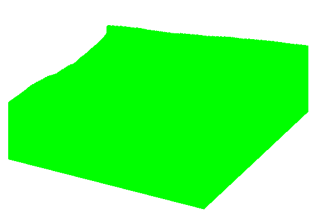](<javascript:void\(0\);>)  
Display blocks in selected or legend color. This option is only available if a block model object has been selected.  
Blocks |  None |  Highlighted Edges |  [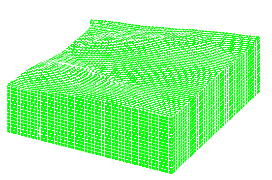](<javascript:void\(0\);>)  
Display outline of the maximum extent of the block model in selected or legend color. This option is only available if a block model object has been selected.  
Blocks |  Flat |  Normal |  [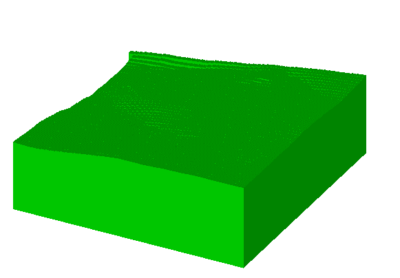](<javascript:void\(0\);>)  
Display each face as a single shade of the selected or legend [color](<Format%20Display%20Dialog_Overlays_Color.md>). Each face is a different shade from an adjacent one. This option is only available if a block model object has been selected.  
Blocks |  Smooth |  Normal |  [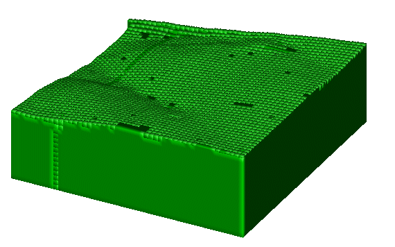](<javascript:void\(0\);>)  
Display faces with graduated shading between one face and the next. This option is only available if a block model object has been selected.  
Arrows |  - |  - |  [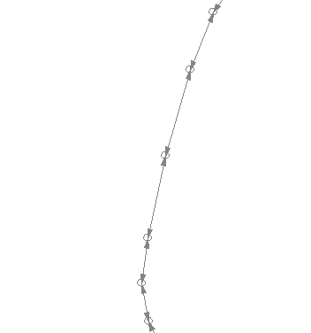](<javascript:void\(0\);>)  
Applies to string data types only. This will display the selected string with arrow heads to indicate the start and end of the string.  
Intersection |  None |  Normal |   
Displays the intersection profile with the section plane. Only applies to wireframe object selections.  
Intersection |  None |  Display Hull |   
Displays the outline of the intersection profile with the section plane. Only applies to wireframe object selections. Two objects must exist in memory that pass through the perimeters of another object for this setting to display any data on screen.  
Intersection |  Flat |  Normal |   
Displays the intersection in a single shade of the selected [color](<Format%20Display%20Dialog_Overlays_Color.md>) or legend. Only applies to wireframe object selections. Two objects must exist in memory that pass through the perimeters of another object for this setting to display any data on screen.  
Intersection |  Smooth |  Normal |   
Displays the intersection in a graduated (3D) color. Only applies to wireframe object selections. Two objects must exist in memory that pass through the perimeters of another object for this setting to display any data on screen.  
Drillholes |  Smooth |  Normal |  ;>)  
Displays the selected object (if appropriate) as a formatted downhole column. This setting is normally used in conjunction with the [Format Traces](<../PLOTS_LOGS/format%20traces%20dialog.md>) screen to ensure the require lithological/geological information is portrayed along the length of each borehole. Note: 3D Rendering options are not supported for the display of drillhole data.  
  
Related topics and activities

  * [3D Rendering](<Format%20Display%20Dialog_3D%20Rendering.md>)

  * [Format Display: Style](<Format%20Display%20Dialog_Overlays_Style.md>)
  * [Projection Overlay Types](<../PLOTS_LOGS/Projection%20Overlay%20Types.md>)