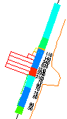

# Format 2D Drillhole Overlays

Studio RM gives you full control over visual formatting settings for static or dynamic drillholes overlays in **[Plot](<Window_PLOTS_Overview.md>)** window [2D projections](<../PLOTS_LOGS/alignviewwithsection.md>).

The hub screen for these settings is the **Drillholes** tab of the **Format Display** screen. Each drillhole object (dynamic or static) can be formatted independently. Formatting is achieved through the definition of "downhole columns", visual elements that (typically) follow the direction of the hole from collar to end-of hole and can represent a wide range of data, including:

  * Grade histograms

  * Rock type descriptions

  * Core sample images

  * Core azimuth angles

  * Line graphs

  * Text 

  * ...and more.

An example of 2D plot projection downhole columns

These columns become an integral part of the overlay, so if the underlying data values or view direction changes, the columns update automatically. They can make reports easier to understand, courtesy of more detailed contextual information about each drillhole and its intervals.

Whilst these settings are very similar to those found on the **Drillholes Properties** screen supporting 3D window overlays, settings for 2D drillhole plot projects are independent. This allows you to set up different formatting options for dynamic 3D visualization and report-ready plotting.

You can [preview](<Activity-Drillhole-Previewer.md>) your downhole columns and fine-tune their relative positions (to the hole) and there is no limit to the number of downhole columns that can support a drillhole.

Tip: You can also use downhole column _filtering_ to restrict the display of information to a particular hole, a grade range, rock type and so on.

The settings apply to both [static and dynamic drillhole object overlays](<Drillhole%20Representation%20in%20Studio.md>).

Note: These settings do not affect 3D window overlays, nor drillhole overlays rendered in 3D plot projections. See [Projection Overlay Types](<../PLOTS_LOGS/Projection%20Overlay%20Types.md>). For information on formatting 3D window downhole columns, see [Drillhole Properties: Columns](<../VR_Help/DH_PropDialog_Columns.md>).