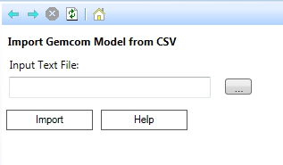

# Gemcom Model Import

To access this utility:

  * **Data** ribbon Load >> External >> Convert Gems Model Text File

Run a scripted utility to convert a Gemcom text format model file to a Datamine file.

The script accepts an **Input Text File** (browse to select a file) containing Gemcom CSV (comma-separated-value) model data and creates the corresponding parent cell Datamine model.

During import, this utility will calculate the model origin, rotation angle and cell size from the Gemcom data and create a Datamine model in memory.

Note: This utility can process both rotated and unrotated model data, but will only work for a single rotation about the Z axis. Also, parent cell sizes (**XINC** , **YINC** , **ZINC**) and the rotation angle (**ANGLE1**) should not include numeric data specified to more than 2 decimal places.

Related topics and activities:

  * [Loading Data](<Concept_Loading%20Data.md>)