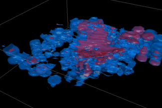
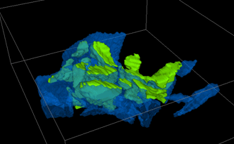
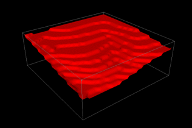
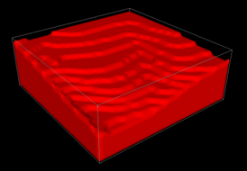
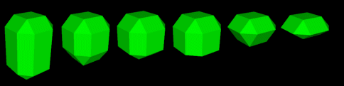

# Generate Isosurfaces

To access this screen:

  * **Model** ribbon **> > Data From Model >> Isosurfaces**.

  * **Explicit** ribbon **> > Automatic >> Isosurfaces**.

  * Using the **[command line](<Command_Toolbar.md>)** , enter "create-isosurfaces"

  * Use the quick key combination "iso"

  * Display the **[Find Command](<findcommand.md>)** screen, locate **create-isosurfaces** and click **Run**.

Create a wireframe isosurface(s) from defined values within a block model, using the **Generate Isosurfaces** screen.

The algorithm that is used to create the wireframe surface data takes samples of the data at fixed intervals and looks for samples falling either side of a target level. In which case, a wireframe surface is generated at the appropriate point. Isosurfaces may be generated where sample values pass through a target level, or alternatively where sample values change to a specific target value, or from a specific target value.

The "marching cubes" algorithm used by the isosurface generator needs to sample the underlying data at fixed intervals. This is fine for block models which consist entirely of full cells, as the samples occur at cell centres by default. However, where subcelling has been used, only one of those subcells will be sampled in each cell, which could lead to missed data, and a reduction in detail.

Increasing the subsampling amount will increase the number of samples within each cell, along each axis. For example, subsampling at 2 would be appropriate where the cell has been divided into 2 x 2 x 2 subcells.

Increasing the number of subsamples will increase the number of calculations required: for example, 2 subsamples require 8 times as many calculations, 3 subsamples require 27 times as many calculations, and since this increase applies to all cells, even if they havent been subcelled, subsampling should be used with caution.

Only one attribute can have isosurfaces generated at a time, but isosurfaces for many different isolevels may be generated within a single run. An option is also available to smooth surfaces, to minimise artefacts from the surface generation. This menu option is only enabled if a block model exists in memory.

**Tip** : use Restore to reinstate previous isosurface run parameters.

### Isosurface Examples

In the following example, isosurfaces were generated for a model according to data held in a user-defined "S" field. 2 unique values could be found in the data set; 2 and 4. By setting the Isolevels Column to [S] and the Isolevel Type to Passing Value(s), the surfaces were generated shown as below:

Note how the blue area (representing S = 2) encapsulates the smaller purple area (where S = 4). This is because in the blue area, 2 is the trigger point at which data values are included, up to the maximum value (2, 2.1, 2.7, 2.8, 3.4, 4.0, 4.2 etc., for example) and 4 represents a subset of this (e.g. 4.0, 4.2 and so on).

In the following example, the block model stores different ROCK type classifications for each block, ranging from ID 2 to ID 4. These have then been converted into isoshells:

These surfaces were generated by selecting the Equal to Value(s) option and the ROCK Isolevels Column. The blue and green areas represent data where the ROCK value exactly matches the value 2, 3 or 4 - all other values are ignored. As such, the data areas are distinct.

The surface of a Passing Values(s) isosurface (as shown in the examples above) will not necessarily follow cell boundaries, as it uses interpolation between samples to determine the point at which the level was crossed. This means that every sample must have a valid numerical value. Absent cell values or missing cells are tagged with a special value which does not necessarily have a numeric equivalent. This is normally treated as being very low. However, depending on the particular task, it may be necessary to treat absent values as being very high, in order to generate an isosurface in the correct direction, as shown in the examples below.

The following example shows a simple isosurface that has been created within the extents of the block model on the surface of the topology, since no cells were present in the empty region:  
  
  
  
Repeating the above example, but including boundaries, means that not only were the missing cells in the air above the surface checked, but the missing cells outside of the model boundary were also considered:  
  

To generate isosurfaces for a loaded block model:

  1. Load the block model you wish to review.

  2. Display the **Generate Isosurfaces** screen.

  3. Choose how wireframe data is **Output** :

     * Current Objectselect this option to update the current wireframe object (append the new surface(s) data to the current object's data).

     * New Object(s)select this option to create a new wireframe object. Choose a name for the object.

     * Single Object Output: select this check box to save multiple surfaces to the same object. De-select it to generate a new object for each surface.

  4. Select a loaded **Input Block Model**.

  5. Select a **Subsample** level. The default value (x1) considers the centre of each block model cell as the sample coordinate. Entering higher values increases the frequency of generated samples.

  6. Select the Isolevels Column that determines isosurface generation.

**Note** : although wireframes can be generated for multiple isosurface values at the same time, only one data attribute can be referenced. For Passing Value(s) isosurfaces (see below), only numeric columns are offered.

  7. Choose the Isolevel Type:

     * Passing Value(s) (numeric values only)select this option to generate isosurfaces which have interpolated values passing a certain isolevel value.

For example, if a block model was used to generate a series of surfaces according to the ZC value of the model cells, and the model values ranged from 5 to 25 with a step of 5, The first wireframe is constructed in accordance with data points 5 to 25 (all the values that pass the 5 elevation). The second surface would take cells from elevations 10 to 25 into account and so on, like this:

     * Equal to Value(s)isosurfaces are generated where values change from a specific value, or to a specific value. Values are included in isosurface generation if they are exactly equal to the value(s) in the Current Value list.

     * Include Boundariesnormally, samples are only taken between the minimum and maximum extents of the block model, as no valid data exists outside of this range (the values will all be absent). If this option is checked, it can help with closing off volumes which may have been bisected by the model boundary, and would otherwise have left a gap in the surface. 

**Note** : when generating **Passing Values(s)** isosurfaces (see above), the correct use of the **Absent cell/values** setting (see below) is vital to ensure the gap is closed in the correct direction.

  8. Decide how Absent cells/values are treated. These options are disabled if Equal To Value(s) is selected (see above):

     * Treat as Lowtreat absent cells/values as lower than the isosurface.

     * Treat as Hightreat absent cells/values as higher than the isosurface.

  9. Define your **Isolevel values**. 

Multiple isosurfaces can be generated at a single time, but all isosurfaces must reference only a single attribute (data column). Values are added to the Current Value(s) list using any of the following methods:

     * From Isolevel Columnadd the unique values found in the Isolevel Column to the Current Value(s) list. After selecting this option, and clicking Add, the approximate number of entries to be added - if greater than 20 - is displayed. If you confirm these values, the unique values are added. This option is most useful when generating multiple isosurfaces using the Equal To Value(s) Isolevel type.

     * From Legendadds the boundary values for each legend item in the selected legend to the Current Value(s) list. Only non-filter legends are included. After selecting this option, and specifying the Legend Name, click Add.

     * From Valueadd a specific value to the Current Value(s) list. After selecting this option, and typing the required From Value, click Add.

     * From Rangeadd a set of equally spaced values to the Current Value(s)list. After selecting this option, enter the starting **Min** and **Max** value and the required **Step** interval. Click **Add**.

  10. As isosurfaces are generated from block models, the results can look boxy, especially if the original cell size was large. The resulting wireframe can be smoothed externally using the [wireframe-smooth](<../command_help/wireframe-smooth.md>) command, or this can be done by checking Smooth Wireframeand defining the extent of smoothing using **Passes**.

Related topics and activities

  * [Introduction to Block Models](<../STUDIO_RM/block_models_introduction.md>)
  * [Introducing Wireframes](<concept_introducing%20wireframes.md>)
  * [Current Object Concept](<Concept_Current_Object.md>)