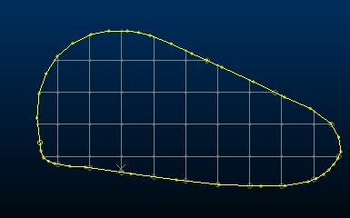

# Generate Grids in Outlines

To access this screen: 

  * **Edit** ribbon **> > Shapes >> Outlines >> Generate Grids in Outlines**.

  * **Digitize** ribbon **> > Create >> Outlines >> Generate Grids in Outlines**.

  * Using the **[command line](<Command_Toolbar.md>)** , enter "generate-grids-in-outlines"

  * Use the quick key combination "gio".

  * Display the **[Find Command](<findcommand.md>)** screen, locate **generate-grids-in-outlines** and click **Run**.

Generate a regular grid of strings within selected outline string data.

Select the origin of the grid, then the size of the grid intervals. Specify a grid angle using the Azimuth setting.

Grid data is added to the current object, which can be independent of the closed outline data used to constrain the grid.

**Important** : closed string data must be selected before you can Generate grid strings. Multiple closed strings can be selected.

To generate a grid of strings within an enclosed outline:

  1. Load and select a perimeter string so it is highlighted in a 3D window.

  2. Enter an **X** and **Y** coordinate to define a known **Anchor Point** , or pick the origin point of the grid in a 3D window. 

  3. Enter the **Azimuth Degrees** for your grid, or select a string in any 3D window to match the azimuth of the selected item. Snapping is supported if selecting a string to define the azimuth.

  4. Enter the **Grid Dimensions** by defining a **Length** and **Width** of each grid interval. This is used consistently throughout the grid.

Related topics and activities

  * [generate-grids-in-outlines](<../command_help/generate-grids-in-outlines.md>) (command)