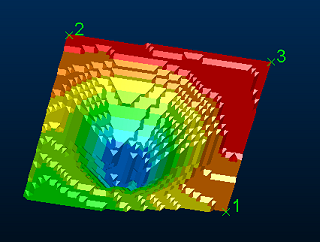

# Transform Objects

To access this screen: 

  * Run the command "georeference-objects"

  * Use the quick key combination 'gro'

  * Display the **[Find Command](<findcommand.md>)** dialog, locate **georeference-objects** and click **Run**.

Transform the 3D location of any loaded 3D object using one or more pairs of point coordinates, using the Transform Objects screen.

Activity steps:

  1. Ensure the data object(s) to be georeferenced are loaded (they do not have to be displayed, but it is recommended).

  2. Run the command.

  3. Select the object(s) using the upper list. These are the objects to be georeferenced. All selected objects are transformed.

  4. Either use the pick buttons in the first table row to interactively select a location in the 3D view and its new georeferenced position. Alternatively, you can enter coordinates manually, or use a combination of these techniques.

  5. Add as many landmark and world coordinates using the "+" button and either pick or enter coordinates for each. As each coordinate is selected, it appears in the 3D view with a crosshair and point number (which matches the number in the table), for example:  
  
  

     * If only a single point (current and target) is specified, a simple data translation occurs, that is, without rotation around any axis.

     * If two point pairs are defined, a translation is applied using the first point pair, followed by azimuth and dip adjustment to align the second point target.

     * If three point pairs are defined, the same transformation as for two points is applied, with a subsequent roll adjustment to honour the third target position.

     * If more than three point pairs are defined, a 'best fit' transformation is applied to adjust the data position and orientation as closely as possible to all target point locations.

  6. Click Transform to relocate your selected object(s).

Related topics and activities

  * [georeference-objects](<../command_help/georeference-objects.md>)