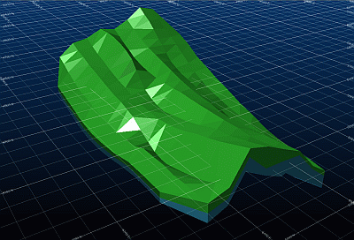

# 3D Window Grids

Grids provide a useful reference for loaded 3D objects. The display of 3D data can be enhanced with the provision of a grid.

There are two basic types of grids:

  * A **section** type will be aligned with the currently active section in the target 3D window, for example:  
  

This type of grid is useful for both highlighting the location of a section (either the currently active one or the system default) and can provide a useful dimensional reference for multiple loaded objects in a scene, and their spatial relationships.

  * A **3D hull** grid aligns with the 3 visible faces of a cutaway cuboid (or a single plane, if the data is on the same plane), wrapped around a target 3D object, for example:  
  

This is a great way to get a feeling for the size of the object.

Grids have several formatting options to control how the grids appear, how they are labelled and so on. All grid settings are applied via the **[Grid Properties](<grid%20properties%20dialog.md>)** screen.

A 3D window can have one or more grids, and grids can also be defined for each [independent 3D window](<Independent_3D_Windows.md>).

Grids can also be used as **[snapping](<Snapping-3D-windows.md>)** targets, which can make precise digitizing to know distance or position constraints a lot easier.

To avoid unnecessary screen clutter, grids will automatically adjust their presentation according to the current screen magnification, gradually adjusting the granularity of grid axis indicators to match the data appropriately.

Note: 3D window grids aren't a target for snapping. The snapping grid is separate and formed using the [Snapping Grid Parameters](<SnappingGrid_Dialog.md>) screen.

Related topics and activities

  * [Grid Properties](<grid%20properties%20dialog.md>)

  * [Independent 3D windows](<Independent_3D_Windows.md>)

  * [Snapping](<Snapping-3D-windows.md>)