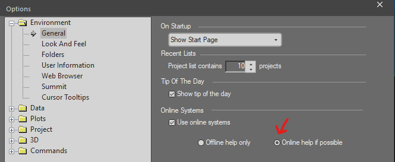
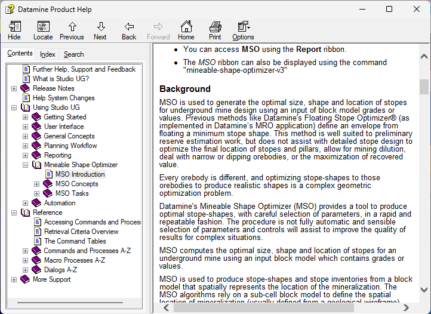
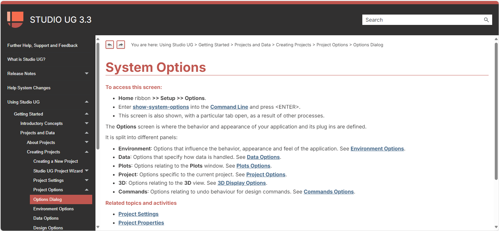
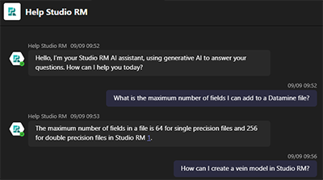

#  Help System Changes

We're reworking our help systems and providing better ways to support you using Datamine products. 

### Why are we doing this?

Essentially, it's time for a new format that will adapt well to emerging web technologies, to ensure you can get to the support you need as quickly as possible in a growing range of Studio products. Datamine has access to a wealth of authoring and instruction design expertise and technologies, so it's time to make good use of both.

We've listened to feedback from our users and this has determined the direction we're taking with information delivery. Studio help files have traditionally been packed with tons of information, collated over many years, which is great if you can find your way around it. 

We need to review the existing content, make it clearer and more concise and make it relevant to day-to-day mining operations. You need to find answers quickly, without have to wade through layers of content that isn't relevant to you at the time. Challenge accepted!

Something we've done already is to put our help _online_. You may already be looking at this in a web browser. We've adopted an open approach where our help is freely visible to the world (we're proud of what we're doing and have nothing to hide). You will start to see help topics appearing in search engine results over the coming months as our entire library of global documentation works its way through the indexing systems of the likes of Edge and Google. You don't need a license to view anything - we're happy to let you and even our competitors know what we're up to and how our software works.

If you aren't already accessing our online documentation library, you can set up your application to point to the live content as opposed to your installed content using the **Options** screen. If it's not already, check Online help if possible to see help files in a web browser, showing the latest information we have for your version of software:

;>)

For more information on these options, see [Options: Environment](<Options_Environment.md>).

Our campaign to renew and replace context-sensitive and conceptual documentation is underway, and is part of a bigger initiative to streamline both support and software deployment. 

;>)

Old help. It's showing its age.

;>)

_New help. More concise, easier to view and navigate, and better for supporting AI chat (see below)_

For help files, this means a new documentation format that adheres to the following principles:

  * **Simplified technical content** Concise, accurate information. Less words, more content.

  * **Improved structure and layout** Access appropriate information easily. Improved search. Web delivery.

  * Procedural documentationInformation on _how and why_ to use a function, not simply describing what a field, button or other control _does_. There will be detailed _activities_ that represent a typical or recommended usage of a tool, supported by _conceptual topics_ that provide a deeper understanding. 

  * **Information systems access** A holistic approach to learning, where e-Learning, social media, knowledge base, forums can be accessed from anywhere and any device.

  * **Domain-relevant information** Focussing on our software in your operations, help is designed to be relevant to your working day. Of course, we can't cover every possible use case, but we can provide activities and examples that reflect typical application usage.

  * **Scalability** We have big plans for our learning resources, including making it easier to connect with a global user base for support and offering a practical platform to share your expertise and feedback. Ultimately, the plan is to bring all learning resources together using a simple, shareable platform.

  * **Bot-compliant** Keeping help clear and concise means it is easier to feed other support channels, such as AI chatbots and make these mechanisms work for you in the future.

**Note** : There are many topics to update (over 5,000) which will take time to review and update. During this transitional phase, you will see help topics appearing in a mixture of formats. 

#### Coming Soon...

We're embracing the wonderful world of Artificial Intelligence!

Reformatting our documentation is just one part of a much larger, exciting project to provide AI-supported functionality alongside more traditional search and look-it-up methods of research. Initial results are extremely encourage and there will be more information here as we progress with this fun endeavour.

;>)

This is going to be good...