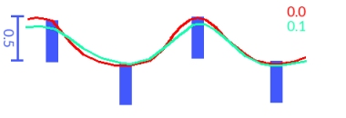

# Data Uncertainty

Note: A Datamine [eLearning course](<https://datamine.learnupon.com/>) is available that covers functions described in this topic. Contact your local Datamine office for more details.

The following information relates to the [Create Categorical Surfaces](<../STUDIO_RM/Implicit_Surface_From_Drillholes_Categorical.md>) and [Create Grade Shells](<../STUDIO_RM/Implicit_Surface_From_Drillholes_Continuous.md>) implicit modelling commands.

When calculating implied volumes, each sample point can have an **Uncertainty** attribute value that allows (per-sample) a best-fit surface to be generated within a tolerated range of limits for that sample. Alternatively, a global uncertainty value can be assigned (using this dialog) that will apply to all samples that match a designated keyfield  _Value_. In addition, sample intervals that match a keyfield/value combination must be defined with appropriate FROM-TO values.

For example, in the image below, a surface is constructed initially with zero uncertainty (red) to model a categorical value (in this case, lithology). The next run, a value of 0.1 is used which allows the resulting surface to pass close to, but not necessarily through, the FROM of each sample interval (green).

Per-sample uncertainty requires selection of a an attribute that will be used for all samples containing non-absent data for this field. global uncertainty is set using the **Default** uncertainty field, which will be applied to all data samples if no uncertainty field is selected, or if a field is selected, to samples that have an absent Uncertainty value.

Using an uncertainty value of zero will attempt to create surfaces that exactly coincide with the ends of the samples. However, in some cases, even with an uncertainty of zero, precise adherence may not be possible due to the influence of surrounding points. In this situation, an optional post-processing step is available to deform the calculated surfaces to more closely adhere to intercept positions. For more information, see [Snapping to Contacts](<../STUDIO_RM/Implicit_Surface_From_Drillholes_Snap.md>).

Related topics and activities

  * [Implicit Modelling](<../STUDIO_RM/Implicit_Modelling_Overview.md>)

  * [Create Categorical Surfaces](<../STUDIO_RM/Implicit_Surface_From_Drillholes_Categorical.md>)

  * [Create Grade Shells](<../STUDIO_RM/Implicit_Surface_From_Drillholes_Continuous.md>)

  * [Snapping to Contacts](<../STUDIO_RM/Implicit_Surface_From_Drillholes_Snap.md>)