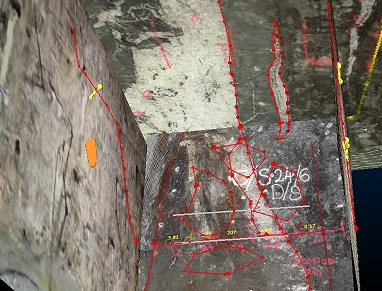
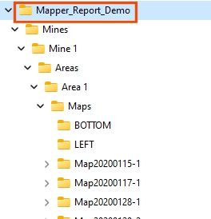
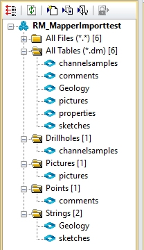

# Import Map Data from External Files

To access this screen: 

  * Activate the Data ribbon and pick Import >> Mapper.

**Studio Mapper** collates field data and stores it in a manageable and reusable way. Each Studio Mapper project is linked to a _database_. Your application understands the structure of the Studio Mapper database and can import some or all of its contents directly, without the need to export data from Studio Mapper first.

Studio Mapper displaying data for a mine area (front, left and back face display).

You do this using the Import Map Data from External Files screen, which is similar to the dialog used to export database contents in Studio Mapper.

You define the elements of the map database you wish to import using a series of controls that allow you to refine the scope of your import. You can import all possible data from the target mapping database, using a wide date range and no other filters, or you can restrict your import to a particular mine, area, map data type and date range, or anything in between.

First, use the Database browser to locate the folder that represents a map database. This will be the folder that contains 

An example of a Studio Mapper database folder structure. The folder to specify in the Import Map Data from External Files dialog is highlighted

Once a database folder has been picked (local or network), a quick scan of the folder is performed to attempt to locate a Studio Mapper configuration file (this is used to manage the import and ensure data is attributed correctly). If a file with an ".mpcfg" extension if found (or, if multiple files of this type exist at the folder location, the first one to be found) it will be listed in the Config file field. Regardless, you can browse for a configuration file if you wish.

To import Studio Mapper data into your application:

  1. By default, Mine is set to _All Mines_ , meaning all mines defined in the current mapping database will be used to import data. Pick a particular mine to further restrict your import. If All Mines is selected, Area is disabled as all areas of all mines are imported.

If a mine is chosen, you can either leave the default Area setting as _All Areas_ , or pick a particular area. Only data of that area is imported.

  2. Choose which of your field map data types you want to import:

     * Properties: tabular data (not 3D) representing imported maps. This includes map-level attributes, if defined and other properties, such as map creation date and time. This can be useful for generating a plot report. 
     * Sketches: freeform sketches are imported as string data. These normally represent map face edits/highlights, recorded by a Surveyor.
     * Comments: textual comments relating to a map or its features are imported as points and displayed as map labels.
     * Channel Samples: map channel samples are imported as drillhole data. You can also choose to import the tabular data representing Collars, Surveys and Assays information.
     * Pictures: each imported map can be supported by one or more images. These are imported as pictures objects.

     * Features: polygonal or linear(open) strings representing a particular geological/lithological structure. This data will be imported into Studio RM as strings, and can be used, for example, to refine implicit modelling operations, using field-measured rock type boundaries as additional points.

  3. Further restrict your import by only importing data **Between** one date **and** another. These timestamps are added to field data in Studio Mapper at the point of data creation, although it is possible that older/legacy map data may not include this information and this is handled separately (see "Missing Dates", below). Use the date pickers to provide a start and end (inclusive) date range.

  4. Choose if you wish to Overwrite existing files:

     1. If Overwrite is **checked** , files of the same name in the project folder will be overwritten without prompts.

     2. If Overwrite is **unchecked** (default), files will not be imported if data of the same name exists in the target location.

  5. Click Import.

Data is imported to the project file but is not loaded into memory automatically. 

  6. Optionally, load imported data references into memory using the [ Project Files](<Concept_Project%20Files%20Control%20Bar%20Overview.md>) control bar.

_An example of a (new) project following a Studio Mapper map data import_

Files of the same type from multiple mines/areas are combined (with the exception of pictures, which remain as separate file references). 

## Maps Missing Dates

To ensure map data within a given range is imported correctly, any maps that don't have a creation date (usually because they were created in an older version of Studio Mapper) will be highlighted. You can continue to import any undated maps, using the [Import \- Maps Missing Dates](<ImportMapMissingDates.md>) screen.

Related topics and activities

  * [Import \- Maps Missing Dates](<ImportMapMissingDates.md>)

  * [Project Files Control Bar](<Concept_Project%20Files%20Control%20Bar%20Overview.md>)

  * [Project Settings: General](<Project%20Settings_General.md>)