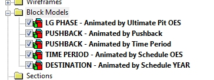
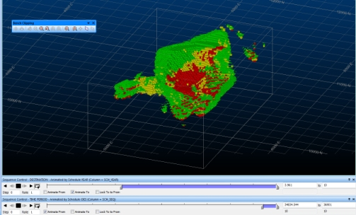

# Import Studio NPVS Block Model

To display this screen:

  * This screen is displayed if an attempt is made to import a block model containing pushback information. Typically, this data is generated by products such as Studio NPVS or Studio NPVS+.

Automatically generate overlays based on strategic planning fields present in the imported model. Where these fields are detected in the incoming file, the **Import Studio NPVS Block Model** screen displays automatically.

These fields are listed below and are added automatically to the block model as part of the strategic planning workflow in Studio NPVS and Studio NPVS+

An example of overlays generated by the block model import function (Sheets control bar)

Once created you can right-click an overlay and select Sequence Controls to show the [Sequence Control](<../VR_Help/Sequence%20Control%20Dialog.md>) toolbar and play back an animation corresponding to the properties that have been automatically set, for example:

;>)

If you choose not to create any overlays in this screen, or Cancel it, the model is loaded using the current default 3D template assigned for block models in your project.

### Overlay Selection

The following overlays can be generated. Check the appropriate item(s) to generate those overlays during import, or select none to load the model as any other block model, without creating additional overlays or legends:

  * LG Phase - Animated by Ultimate Pit OES Generate a display overlay and corresponding legend to visualize distinct LG phases, potentially allowing you to animate your 3D display based on the ultimate pit optimal extraction sequence value for the UPT_SEQ field within the model.

Colouring is applied based on the UPT_PIT data field.

  * PUSHBACK - Animated by Pushback Create an overlay to visualize and animate data based on the pushback number (as determined by the PSB_PIT value). Coloring is also based on the contents of the PSB_PIT field.
  * PUSHBACK - Animated by Time Period Similar to above, but this time the sequence/animation field used is SCH_YEAR
  * TIME PERIOD - Animated by Schedule OES Select this option to produce an overlay to visualize the SCH_YEAR values of the imported model, and a sequence attribute of SCH_SEQ.
  * DESTINATION Create a sequenced overlay based on the **SCH_YEAR** values, coloured according to the destination (NPVDEST field).

Related topics and activities

  * [Sequence Control](<../VR_Help/Sequence%20Control%20Dialog.md>)