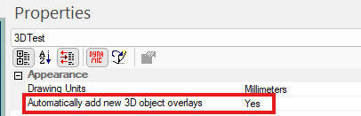

# Independent Views

To access this screen:

  * **View** ribbon >> New 3D Window >> Independent.

"Independent" 3D views allow you to scrutinise all types of data, with different formatting in unlinked windows. For example, you can fully scrutinise your geological data with independent formatting and loading of any data types in multiple windows; show your resource model as an intersection showing AU grades within bounding structures in one window, then display the model and corresponding drillhole data in the other with front clipping. 

;>)

3 independent windows showing different rendering of the project data 

For more information on independent 3D windows, see [Independent 3D Windows](<Independent_3D_Windows.md>).

## Multiple 3D Windows

Your application supports multiple, linked 3D windows.

These additional windows can be additional representations of the current window (and linked to it), either by splitting the screen [horizontally and/or vertically](<../VR_Help/Split_Windows.md>), or can be an ['external'](<External_3D_Windows.md>) floating view that is connected to your primary 3D window data and formatting options. All of these views are linked to a single data source and formatting settings.

Each window is supported by its own Sheets control bar sub-menu.

Independent 3D windows are also available. These allow you to set your own window-specific formatting of overlays, sections, grid and many other scene controls. Independent windows can either be embedded or external/floating.

Activity steps:

  1. Enter a **New name** for your **3D** window. If you are creating an independent-embedded window type, this name appears on the window tab, for example:

If you choose an existing name, a numeric suffix is applied automatically, for example:

  2. Choose what data (if any) from the primary 3D window is copied to the new one:

     * If **Copy overlays from the current view** is **checked** , all existing overlays in the primary 3D view (and their settings and visibility status) are copied to the new 3D view. This is a good idea if you want to present a visual variation on the existing displayed data.

     * If **Copy overlays from the current view** is **unchecked** , no 3D overlays are created in the new scene. You will need to create them manually (using the Sheet or Project Data bar's folder context menu option - **Create from Loaded Data**).

  3. You can optionally Automatically add new 3D object overlays:

     * If **checked** , any data loaded into the primary 3D view is automatically represented with a default overlay in the new independent view. Effectively, this means you will see all newly loaded data in the independent view straight away after loading, but can format (or even hide) the overlay independently of other windows afterwards.

     * If **unchecked** , data overlays are not automatically added to the independent view, but can be added later if required.

Note: You can change this property later by selecting the top-level 3D window folder in either the **Sheets** or **Project Data** control bar:  
  

  4. Choose if the new window is to be **Embedded** (shown as a tab within the main application) or **External** (a floating window, unattached to the main application. You can't change this setting afterwards.

Related topics and activities

  * [About the 3D Window](<../VR_Help/VR_Introduction.md>)

  * [Independent 3D Windows](<Independent_3D_Windows.md>)

  * [External 3D Windows](<External_3D_Windows.md>)