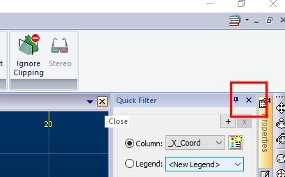
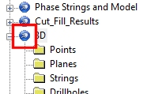

# Independent 3D Windows

## Multiple 3D Windows

Your application supports multiple, linked 3D windows.

These additional windows can be additional representations of the current window (and linked to it), either by splitting the screen [horizontally and/or vertically](<../VR_Help/Split_Windows.md>), or can be an ['external'](<External_3D_Windows.md>) floating view that is connected to your primary 3D window data and formatting options. All of these views are linked to a single data source and formatting settings.

Each window is supported by its own Sheets control bar sub-menu.

Independent 3D windows are also available. These allow you to set your own window-specific formatting of overlays, sections, grid and many other scene controls. Independent windows can either be embedded or external/floating.

**Tip** : Multiple monitors are recommended if you wish to see multiple 3D windows simultaneously (independent-embedded, external, or independent-external types).

This topic describes how to create and manage independent 3D windows.  

## Independent 3D Views

"Independent" 3D views allow you to scrutinise all types of data, with different formatting in unlinked windows. For example, you can fully scrutinise your geological data with independent formatting and loading of any data types in multiple windows; show your resource model as an intersection showing AU grades within bounding structures in one window, then display the model and corresponding drillhole data in the other with front clipping.

**Note** : Each independent 3D window can have it's own cursor - just activate the window then run the select-cursor command. The name of the active cursor for the current 3D window is displayed in the Status bar.

All windows are still linked to the same underlying data, so you're views always represent the 'data truth' and are synchronized in this respect.

These independent windows can be regarded as completely standalone views of your data in nearly all respects. Some elements of your application are still shared between windows, but as far as presentation is concerned, it is a highly flexible system.

## What is - and Isn't - Independent?

Each independent 3D window can be considered a standalone view of your project data. The following table indicates the elements of your project that can be configured separately for each independent window, and those elements that are shared between windows.

This table applies to independent-embedded windows, although a subset of this information applies to independent-external windows as well.

Project item | Independent?  
---|---  
Object overlays |  Yes  
Overlay formatting (all data types) |  Yes  
View orientation and scale |  Yes  
Section list and definitions |  Yes  
Section position, scale and formatting |  Yes  
Interactive View Controller |  Yes  
Perspective Setting |  Yes  
Window Lock setting |  Yes  
Window Split (Vertical/Horizontal) |  Yes  
Active Section Indicator |  Yes  
Edit Interactively toggle |  Yes  
Global clipping settings (primary and secondary) |  Yes  
Overlay-specific clipping settings | Yes  
Stored viewpoints |  Yes  
Ignore Clipping toggle |  Yes  
Sheets control bar entries |  Yes  
Overlay display status |  Yes  
Environment Settings |  Yes  
Grid Settings |  Yes  
VR Objects (and Types) |  Yes  
GVP (and GVZ) objects |  Yes  
Loaded data objects |  No - same for all 3D windows  
Current object status |  No - same for all 3D windows  
Measurement units |  No - same for all 3D windows  
Gradient convention |  No - same for all 3D windows  
  
Generally, settings controlled by the View ribbon are independently controllable for independent-embedded windows.   

To create a new embedded, Independent 3D window

  1. Activate the **View** (3D) ribbon.
  2. Select New 3D Window >> Independent
  3. Using the [Independent View](<IndependentView_Dialog.md>) screen, choose a name for the new window (this will appear on a new window tab).
  4. Select the Embedded option.
  5. Choose if you want to copy the overlays from the currently active window to the new window.
     * If Copy overlays from the current view is checked, overlays from the currently active 3D view will be copied to the new one, and can be modified independently afterwards.
     * If Copy overlays from the current view is unchecked, an empty 3D scene will be created.
  6. Click OK. Your new window will be displayed automatically. A new branch is added to the Sheets control bar, and is automatically expanded for the new view.

To delete an embedded, independent 3D window:

  1. Select the tab of the embedded window you wish to remove.
  2. Click the "x" in the top right corner of the window display (be careful not to close the application instead):  
  

To swap between existing independent-embedded windows

You can select any of your current independent-embedded windows using any of the following techniques:

  * Select the corresponding window tab, e.g.:  
  

  * Select the appropriate entry in the Sheets control bar e.g.:  
  

To display multiple embedded views simultaneously:

The simplest way to do this is to use Studio's window arrangement tools to align each view as you need to.

  1. Create the embedded windows that you require
  2. Activate the Home ribbon.
  3. Expand the Window >> Arrange drop-down menu.
  4. Select the Cascade, Tile Horizontally or Tile Vertically option
  5. Hide the windows you don't wish to see (you can re-display them later if you need to)
  6. Position/align each window as you want them e.g.:  
  

Related Topics and Activitites

  * [About the 3D Window](<../VR_Help/VR_Introduction.md>)
  * [Splitting the 3D Window](<../VR_Help/Split_Windows.md>)
  * [External 3D Windows](<External_3D_Windows.md>)
  * [Independent View Dialog](<IndependentView_Dialog.md>)