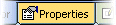

# Data Control Bars

Control bars provide context-sensitive information relating to the selected object or component.

Another series of dockable and floatable panels exist in your application \- Control bars. These components are used to control and view the state and display of loaded and in-memory data.

This information is categorized and presented on one of the following tabs (note that not all tabs may be displayed.

Note: control bars can be hidden or displayed using the **Home** ribbon's **Show** menu.

The items described on this page relate to the context-sensitive control bars normally found on the right of the data window(s) in a default configuration. These control bars are used to view and (optionally) amend data relating to items selected in a data window. The contents of these bars are updated automatically depending on the data that is selected:

## Compositor Control Bar

The **Compositor** control bar displays the values associated with the drillhole segment currently selected.

## Properties Control Bar

The Properties control bar displays context-sensitive information relating to the object selected. This bar does not represent the database values that are associated with the object, only the object properties. Depending on the object selected, some, none or all of the properties may be editable.

## Data Properties Control Bar

The Data Properties control bar displays the database values associated with the selected object. Depending on the object selected, some, none or all of the data properties may be editable.

**Tip** : rearrange the order tabs appear by dragging them to a new position. Hold down the left mouse button or stylus when over a tab to pick it up, then drop at a new position in the tab group.

Related topics and activities

  * [Customizing Control Bars](<Customizing.md>)