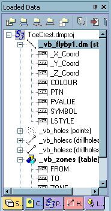
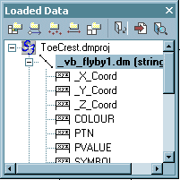

# Managing Control Bars

Note: A Datamine [eLearning course](<https://datamine.learnupon.com/>) is available that covers functions described in this topic. Contact your local Datamine office for more details.

[Control Bars](<Interface_ControlBars.md>)(whether free-floating or docked) can be managed using the context menu, activated via a right-click menu . 

**Note** : Redisplay hidden items using the Show menu.

The following options are available:

  * **Floating** Detach the current tab from the main group and show its contents in a standalone, freely modifiable window, for example:

...when 'floated', becomes:

  * **Docking** If a project bar is already floating, right-clicking its title bar will allow you to select this option. The bar is be returned to its default pane.

  * **Auto Hide** Display control bar contents on demand (when you hover over a sidebar icon).

  * **Hide** Remove a tab from view (without affecting any loaded data), you can select this option.

Note: This menu does not appear when right-clicking a Data Window tab.

Related topics and activities

  * [Organizing your workspace](<Customizing.md>)

  * [ Control bars overview](<Interface_ControlBars.md>)

  * [Output window overview](<Interface_Output.md>)