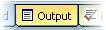
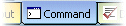
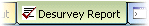

# Output Windows

This section of the interface deals with commands, messages and process results. 

Note: most control bars can be hidden or displayed using the **Home** ribbon's **Show** menu. Not all control bars are available in all Studio products, and product-specific control bars also exist, such as the Optimization Output control bar in Studio NPVS+, or Scheduling control bars in Studio OP, for example.

The output window is a scrollable, dockable window that displays any text output from commands and processes. The output may be cut or copied to the clipboard, or it may be sent to the printer.

To dock an output window:

  1. Right-click the window border to display the popup menu.

  2. Uncheck Float in Main Window.

  3. Check Allow Docking.

The window can now be dragged by its title bar to the desired docking position. It will dock automatically when close to the top, bottom or either side of the main window.

**Note** : Undocking the window requires Allow Docking to be checked.

## Output

##  

The Output tab displays useful information about data objects. For example, selecting a drillhole automatically adds about the selected hole, including dimensions, length, zone information, for example:  
  

## Command

##  

The Command tab is used to enter commands or values into your application, for example, when creating a prototype model using the PROTOM process:

The command line acts as a direct input device, and if you are aware of the command syntax required, it can often act as a shortcut.

##  Desurvey Report

The Desurvey Report window displays information relating to the validation and evaluation of drillhole data, for example, as a result of using the **Define Holes** command:

**Tip** : rearrange the order tabs appear by dragging them to a new position. Hold down the left mouse button or stylus when over a tab to pick it up, then drop at a new position in the tab group.

## The context menu

Right-clicking an **Output** window displays a context menu:

  * Copycopy currently highlighted text to the clipboard.

  * Clearclear the window contents.

  * Select Allselect all available text.

  * Save As...save the contents of the target window to an external file. This can be useful for support purposes.

  * Font...choose the font to use for window text.

  * Hidehide the control bar. It can be redisplayed using the **Show** menu.

Related topics and activities

  * [Managing Control Bars](<Interface_Hide%20and%20Show%20tabs.md>)

  * [Customizing Control Bars](<Customizing.md>)