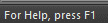
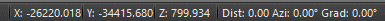
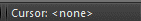
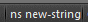
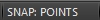

# The Status Bar

The **Status Bar** is located at the bottom of your application and serves the following purposes:

  * To display brief information relating to a specific icon or menu item.

  * To show the progress of commands.

  * To display/set the position of the mouse in XYZ space in the currently open file.

  * To display if a command is currently running.

  * To show the read status of the currently open file.

  * To see or set numlock, scroll lock and caps lock statuses.

  * To view the viewplane distance between subsequent mouse clicks.

  * To view the current azimuth and dip values of the last clicked point.

  * To pick a custom cursor for use in the primary **3D** window.

The Status Bar is available in all windows.

More detailed information on some of the bar zones:

  * Messages

This read-only area displays prompt information when running commands, and provides information about the menu item or icon directly under the cursor (for icons, a tooltip will also be displayed).

  * Cursor Position

The XYZ location of the cursor is updated dynamically with mouse movement. In the Plots and Logs windows, as these are 2D viewports, no Z value is displayed. 

  * Cursor Appearance

You can see the cursor that is currently in use in the primary **3D** window here. By default, this is set to <none>, meaning a default cursor will be displayed. Double-clicking this section of the Status bar displays the Custom Cursors dialog, from which you can select an existing custom cursor or design one. More...

  * **Quick Key Status**

This area displays information relating to a recent quick key command. The information displayed will show the key combination, and the name of the command. If a key combination is typed that isn't recognised, the command name is shown as 'ambiguous'.

  * Snap Mode Status

The current snap mode is also displayed in the status bar. You can see if your Snap Mode is set to [GRID], [LINES], [NONE], [POINTS] or [SURFACE]. Double-clicking this part of the status bar displays the [Snap to Mode](<SnapSettings.md>) screen.

Related topics and activities

  * [Data Control Bars](<Interface_ControlBars.md>)

  * [Managing Control Bars](<Interface_Hide%20and%20Show%20tabs.md>)

  * [The Title Bar](<Interface_TitleBar.md>)

  * [Ribbon Customization](<Ribbon_Customization.md>)

  * [Ribbons](<Ribbons-overview.md>)

  * [Cursor Information](<Cursor_Messaging_System.md>)