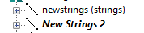
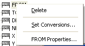

# Loaded Data Control Bar

To display or hide this control bar:

  * Using the **[command line](<Command_Toolbar.md>)** , enter "toggle-loaded-data-bar".

  * **Home** ribbon **> > Show >> Loaded Data Bar**,

The Loaded Data control bar is used to manage the data objects that are currently loaded in memory. This includes loading, unloading and refreshing objects; editing object definitions; accessing the [**Data Object Manager**](<Data%20Manager%20Dialog.md>) and performing object orientated manipulations.

Unlike the **[Sheets](<Sheets%20Control%20Bar%20Overview.md>)** control bar, this bar displays all loaded data objects, even if they are invisible.

## The Loaded Data Toolbar

This toolbar is located at the top of the Loaded Data control bar and contains the following commands:

|  Description  
---|---  
 |  Load a points file.  
 |  Load a strings file.  
 |  Load a static drillholes file.  
 |  Load a pair of wireframe files i.e. wireframe triangles and wireframe points.  
 |  Load a block model file.  
 |  Load a planes file.  
 |  Import a non-Datamine format file using the Data Source Drivers.  
 |  Export a loaded data object to a Datamine or non-Datamine format file.  
 |  Open the Data Object Manager.  
 |  Unload data objects.  
 |  Unload all loaded data objects.  
  
The load functions listed above display the [Project Browser](<ProjectBrowser.md>) screen.

## Files and Objects

Files that have been loaded into memory are referred to throughout this Help file as 'objects', whereas if they are merely associated with the project (and shown only in the Project Files control bar) they are referred to as 'files'.

In summary:

  * Data that have been imported, or added to the project file, but not yet loaded into memory, are referred to as 'files'.

  * Data that have been loaded into memory are known as 'objects'.

Loaded data is both part of the project file, but also 'active'. Data is loaded into memory by a variety of methods (see [Loading Data](<Concept_Loading%20Data.md>)) using both drop-down menus, context menus and the Project Files control bar. When a file has been loaded, it will appear in the list shown in the Loaded Data bar.

## Reloading vs. Refreshing Data

When data is first loaded (from a Datamine or non-Datamine file), the associated Data Source Driver and the other load/import settings are maintained in the project file. If an object is then reloaded, using the [Data Reload](<Data%20Reload%20Dialog.md>) screen, the stored settings are used as defaults and the user has the option to redefine the source and modify the associated import/load settings before the source file is loaded. 

If on the other hand, an object is refreshed, using the [Data Refresh](<Data%20Refresh%20Dialog.md>) screen, the source file is automatically loaded, using the stored settings, but the user is not able to redefine the source nor modify the associated import/load settings.

In both cases, the object name is updated (if a new source file was selected) and the data in memory is updated and is redrawn in the various windows to reflect any new or updated data present in the source file.

## Unsaved Object Changes

Loaded data that objects that have been modified, but not yet saved to a new or existing file, are listed in the **Loaded Data** control bar in Italics. Examples of this are shown in the image below. As soon as the objects have been saved to file, the italics are removed. In the example below, "newstrings" has not been edited since the last data save but "New Strings 2" has (and is also shown in bold as it is the current object).

## Context Menus

There are three menu types:

  * Project-level context menu

  * Object-level context menu

  * Column-level context menu

### Project-Level Context Menu

Right-clicking the top-level project icon in the Loaded Data control bar displays a context menu with the following options:

Load |   
---|---  
>> From Project | Load a Datamine file into memory from the current list of available project files using the [Project Browser](<ProjectBrowser.md>) screen.  
>> From File |  Load an external Datamine file using the Open Source File screen. A further [Object Filter](<Object%20Filter%20Dialog.md>) screen is displayed. More information on filtering data can be found [here](<Filtering_Data.md>).  
>> From Data Source | Load 3rd party files using Data Source Drivers. Displays the [Data Import](<data%20import%20dialog.md>) screen. Using this option allows the selected file to be both added to the project file and loaded into memory, in a single step.   
Unload | Unload data type objects from memory. This does not remove the file from the project nor does it remove the file from disk.  
>> All | Unload all loaded data objects. Essentially, clear system memory. You need to confirm this.   
>> Select | Select objects to unload using the **[Data Unload](<Data%20Unload%20Dialog.md>)** screen.  
>> [Data Type] | Unload all objects of a specific data type.  
Reload |  Reload one or more data objects using the [Data Reload](<Data%20Reload%20Dialog.md>) screen.   
Create Table | Create a new, empty table in memory (only) using the [Select Table Type](<Select%20Table%20Type%20Dialog.md>) screen.  
Merge Tables |  Combine two or more tables using the [Merge Tables](<Merge%20Tables%20Dialog.md>) screen.  
Refresh | Refresh one or more data objects into memory using their associated data import settings, using the [Data Refresh](<Data%20Refresh%20Dialog.md>) screen.  
Refresh All | Refresh all loaded data objects (see above). This option does not allow import settings to be changed - previous settings are used.  
Export | Export one or more loaded objects using the [Object to Export](<Object%20List%20Dialog.md>) screen,   
Set Conversions | Define and apply custom data conversion rules for loaded data objects using the [Data Conversions](<data%20conversions%20dialog.md>) screen.   
Data Object Manager | Open the [Data Object Manager](<Data%20Manager%20Dialog.md>) which provides various object-related functions.  
Properties | Display summary, contents and other project properties via the [Properties](<Project%20Properties%20Dialog.md>) screen.  
  
### Object Level Menu

Right-clicking an object in the Loaded Data control bar displays the following context menu:  

Save | Save a loaded object in memory to a Datamine file. This option can be used to update an existing file.  
---|---  
Data >> |   
>> Reload | Reload the selected object into memory using new load/import settings. See [Data Reload](<Data%20Reload%20Dialog.md>)  
>> Refresh  | Refresh the selected object into memory using its associated data import settings. See [Data Refresh](<Data%20Refresh%20Dialog.md>)  
>> Save As | Save the selected new 3D object to the project file or a new Datamine file.  
>> Export | Export the selected object to a Datamine or non-Datamine file, using the [Data Export](<ExportTable.md>) screen.  
>> To Excel | Export the selected object's table and open it in Microsoft Excel.  
>> Unload |  Unload the selected object data from memory. **Note** : some data may be "managed", meaning it is controlled by other tasks or commands. In these cases, the Unload option is unavailable.  
Copy Data From | Append the selected object with data from another object of the same type using the [Select Objects to Copy From](<CopyDataFromDialog.md>) screen.  
Extract | Extract a subset of data from the selected object to create a new object, using the [Extract Data Object](<ExtractDataObject_Dialog.md>) screen.  
Add Column | Add a data column to an object, using the [Add Column](<AddColumn_Dialog.md>) screen.  
Properties | List the selected object's properties in the [Properties](<Properties%20Dialog.md>) screen for viewing or editing.  
Rename | Rename the selected object.  
Select All | Select all data entities of the target object. Selected items are highlighted in the 3D views.  
Deselect All | Deselect all data entities of the target object.  
Verify | (Wireframe objects only) verify the selected wireframe object using the [wireframe-verify](<../command_help/wireframe-verify.md>) command.  
Decimate | (Wireframe objects only) reduce the resolution of the loaded wireframe object using the [Wireframe Decimate](<Wireframe%20Decimate%20Dialog.md>) screen.  
Calculate Volume | (Wireframe objects only) calculate the volume of the loaded wireframe object using the [Wireframe Calculate Volume](<Wireframe%20Calculate%20Volume%20Dialog.md>) screen.  
Boolean Operations | (Wireframe objects only) display currently available Boolean options for your application.  
Plane Operations | (Wireframe objects only) display the currently available plane options for your application.  
Translate Wireframe | (Wireframe objects only) transpose the current object in virtual 3D space using the [translate-wireframe](<../command_help/translate-wireframe.md>) command.  
Rotate Wireframe | (Wireframe objects only) rotate the wireframe using the [rotate-wireframe](<../command_help/rotate-wireframe.md>) command.  
Scale Wireframe | (Wireframe objects only) scale the wireframe using the [scale-wireframe](<../command_help/scale-wireframe.md>) command.  
  
## Data Column Level Menu

Each item in the tree menu can be expanded to see a list of data columns that comprise the selected object, e.g.:

Delete | Delete the selected data column. This is unavailable if the attribute is a system attribute.  
---|---  
Set Conversions | Define and apply custom data conversion rules for loaded data objects, using the [Data Conversions](<data%20conversions%20dialog.md>) screen.   
Properties | List the selected column's properties in the [Properties](<Properties%20Dialog.md>) screen for viewing or editing.  
  
**Note** : not all commands are available for all objects, for example, if an essential field is selected, such as an X Coordinate for a point, you will not be able to delete it as this will void the definition of the location in 3D space.

Related topics and activities

  * [Loading Data](<Concept_Loading%20Data.md>)

  * [Data Conversions](<data%20conversions%20dialog.md>)

  * [Object Summary](<Properties%20Dialog.md>)