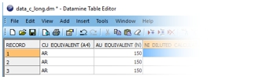

# Short and Long Field Modes

Prior to **May 2018** , field names within Datamine files were restricted to a maximum of 8-characters for both single- and extended-precision files. 

**In 2018** , starting with Studio RM 1.4 and Studio EM 2.3, support for 24-character field names was introduced for extended-precision files. Single-precision files still incur an 8-character restriction regardless of operating mode.

This introduces a potential break in compatibility with earlier application versions. The purpose of this document is to explain how these changes may affect you.

  * A legacy system (8-character limit) will be referred to throughout this document as a Short-Field systems and modes. 

  * A system supporting up to 24-characters will be referred to as a Long-Field system.

Since **January 2023** , all Studio products permit long field names.

## Long Field Name Systems

Long-Field systems permit a field name of up to 24-characters, regardless of the mechanism used to define it:

This includes:

  * Using the Table Editor installed with the long-field system (to create or modify data definitions).

  * Using interactive commands such as add-attributes, the [Datamine Attribute Manager](<Attribute_Manager.md>), the [Data Object Manager](<Data%20Manager%20Dialog.md>) and so on.

  * Using processes (or superprocesses) either interactively or by macro/script, where the process generates a field or modifies an existing one, e.g. **EXTRA** , **DILUTMOD** , **ADDDD** etc.

  * This includes reference to field names in an external file (e.g. &**FIELDLST**).

  * Setting object column names through a direct data connection such as **DHLogger** , **SampleStation** etc.

  * Setting field names directly using script (e.g. accessing DmFile or DmFileADO objects).

  * Importing data in Datamine or non-Datamine formats where the incoming column name is >8 characters.

## Compatibility with Earlier Versions

To implement extended field name support in Studio, changes have been made to core functions, including prerequisite functions such as **Table Editor** and **Data Source Drivers**.

The table below summarizes behaviors when swapping data between Short-Field and Long-Field systems:

## Summary

  * The only chance of unexpected behaviour arises from sharing data files with extended field names between Long-Field and Short-Field systems. If there is no intention to do this, you can use extended field names without impact.
  * Loading a file containing extended field names into a short-field system will not change its data definition but a restricted view of that data will be presented to the legacy application. Saving a loaded file (with truncated or obviated field names) in the Short-Field system will change the DD, however be careful!
  * If a mode has been locked by an application in the current Windows session, it is necessary to log out and back in to change the system mode.

  * Legacy Studio applications will continue to be restricted to 8-character attribute names regardless of the operating mode. All newer systems running in Short-Field mode will behave in the same way, i.e. be restricted to 8-character attribute names.

Related topics and activities

  * [Attributes Overview](<Attributes.md>)

  * [Attribute Naming Conventions](<Attribute_Naming_Convention.md>)

  * [The Attribute Manager](<Attribute_Manager.md>)

  * [Edit Attributes Dialog](<edit%20attributes%20pick%20dialog.md>)