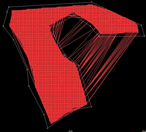
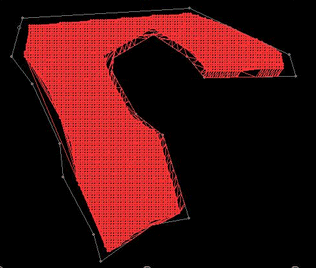
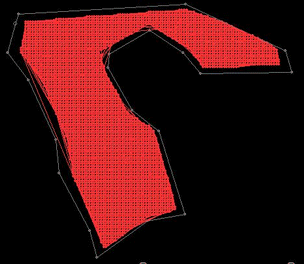
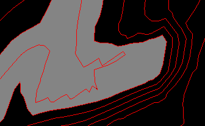
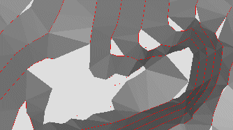
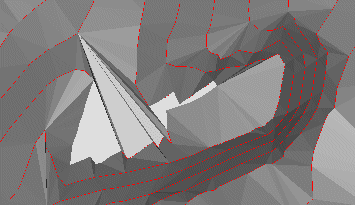
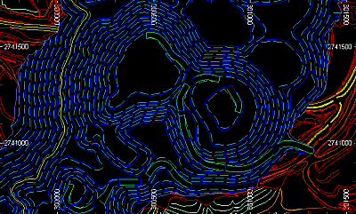
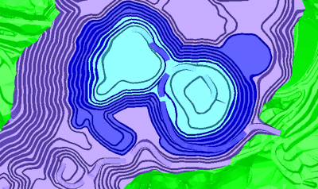
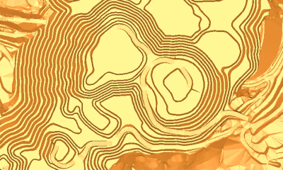
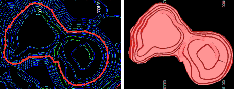

# Make DTM: General Options

To access this screen:

  * Display the [Make DTM](<Make_DTM_Dialog.md>) wizard. The **General Options** screen displays by default.

The Make DTM wizard is used to create a digital terrain model from loaded string or points data. It does this by displaying the following screens in sequence.

**Note** : The default settings for this screen are set at the project level, using the [Project Settings](<Project%20Settings_DTM.md>) screen. The screen layout and function is identical to the General Options screen (see below), with the exception of the output object destination, which is absent.

### Boundary String Settings

If Use Boundary Strings is selected, the [Make DTM: Select Boundary Strings](<Make_DTM_Boundary.md>) displays later in the wizard flow.

Boundary strings can only be used if the original object used to create the DTM (the object(s) selected on the following screen) are of the string type. Although you can create DTMs from point objects, you will not be able to combine this with a boundary-trimming operation (instead, you will need to generate the full DTM first, then trim it afterwards).

Any number of boundary strings can be specified, with the system using the left-to-right rule to determine whether the string is an outer or inner limit. By default, the first string encountered will be assumed to be an outer limit, then the next, an inner limit and so on.

#### Invert Results

There can be multiple outer limits, and multiple inner limits within an outer limit. Where the first string defines the inner limit (e.g. there is only one string), choosing Invert Results reverses this left-to-right logic.

#### Remove Entire Triangles

The default setting for creating a DTM with boundary strings, that is, with this setting disabled) creates a DTM using all provided strings and vertices, and then precisely cuts those triangles against the boundaries formed by the boundary strings, re-triangulating any triangles cut by the boundary string. 

Checking **Remove entire triangles** forces a similar process, but any triangles which are cut by a boundary string are removed in their entirety, rather than being re-triangulated.

For example, the following DTM was created with Use boundary strings unchecked (the boundary string is shown in grey but isn't used):

In the second example, Use boundary strings is checked, but Remove entire triangles is unchecked. This means that any 'bridging' splines are cut at the point they reach the boundary and then reformed into new triangles:  
  

Finally, with both **Use boundary strings** and **Remove entire triangles** unchecked, triangles are removed completely if they intersect with the boundary line:  
  

#### Minimize Flat Triangles

When generating a mesh from contours, facets may connect to the same contour line. Selecting this option will perform a pass after the initial tessellation to flip connections to minimize this effect. 

The effect of this setting can be hard to visualize, but is best described by means of an example. The following image shows a magnified section of a topographical contour string file. The area highlighted in grey represents the area where most 'decision making' must be made by any surfacing routine, due to the multitude of options for connecting separated vertices:

;>)

If **Minimize Flat Triangles** is checked, connections to the same contour line are minimized. Following the above example, this results in a surface like this:

;>)

Whereas, if no attempt is made to eliminate triangles sharing the same alignment ( Minimize Flat Triangles is unchecked), connected to the same facet, the result in this case is similar to this:

;>)

### Data Spurs

Flat zones on a surface triangulation are often undesirable and can occur frequently when a surface triangulation is formed for a contour set that is somewhat sparsely separated. A thin section of contour will often connect to itself, forming a flat bridge that is undesirable. The spur generation will identify and classify each flat zone in the triangulation according to _Crest_ , _Valley_ and key zones:

A Crest zone is where all boundary edges belong to adjacent triangles that connect to a lower level. Adjust Crest Heights By would be a positive number to increase the crest elevation. As a guideline, it is recommended that the height setting is at least half the distance upwards between contour strings.

A Valley zone is where all the boundary edges belong to adjacent triangles that connect to an upper level. Adjust Valley Heights By can be used to reduce the valley elevation by setting a negative number. 

Tip: As a guideline, it is recommended that the height setting is at least half the distance downwards between contour strings.

_Key spurs_ are similar to a crest or valley spur, but are generated when some of the boundary edges may not have adjacent triangles (on the edge of the resulting model). Note that no adjustment value is possible with this setting; the algorithm will dynamically assign the height to a value between the contour levels as it moves along the spur skeleton polyline.

### 

### Make Diagonals Consistent

You can form a DTM from one or more input string or points objects (or a combination). However, where point data is common between multiple objects (meaning there are coincident data points in the set used to form the DTM), it is possible for surface triangulation to be performed in a different way, and often unexpectedly so, compared to the outcome if data were sourced from a single object (without coincident points). 

To mitigate this possibility, the Make Diagonals Consistent option can be checked to ensure the surface generated between disparate data sets is performed identically, ensuring the combined DTM matches the triangulated output from a single data object input.

Note: Selecting this option can introduce a performance hit, so where large coincident data overlaps are known to occur between input objects, it may be more efficient to combine data first into a single object (say, using the [Copy from Object(s)](<CopyDataFromDialog.md>) screen) before generating a DTM.

### Define General DTM Settings

To define general settings for a digital terrain model:

  1. Load string or points data that will be used as a basis for a digital terrain model.

  2. Display the **Make DTM** wizard.

  3. Decide if **Output** wireframe data is stored within the [Current Object](<Concept_Current_Object.md>), or if a **New object** will be created to store it (rename the object if you like).

  4. Define your **General Options** :

     * Use boundary strings Check to display a [Select Boundary Strings](<Make_DTM_Boundary.md>) screen later as part of the wizard flow.

       * Invert Results Reverse the logic used to manage DTM creation where multiple outer or inner limits exist (see "Boundary String Settings", above).

       * Remove entire triangles Decide what happens with triangles that are intersected by a boundary string (see "Boundary String Settings", above).

     * Minimize flat triangles Control what happens to multiple wireframe facets connecting to the same contour line during DTM creation (see "Boundary String Settings", above).

     * Breakline tolerance Honouring breaklines (the positions of string vertices) unequivocally when generating a DTM wireframe can lead to degenerate sliver triangles. The extent to which this may occur will depend on the position and density of initial string triangles. Opting to include a Breakline Tolerance will allow these positions to deviate by the specified amount to minimise this effect.

     * Make diagonals consistent If you are using multiple input objects to create a DTM (selected on the [Make DTM: Select DTM Points and Strings](<Make_DTM_Points_Strings.md>) screen shown next), you should consider checking this to ensure triangulation is managed in a consistent way where point duplication exists between objects. See Make Diagonals Consistent.

  5. Choose the 3D **Plane** direction used to create a DTM surface:

     * Plan Use the horizontal XY plane, which is often useful for topography generation.

     * View Use the current view plane to generate a surface.

Warning: Care should be exercised when creating a DTM using view coordinates rather than world (XY) coordinates. For example, if the plan view is in use, but the view direction is set to a significantly different orientation, unexpected results can occur. For this reason, if you have configured a view direction with this type of deviation from the world plane, particular care should be taken in the definition of inner/outer limit strings.

     * Best Fit Use the mean plane of the selected data to control the plane used for DTM creation.

  6. Choose data **Trimming options** :

     * Trim edge triangles The convex hull created by the DTM process may contain thin 'sliver' triangles. Check Trim Edge Triangles to have these recursively removed from the edge of the wireframe until the specified parameters have been satisfied. Once selected, the following options become available:

       * Minimum Angle Remove any triangles which have a vertex angle less than the user-specified minimum.

       * Max. edge length Select this option to remove any triangles with an edge longer than a specified amount.

  7. Choose whether data spurs are generated during DTM creation, and how:

     1. Generate crest spurs

     2. Generate valley spurs

     3. Generate key spurs

     4. Output spur objects Check to see the spur strings which were generated for use within the DTM creation. This will output spur strings a new strings object. The type of the spur (Crest, Valley, Key) is stored in its **TYPE** attribute.

**Note** : See "Data Spurs", above, for a detailed explanation of these settings and concepts.

  8. There are several different ways to define the **Attributes** which will be contained within the DTM. All of these options are mutually exclusive:

     * Use First Point/String Copies all non-system attributes from the first string or point encountered when generating the DTM. The precise string or point is essentially undefined, so this option is primarily intended for copying general attributes where the input strings share a common set of attributes (such as colour).

     * Use All Points/Strings Post-processes the DTM and attempt to match each point (or string vertex) to any wireframe triangles which shares the vertex, and will then copy all non-system attributes to those triangles.

     * Inside DTM Strings If selected, all closed strings found in the selected base string object (that is, the object selected on the Select DTM Points and Strings panel (see below) are used when determining the attributes of the resulting wireframe. In other words, when wireframe vertices are created, the attributes used to colour the resulting triangles is determined by the attributes of the innermost closed string surrounding the positions of those vertices. 

**Note** : Strings that are not closed are not included in the attribution process.

In the following example, the image at the top represents the base strings used to generate a DTM. The image in the middle represents the wireframe mesh that results from the command if Inside DTM Strings is checked. The image at the bottom represents another DTM generated, this time, with Use first point/string checked:

;>)

;>)

;>)

The important point to note about the central image is that, despite the presence of green pit road strings rising out of the pit base in the original image, these strings are not closed, and as such, it is either the surrounding blue bench strings that are used to colour these features or the cyan colour representing the lower pit contours - this is because these are the closest closed strings the encapsulate the wireframe triangle centroids of the pit road. Similarly, the extensive green area surrounding the pit contours doesn't tally with the first image; this is expected as the red / turquoise / orange contours do not represent fully closed strings. Although not shown in the image, the entire surrounding topography is enclosed by a green contour line, and it is the green attribute that is used to colour this DTM region.

The orange mesh generated in the final image is due to the first vertex generated for the DTM being matched to the underlying data point, which happened to carry an orange COLOR attribute.

Warning: Closed strings used to define attributes should not be overlapped by other strings, as this can cause unexpected results in the DTM with regards to the attributes that are selected. As attributes are always taken from the innermost closed string, if this is traversed by another closed string (that is, the internal areas overlap), the resulting attributes will be taken from both strings, according to the order in which they were originally digitized). Where possible, ensure that strings do not overlap before generating your DTM.

Note: A string is regarded as being _inside_ another string if any point in the first string falls clearly inside the polygon defined by the second string. In the event that all the points of the first string fall exactly on the polygon defined by the second string, the test will be repeated using segment mid-points from the first string. No tests are made for overlapping strings. The results will be undefined in this case.

     * Inside boundary strings Only available if Use Boundary Strings is checked (see above). Similar to the above command, you can specify that wireframe data attributes can be derived from boundary strings, resulting in all wireframe triangle centroids falling within the specified boundary strings being attributed the relevant values from those strings.

Consider an example where a boundary string object has been digitized, as shown by the image on the left. If that string object was selected as the boundary, and Inside boundary strings checked, the resulting DTM mesh would be as shown on the right:

;>)

Note how, in this case, it is the boundary string attributes that are used to color the resulting wireframe data.

     * User-Defined If checked, the final stage of the wizard is the [Edit Attributes](<edit%20attributes%20pick%20dialog.md>) screen. This lets you customize DTM (and other object) attributes and values.

  9. Click **Next** to display the [Make DTM: Select DTM Points and Strings](<Make_DTM_Points_Strings.md>) screen.

Related topics and activities

  * [Make DTM](<Make_DTM_Dialog.md>)

  * [Make DTM: Select DTM Points and Strings](<Make_DTM_Points_Strings.md>)

  * [Make DTM: Select Boundary Strings](<Make_DTM_Boundary.md>)

  * [Make DTM: Edit Attributes](<Make_DTM_Attributes.md>)