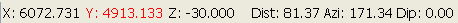

# Mouse Position

To access this screen:

  * **Home** ribbon **> > Query >> Position.**

  * In the [Status Bar](<Interface_Status%20Bars.md>), double click displayed section or coordinates information.

The Mouse Position screen lets you view, set and lock the coordinates of the cursor in a **3D** view. This could be useful in many cases, such as:

  * Digitizing data points e.g. survey points, drillhole collar locations, mapping points.

  * Modeling geological features e.g. a fault trace on surface, a mapped geological contact.

  * Designing mine layouts or workings e.g. when starting a road centre line from a known position; using the Circle by Radius command to create a shaft.

You can also use this screen to query distance and direction between successive selected (clicked) cursor positions.

**Tip** : Design your own cursors using the [ Custom Cursors](<CursorEditor.md>) screen.

## Locking the Cursor

The X, Y and Z co-ordinates of the mouse position are always displayed at the bottom of the main window in the Status Bar, for example:  

   

These coordinates are also displayed on the Mouse Position screen which can be used to view or lock the cursor position. Locking of any of the co-ordinate axes prevents mouse movement in that direction. The following three 'locking' scenarios are possible:

  * Locking 1 coordinate restricts cursor movement to a plane.

  * Locking 2 coordinates restricts cursor movement to a line.

  * Locking all 3 coordinates restricts the cursor position to a point.

In a **3D** window, if the view plane is in an orthogonal view, the X, Y or Z value may not change during mouse movement. For all other non-orthogonal views, movement of the cursor will always show changing X, Y and Z coordinate values.

Locked axes are have coordinate values highlighted in red in the Status Bar, as shown below (here the Y coordinate is locked):  

To measure the distance between two or more points:

  1. If required, display data to be measured in any **3D** window.

  2. Tap, or click with the left or right (snap) mouse button to enter an origin point, from which measurement will be taken.

**Current** displays zero. This is because no measurement is yet possible.

**Note** : Clicking will honour your current data snapping settings so you can measure between existing data points easily.

  3. If using a mouse, move the cursor.

The distance between the cursor position and the first point displays in the **Current** field, which updates dynamically during mouse movement.

**Gradient** and **Azimuth** also update to show the relative directional change between the first point and the current mouse position. If the currently active 3D section is horizontal, **Gradient** won't change during movement.

  4. Tap or click a second point.

**Total** displays the distance between the first and second clicked point. **Current** resets to zero.

  5. Tap or click subsequent points.

**Total** shows a sum total of all distances measured so far. Each time a new point is chosen, Current resets to zero to allow precise, relative mouse positioning if needed.

  6. To revert **Total** to zero, click **Reset**.

Related topics and activities

  * [ The Status Bar](<Interface_Status%20Bars.md>)