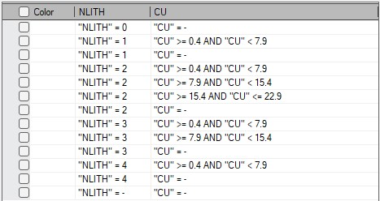

# Multiple Attribute Legend

To access this wizard:

  * Using the command line, enter create-multiple-attribute-legend
  * Use the quick keys 'cml'

The New Multiple Attribute Legend wizard generates a filter legend based on loaded data object attribute values or, for numeric values, nominated value ranges. Any combination of attribute values can be set up, meaning the resulting legend can, when applied to 3D view, highlight specific situations resulting from multiple influencing factors.

For example, you may want to create a legend with intervals representing geological zone and reserves category values, or highlight specific rock types for a subset of loaded drillholes and so on. 

It's a flexible tool that will let you construct a filter legend based on the values of attributes in a particular loaded object.

## Creating Legends in Studio Products

There are several ways of generating legends in Studio products:

  * You can define any type of legend using the [Legends Manager](<FormatLegendsDialog.md>).
  * You can create date-based legends using the [Create Date Legend](<Create_Date_Legend.md>) dialog.
  * You can quickly create a visualization legend using the [Quick Legend](<Quick_Legend_Dialog.md>) tool.
  * You can generate a filter legend based on one or more attributes values, using the Multiple Attribute Legend tool.
  * Several commands and functions within Studio will automatically create (and possibly assign) legends.

To create a multiple-attribute legend:

  1. Load the data from which you wish to create a filter legend. This can be any data from any source.
  2. Open the **New Multiple Attribute Legend** wizard.
  3. Select a loaded data **Object** containing the attribute(s) you wish to represent in your legend.
  4. Either accept the default Legend Name ("Multiple Attributes...") or enter your own.
  5. Choose a legend **Storage** option:
     * _Project_ \- save your legend as part of the project. If a project is sent to another user, its project legends will be available to that user.
     * _User_ \- typically, frequently used legends which are saved independently from the project. These legends are not stored with the project but instead are saved, as "User.elg" in the following location:  

**C:\Users\ <username>\AppData\Roaming\Datamine\Legends**

  6. Select one or more Attributes that will be referenced by your legend (use the header cell check box to select or clear all attributes in the list).
  7. For numeric attributes, you can either pick legend bin values from all unique numeric values of the attribute (which may be fine, say, for numeric lithological codes but not grades) or pick a range of values (which could be useful for categorizing grade cut-offs, for example).  
  
As such, the choices shown on the next screen are determined by the **Interval** selection:
     * _Value_ \- on the next screen, pick a condition of your legend filter from any unique value of the selected attribute. 

**Warning** : For some attribute types, such as grades, coordinate fields and so on, this could lead to generating a very long list of values.

     * _Range_ \- if value ranges have been configured (see below), you can choose to pick a value range to form a filter expression. If this is selected and no ranges have been defined, all unique values will be listed on the next screen.

  8. If you want to include a numeric value range in your legend filter expression, you will need to defined **Ranges**.

To define ranges for a target attribute:

     1. Use the **Ranges** browse button to display the **Create Ranges** screen. See [Create Ranges for a Legend Filter Expression](<MultipleAttributeLegendRanges.md>).
     2. Complete the required fields and **Create Ranges**. 
     3. Click **OK** to return to the **New Multiple Attribute Legend** screen.
  9. The **Ranges** column displays the number of ranges that will be used to build up a list of filter expression options on the next screen, combined with other selected **Attributes**.

**Note** : If you wish to use numeric value ranges to construct a legend, ensure _Ranges_ is selected in the **Interval** column. Otherwise, _Value_ will be set and all unique values of the attribute will be used to create filter expression permutations on the following screen.

  10. Click **Next**.

At least one attribute must be selected to continue, and a **Legend Name** must also be specified (one is created automatically, but you can change it).

**Note** : if you select an attribute containing more than 500 values, you will see a warning, but can still continue if you wish.

The filter expression list displays.

  11. Choose from a list of all possible value combinations between all selected attributes using the check box on the left side of the screen.

Each attribute is represented by its own column, preceded by a check box. In the example below, two attributes are utilized; NLITH is a numeric rock code (all unique values are included) and CU is a grade attribute comprising 3 ranges for reserve reporting:

  12. Click Create.

A filter expression legend is generated.

You can apply your legend to any object through the usual means (e.g. via a 3D object properties screen).

Tip: Legends can be edited further after creation (for example, to change the name of the legend interval), using the [Legends Manager](<FormatLegendsDialog.md>).

Related Topics and Activities

  * [Multiple Attribute Legend Ranges](<MultipleAttributeLegendRanges.md>)
  * [Legends Manager](<FormatLegendsDialog.md>)