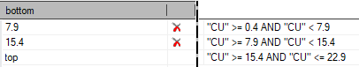

# Multiple Attribute Legend Ranges

To access this screen:

  * On the [Multiple Attribute Legend](<MultipleAttributeLegend.md>) screen, select the **Ranges** browse button.

The New Multiple Attribute Legend wizard generates a filter legend based on loaded data object attribute values or, for numeric values, nominated value ranges. See [Multiple Attribute Legend](<MultipleAttributeLegend.md>).

The **Create Ranges** screen is used to generate filter expressions relating to a range of numeric values of a target attribute. A range is, essentially, a legend 'bin' that will be matched against the value of a loaded data object for visualization or evaluation purposes.

To create ranges within the numerical scope of an attribute:

  1. Display the **Create Ranges** screen.
  2. Choose the **Distribution** of values that fall within the full range of available numeric values of the target attribute. 
     * _Linear_ \- values will be categorized within ranges that are spread out uniformly throughout the range of all possible values. In other words, the 'size' of each range will be the same in the generated legend.
     * _Log_ \- a logarithmic distribution (also known as the logarithmic series distribution) is a discrete probability distribution. This differs from a _linear_ distribution in that with a linear version, the gaps between interval start points are governed by a standard and fixed amount. 

This amount can be derived from the value range itself (using an _Equal Interval_ **Type**), or by the number of itemswithin a range (_Equal Population_ **Type**). 

     * _Exponential_ \- this option will ensure that legend ranges are spread on an exponential basis throughout the total value range. In statistical terms, an exponential distribution is used to model Poisson processes, which are situations in which an object initially in state A can change to state B with constant probability per unit time (often referred to in mathematical equations as lamda or 'λ').

However, from a legends perspective, the exponential distribution is controlled by the number of items in a given category being used to define the end point of that category. The mathematics behind this calculation is complex, but, in practice, this calculation is likely to shift more items into the latter (higher) value categories. Both _Equal Width_ and _Equal Population_ types are available for this option.

  3. For the selected **Distribution** , choose how values will be assigned to a legend interval, that is, select a **Type**.

     * _Defined Interval_ \- only available if the **Distribution** is _Linear_. To categorize numeric data by explicitly defining an **Interval** size, use this option. For example, you want a legend to delineate all benches of 20m height throughout the pit. Setting a _Defined Interval_ of 20 and creating ranges would create equally-sized intervals throughout the data.

_Linear_ \- values will be categorized within ranges that are spread out uniformly throughout the range of all possible values. In other words, the 'size' of each range will be the same in the generated legend.

     * _Equal Interval_ \- this setting ensures the limits of each interval is determined by taking the minimum and maximum legend values and dividing the difference by the number of intervals specified. For example, if a minimum value of 10, and a maximum value of 200 is specified, and 10 intervals are required, the legend items is created with gaps of 19 (200-10 = 190, 190/10 = 19).

     * _Equal Population_ \- this is best explained using an example:

If a wireframe object has 20 coordinates for a Z value, ranging from 0 to 100, with 10 intervals, a legend with an _Equal Population_ **Type** will ensure that 10 database records is associated with each legend item

This will mean an equal number of distinct values being represented for each legend interval, but will not necessarily mean that the start and end values of each legend interval will be in a repeatable pattern. Note that this option will take longer to calculate,and may incur a small delay when display data items are associatedwith a legend of this type.

  4. If defining an **Equal Interval** or **Equal Population** legend, pick the number of ranges to create using **Count**. For example, if you want to split your CU grade values into 4 reporting categories, the **Count** = 4.
  5. Set the **Precision** level to be used to segregate numeric values. For example, if you only want to consider values to the 2nd decimal place, **Precision** = 2.
  6. In some cases, you may only want to consider attribute values between two values. For example, if you're aware that your input data contains outlier data points that could skew the assignment of interval ranges. In this case you can enable **Range filter** and enter a minimum and maximum value. Only values between the specified bounds will be considered when creating ranges. 

By default, **Range filter** is disabled, meaning all numeric attribute values will be considered when constructing ranges.

  7. Choose if you wish to generate filter expressions that **Include absent** data values as a category. By default, an absent ("-") numeric data range will be generated, but this can be disabled.
  8. Select **Create Ranges**.

The ranges table updates to show the numeric ranges that match your settings and attribute. Ranges are displayed in increasing value order from top to bottom.

The topmost interval will range from the lowest detected value (or whichever value is set as the minimum if **Range filter** is enabled) up to (but not including) the value shown in the leftmost column. 

Subsequent values range from the value in the preceding row up to (but not including) the next row, and so on. 

For example, the following image shows generated Copper value ranges and their corresponding filter expressions. The lowest detected attribute value is 0.4:

;>)

  9. Click **OK** to return to the [Multiple Attribute Legend](<MultipleAttributeLegend.md>) screen and continue filter legend creation.

Related Topics and Activities

  * [Multiple Attribute Legend](<MultipleAttributeLegend.md>)
  * [Legends Manager](<FormatLegendsDialog.md>)