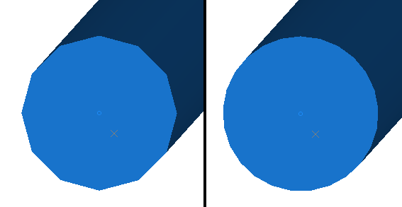

# Options: 3D General

To access this screen:

  * On the [Options](<Options.md>) screen, expand the 3D tab and select **General**.

This screen lets you define general settings for 3D window rendering. All 3D windows are affected by changes made on this screen, and as with all system options, applies to all future projects created using your application.

Also see [Environmental Settings](<../VR_Help/EnvironmentalSettings_Dialog.md>) for information on other view rendering options for the current project.

Option | Description  
---|---  
**Label** | Select Change to configure default label properties using the **Font** screen. Specify your **Font** , Font style, **Size** , **Effects** and **Colour**.  
Cylinder Segments |  Change the resolution of alignment string segments rendered using the **3D** setting and drillholes rendered using the **Default Cylinder** setting. This increases the number of cylinder 'faces'. For example, the image on the left below shows the end of an open string with Edge Cylinder Segments set to _12_. On the right it is set to _24_. ;>) Values between 3 and 25 are allowed. See [Strings Properties: Lines](<../VR_Help/Traces%20Properties%20Dialog%20\(Edge%20Visual\).md>). Also see [Drillholes: Style](<../VR_Help/DHPropDialog_Segments.md>)  
Edge Cylinder Cap Ends |  If **checked** , strings rendered in **3D** and drillholes displayed using the **Default Cylinder** display type have closed ends (as in the image directly above). If **unchecked** , this data is rendered without end caps.  
**Use Mipmaps** |  "MIP map" is the name given to a collection of images to be used as surface textures when building, or rendering, a 2D representation of a 3D scene. The acronym "MIP" comes from the Latin phrase: _multum in parvo_ which is translated as "many things in a small place". Each of the many images stored in the "small place", or Mipmap, holds a copy of the same texture but at a different scale from the others, each being known as a "MIP map level". The largest-scale copy of the texture is used on surfaces close to the observer's viewpoint; the next smaller-scale image is used on surfaces a little further away and so on. Using pre-scaled versions of a single texture saves the processing time that would be required to scale-down a large texture to make it usable on a "distant" surface. Scaling of textures is still usually necessary but, by selecting the version of the texture which is closest to the required scale, the scaling process takes less time and also the possibility of errors being introduced by the scaling process, and the consequent distortion of the texture, is reduced. **Note** : Using Mipmaps increases the overall load on your processor. If you are having performance problems rendering3Dviews, you should **uncheck** this option if it is checked.  
Make new wireframes shiny | Choose if wireframe data is displayed with reflective surfaces (**checked**) or a more flat-shaded approach (**unchecked**).  
Smooth view transitions |  **Check** to make view transitions in 3D windows smoother, by gliding from one orientation to another. **Uncheck** to immediately display a new chosen view direction in the 3D window  
Blended symbols |  If **checked** , symbols displayed in your 3D window have softer (anti-aliased) edges. If **unchecked** , symbols are displayed with hard edges (no anti-aliasing).  
**Align view to new sections** |  If **checked** , 3D views are automatically oriented to be orthogonal to new section definitions after creation. If **unchecked** , the view position and orientation is unaffected by new section definitions, unless requested via other means.  
**Selection Colour** |  Pick the colour you wish to display when highlighting objects in a 3D window.  See [Selecting 3D Data Interactively](<Selecting3DDataInteractively.md>). Also see [Environmental Settings](<../VR_Help/EnvironmentalSettings_Dialog.md>) for information on other view rendering options for the current project.  
Show / Hide Objects |   
**With Attached Wireframe** |  If **checked** , and **[3D Objects](<../VR_Help/3d_objects.md>)** are attached to a loaded wireframe object, when those 3D objects are hidden, so is the wireframe. If **unchecked** , the display of the associated wireframe is unaffected by the display of the 3D object attached to it. See [Create 3D Objects](<../VR_Help/3d_objects.md>) and [Placing Objects on Surfaces](<../VR_Help/Objects_Placing_objects_on_surfaces.md>). See also [VR Objects and Simulations](<../VR_Help/Objects_Simulation%20objects.md>) and [Stationary VR Object types](<../VR_Help/Objects_Stationary%20objects.md>).  
With Attached String | As above, but for 3D Objects attached to string data.  
External links |   
**Check on startup** |  If **checked** , your application validates links to external files associated with the 3D view when the project is loaded. If **unchecked** , these checks are not performed.  
NPV Scheduler files |   
**Detect Block Models** |  If checked, block models loaded into the 3D window are checked for Studio NPVS fields, and if found, the associated overlays are created. All NPVS overlays after the first are hidden by default. If unchecked, Studio NPVS overlays are not generated for loaded model data.  
**Interactive Section Editor** |   
**Rotate Around Mid Point** **Rotate Around Ref Point** | Control how your 3D sections react to mouse movement during****[interactive editing](<Section_Widgets.md>); either to rotate around the section mid point, or the point defined by coordinates on the [Section Properties](<../VR_Help/Section%20Properties%20Dialog.md>) screen(Section Ref Point).  
Orthogonal View  
Keep data in front of the camera |  If **checked** , data is visible at any screen magnification. However, when operating in this mode, data picking issues can occur due to the data on screen being such a tiny proportion of the overall hull of all loaded objects. If **unchecked** (the default setting) when you view data in a **3D** window and the data coordinates are very widely dispersed,(that is, the scene is very large) you can encounter issues relating to data precision when zoomed in a long way. The primary symptom is that 3D window data disappears beyond a particular zoom factor. **Note** : this setting only affects the display of data in 3D windows using [perspective mode](<../VR_Help/Perpective%20and%20Orthogonal%20Modes.md>).  
  
Related topics and activities:

  * [Options: 3D ](<Options_InTouch.md>)

  * [Options: 3D Initial States](<Options_InTouch-Initial-States.md>)

  * [3D Options: Stereo](<Options_InTouch-Stereo.md>)

  * [Options: 3D Printing](<Options_InTouch-Printing.md>)

  * [Viewing Data](<Interface_Viewing%20Data.md>)

  * [3D Design](<../VR_Help/Designing_in_VR.md>)

  * [3D Window Visualization](<../VR_Help/VR_Introduction.md>)

  * [External 3D Views](<External_3D_Windows.md>)

  * [Independent 3D Windows](<Independent_3D_Windows.md>)

  * [Clipping 3D Data](<../VR_Help/Clipping-Data.md>)

  * [Windows, Sheets, Projections and Overlays](<concept_views%20sheets%20overlays.md>)

  * [The View Hierarchy](<View%20Hierarchy.md>)

  * [3D Window Templates](<3D_Window_Templates.md>)

  * [3D Window Drawing Units](<3D%20Window%20Drawing%20Units.md>)