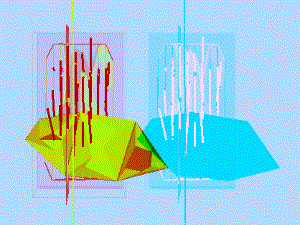
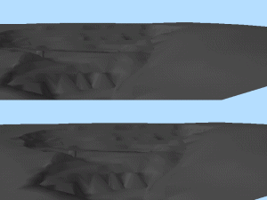
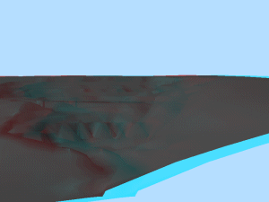

# 3D Options: Stereo

To access this screen:

  * On the [Options](<Options.md>) screen, expand the 3D tab and select **Stereo**.

Settings for control the display of stereo 3D views are found here. These stereoscopic modes are available:

Option | Description  
---|---  
Stereo Mode |   
Side by Side |  Generate an image with the stereo pair side by side on the screen (this can be useful for dual projector passive stereo configurations, and some handheld viewing aids). For example:   
Over and Under |  Generates an image with the stereo pair split horizontally on the screen (this can be useful for some older shutter glasses). For example:   
**Anaglyph** |  Provides a red/cyan anaglyph stereo image. This can be viewed with appropriately coloured glasses, and can be printed out to be viewed later using the same glasses. However, the glasses filters must match the monitor or printer colours for this mode to be effective. Also, extensive use of primary colors within the image should be avoided (grey scale would be better). For example:   
Other Settings |   
**Stereo Separation** Screen Distance |  Define the distance between the two eyes in the 3D world. It is rare that either of these settings match the physical world. **Tip** : if in doubt, set **Screen Distance** to 1 and **Stereo Separation** to 0.1, and then use the appropriate controls within the stereo session.  
Flip Views | There is no formal standard for the order in which the images forming the stereo pair are presented to hardware, and in some cases this may result in the stereo being inverted (left eye sees what the right eye is supposed to be seeing or the other way round). In this case, checking this option reverses the order in which the images are presented.  
**Show Grid** |  If **checked** , the stereo image is overlaid with a simple grid structure. This is intended to aid the alignment of twin projector passive stereo systems. If **unchecked** , no grid is displayed.  
  
Related topics and activities:

  * [Options: 3D ](<Options_InTouch.md>)
  * [Options: 3D General](<Options_InTouch-General.md>)

  * [Options: 3D Initial States](<Options_InTouch-Initial-States.md>)

  * [Options: 3D Printing](<Options_InTouch-Printing.md>)

  * [Viewing Data](<Interface_Viewing%20Data.md>)

  * [3D Design](<../VR_Help/Designing_in_VR.md>)

  * [3D Window Visualization](<../VR_Help/VR_Introduction.md>)

  * [External 3D Views](<External_3D_Windows.md>)

  * [Independent 3D Windows](<Independent_3D_Windows.md>)

  * [Clipping 3D Data](<../VR_Help/Clipping-Data.md>)

  * [Windows, Sheets, Projections and Overlays](<concept_views%20sheets%20overlays.md>)

  * [The View Hierarchy](<View%20Hierarchy.md>)

  * [3D Window Templates](<3D_Window_Templates.md>)

  * [3D Window Drawing Units](<3D%20Window%20Drawing%20Units.md>)