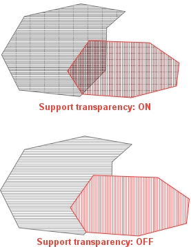

# Plots Options

To access this screen:

  * [Options](<Options.md>) screen **> > Plots**.

Configure settings relevant to the Plots window, including default page and printing settings.

## Default Page Setup

Specify how your Plots window output is formatted:

  * Paper Size and Orientation Choose _Portrait_ or _Landscape_ orientation for new plot pages. 

Note: This does not adjust existing plots.

  * Width/Height Edit the default width and height new plot sheets.

  * Margins Set the default page margins using the four fields in this area. 

## Default Font

Click **Edit** to choose a default font for new plot items containing annotation.

Note: This does not affect existing plot items.  

## Printing

Plots window printing options:

Automatically adjust printer page... If **checked** , printer page settings are amended to match those of your plots window (see "Default Page Setup", above).

Bitmap Handling Options to control how bitmap images are handled during printing:

  * Proportional Scaling (default) Images are scaled proportionally, maintaining their aspect ratio.

  * No Scaling Images are not scaled.

  * Average Colour Fill Use an averaging algorithm to represent overlapping data caused by the scaling process.

Support transparency If **checked** , closed string data filled with hatching and transparency is rendered, if possible, when printing a plot to a PDF printer driver, for example:  
  

Note: Some PDF printer drivers are unable to process transparencies as expected, so, if you find your PDF output doesn't represent your hatch-filled strings in the same was as rendered in the **Plots** window, you may need to uncheck this option.

Related topics and activities

  * [System Options](<Options.md>)