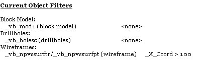
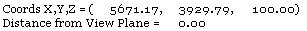

# Output Control Bar

To toggle the display of this control bar:

  * **Home** ribbon **> > Show >> Output Bar**.

The Output control bar is used to view the results and reports of some application processes, such as querying the current filters used, or querying a specific item of data such as the length of a string.

As other control bars, the **Output** control bar can be repositioned, floated and docked. See [Customizing Control Bars](<Customizing.md>).

Note: Copy selected **Output** control bar text to the clipboard using CTRL+C.

### Output Control Bar Examples

To report existing filters in the Output control bar:

  1. Display the **Output** control bar.

Run the command [query-current-file-filters](<../command_help/query-current-file-filters.md>) (quick keys "qf").

Each loaded object is listed in the Output control bar along with any associated filter expressions that may exist, for example:  
  

To show the statistics of a data point in the Output control bar.

  1. Display the **Output** control bar.

  2. Run the command [query-points ("qp")](<../command_help/query-points.md>) (quick keys "qp").

  3. Information relating to the selected point is now listed in the Output control bar, for example:  
  

Related topics and activities

  * [Data Selection Control Bars](<Studio%203%20Browsers.md>)

  * [Customizing Control Bars](<Customizing.md>)

  * [The Project Files Control Bar](<Concept_Project%20Files%20Control%20Bar%20Overview.md>)

  * [Properties Control Bar](<properties%20control%20bar%20overview.md>)

  * [Quick Filters - More Information](<QuickFilterLegendDialog.md>)

  * [Loaded Data Control Bar](<Loaded%20Data%20Control%20Bar.md>)

  * [Command Control Bar](<command%20control%20bar%20overview.md>)