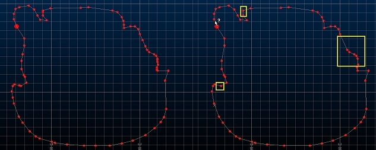
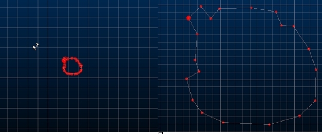

# Percentage Reduction

To access this screen:

  *   *   * **Explicit** ribbon **> > Condition >> Condition >> Percentage Reduction**.

  *   * Using the **[command line](<Command_Toolbar.md>)** , enter "reduction-percentage"

  *   * Use the quick key combination "pre".

  *   * Display the **[Find Command](<findcommand.md>)** screen, locate **reduction-percentage** and click **Run**.

Used in connection with the [reduce-points ("red")](<../command_help/reduce-points.md>) command to determine the extent of point reduction. 

The value supplied is a percentage of the overall number of original points. 

**Tip** : consider the **[simplify-string](<../command_help/simplify-string.md>)** as an alternative to string conditioning.

### Reduce Points Automatically (Example)

With this option selected, the string will be simplified according to its visible shape; if you are zoomed in to show the shape of a string in high detail, the chance of point reduction is comparatively low compared to a zoomed out view of the same string, where details are less obvious.

Where possible, the visible integrity of the string will be maintained.

For example, the string below, zoomed in to show details is reduced, resulting in the output on the right. In this case, the reduction of points is relatively low as not many can be removed without adversely affecting the visible shape of the string:

;>)

Zooming out to show the original string as a less detailed shape, then running reduce-points, removes more points as it is the zoomed out shape that is preserved.

In the image below the original string is zoomed out to the relative scale shown. The image on the right shows the string after reduce-points, and returned to its previous scale:

;>)

In this case, the reduction was applied whilst the shape was less detailed, so it was the less detailed shape that was preserved. 

In effect, zooming out is likely to result in a more pronounced reduction of points than at larger scales, although this will depend on the original shape of the data.

### Reduce Points on a String

To set the extent of reduction when using the reduce-points command:

  1. Run the command.

  2. Choose either:

     * Reduce points by [n] %: enter the percentage by which points will be reduced on the selected strings, when reduce-points is used.

     * Reduce Points Automatically: use the current screen magnification to determine the amount of point reduction. See the example above.

  3. Click OK, then run the [reduce-points](<../command_help/reduce-points.md>) command to select strings and apply the reduction.

  4. Save your project.

Related topics and activities

  * [reduce-points](<../command_help/reduce-points.md>)

  * [simplify-string ("sps")](<../command_help/simplify-string.md>)