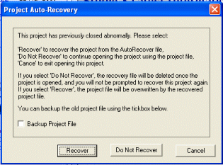
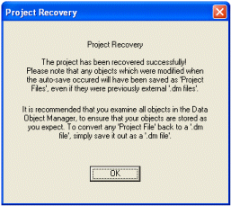

# Project Settings: Autorecover 

To access this screen:

  * On the [Project Settings](<ProjectSettings.md>) screen, select the Autorecover tab.

_Autorecover_ can help you to retrieve your project data if an application session is closed unexpectedly, or you forget to save data manually.

When a project is closed, that project is 'flagged' as being safe for reloading. This tag is added when any expected close function is performed. However, if your application is forcibly closed (e.g. using Windows Task Manager) or as a result of unexpected system behaviour, your system will allow you to recover your project at its last automatically saved state.

**Note** : automated project saving is recommended to avoid unexpected loss of data. However, project saving will temporarily suspend other processing so it is important to pick a save frequency that allows you to work without unnecessary disruption.

### How does Autorecover work?

Every time you open an existing project, and automatic saving is enabled, a check is made to ensure the project was not closed unexpectedly (see above). If the file was saved correctly, the project file is opened without any further prompts. This flag is automatically removed each time a project is successfully opened and only replaced if project closing is as expected.

If your application does not encounter this 'all clear' when opening a project (and automatic saving is enabled for that project), a check is made to see if an automatically saved 'temporary file exists (this file is normally stored in your documents and settings folder). If it exists, this is likely to be the result of improper closing of a project and you are shown an option dialog as shown below:  
  

At this point, you have the following options;

  * Recover: load the temporary file that has been detected on your system. This will load the project as it was last auto-saved. If selected, you will be shown the following dialog when project load is complete:  
  
  
  
Any object loaded into memory at the time the autorecover file was created (at the specified interval - see below) is stored within the project file, and will not have been used to overwrite any existing, standalone Datamine files. This is by design, as it allows you to view the archived data information before committing it to a physical file (either by overwriting the existing file or by creating a new one).

  * Do Not Recover: select this button to load the project at its last manually saved state, ignoring the temporary autosave file.

  * Cancel: abort the project opening operation. Note that the dialog will be redisplayed the next time the same project is opened.

One final option - Backup Project File \- will create a copy of the current project (in the project directory) before loading it (regardless of whether autorecovery is launched or not).

To define Auto Recover settings:

  1. Display the **Auto Recover** settings screen.

  2. Select if automatic saving is performed:

     * If **Enabled** is **checked** , your project is automatically saved at the selected time interval (see below).

     * If **unchecked** , no automatic saving is performed an you will have to manually save your project to protect against unplanned data loss.

  3. If automatic saving is enabled (see above), choose the time **Interval between saves**. 

**Note** : the next automatic save is performed at the predefined interval after the Project Settings screen is dismissed.

Related topics and activities

  * [Project Settings](<ProjectSettings.md>)

  * [Studio Projects](<Concept_The_Studio_3_Project_File.md>)

  * [Archive Project Data](<archiving.md>)