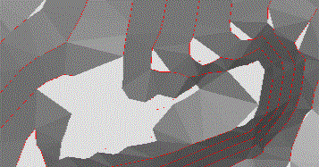

# Project Settings: Digital Terrain Models

To access this screen:

  * On the [Project Settings](<ProjectSettings.md>) screen, select the Digital Terrain Models tab.

  * **Explicit** ribbon **> > DTM >> DTM Settings**.

A digital terrain model is an open wireframe mesh, normally used to intimate the presence of a topographical surface, although it is also used to denote fault planes or any other planar geological domain. To use this command, at least one string object must exist in memory.

**Note** : setting defaults can also be set using the [Make DTM](<Make_DTM_Dialog.md>) wizard. 

To define digital terrain modelling settings:

  1. Display the **Digital Terrain Models** settings screen.

  2. Choose **General Options** for modelling DTMs:

     * Use boundary strings

       * If **checked** , introduce a third (and final) screen to the **Make DTM** wizard, in which you specify a string file that demarks the positions of a mesh boundary. All data outside of this closed string is removed from the resulting DTM object.

Any number of boundary strings can be specified, with the system using the left-to-right rule to determine whether a string is an outer or inner limit. By default, the first string encountered is considered an outer limit, then the next, an inner limit and so on. There can be multiple outer limits, and multiple inner limits within an outer limit. Where the first string defines the inner limit (for example, there is only one string), choosing Invert Results reverses this left-to-right logic.

       * If **unchecked** , DTM modelling occurs without a boundary constraint.

     * Minimize flat triangles

When generating a mesh from contours, facets may connect to the same contour line.

       * If **checked** , a check of initial tessellation is performed, and connections are flipped to minimize this effect of these connections.

Consider the following example, which shows a magnified section of a topographical contour string file. The area highlighted in grey represents the area where most 'decision making' must be made due to the multitude of options for connecting separate vertices:  
  

In this situation, settings made in the **Make DTM** wizard can have a significant effect on how the DTM is generated in this area. If the **Minimize Flat Triangles** option is checked, connections to the same contour line is minimized. Following the above example, this results in a surface similar to the following:

       * If **unchecked** , no attempt is made to eliminate triangles sharing the same alignment, connected to the same facet, the result in this case would be similar to the following image:

     * Breakline tolerance: honoring breaklines (that is, the positions of string vertices) unequivocally when generating a DTM wireframe can lead to degenerate 'sliver' triangles. The extent to which this occurs depends on the position and density of initial string triangles. 

       * If **checked** , vertex positions will be allowed to deviate by the specified amount to minimise unwanted degenerate faces.

       * If **unchecked** , vertex positions will not be modified to avoid slivers and degenerate faces may occur.

  3. Choose the **DTM Plane** used for DTM surface normalization. Typically, this is a horizontal plane, but a custom orientation may be required in some cases.

     * **Plan** the default setting, meaning triangulation is performed (where possible) to produce surface normals that are orthogonal to a horizontal plane.

     * **View** the current view direction is used to orient normals. If using this setting, you will need to orient the view appropriately before running the **Make DTM** wizard.

     * **Best Fit** project normals using a 'best fit plane' approach. The orientation is set to the mean plane of loaded data. This is useful if a custom, but obvious linear trend is apparent in the DTM input data.

  4. A convex hull created by the DTM process may contain thin 'sliver' triangles. Checking Trim Edge Triangles initiates an attempt to recursively remove these from the edge of the wireframe until the specified parameters are satisfied. Once selected, the following options become available:

     * Minimum Angle**check** to remove any triangles which have a vertex angle less than the user-specified minimum.
     * Max. edge length**check** to remove any triangles with an edge longer than a specified amount.

  5. When generating DTMs from a series of contours, plateaus can often be created on the upper or lower contours. _Spur strings_ can be used to minimise this effect by using interpolation of the surrounding slopes to extend the gradient past the plateau level.

The following Spur options are available:

     * Generate crest spurs**check** to create and use crest spurs. Adjust Crest Heights By would be a positive number to increase the crest elevation
     * Generate valley spurs**check** to create and use valley spurs. Adjust Valley Heights By is a _negative_ number to reduce the valley elevation.

     * Generate key spurs**check** to create and use key spurs.

     * Output spur Objects**check** to see the spur strings generated during DTM creation. A new strings object is created, where the type of the spur (Crest, Valley, Key) is stored in its TYPE attribute.

  6. Define the **Attributes** stored in the generated DTM.

     * Use First Point/Stringcopy all non-system attributes from the first string or point encountered when generating the DTM. The precise string or point is essentially undefined, so this option is primarily intended for copying general attributes where the input strings share a common set of attributes (for example, colour).

     * Use All Points/Stringspost-process the DTM and attempt to match each point (or string vertex) to any wireframe triangles which shares the vertex, and will then copy all non-system attributes to those triangles.

     * User-Definedallows the [Edit Attributes](<edit%20attributes%20pick%20dialog.md>) screen to be used to define the attributes and values which will be used during DTM creation.

Related topics and activities

  * [Project Settings](<ProjectSettings.md>)

  * [Make DTM](<Make_DTM_Dialog.md>)

  * [Edit Attributes](<edit%20attributes%20pick%20dialog.md>)