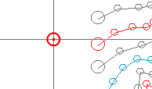
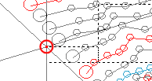

# Project Settings: Data Display

To access this screen:

  * On the [Project Settings](<ProjectSettings.md>) screen, select the Data Display tab.

Manage 3D window crosshair and grid font formatting.

## Cursor Crosshairs

If **Display Cursor Crosshairs** is checked, crosshairs extending from the cursor position in 3D windows.  

   

When cursor crosshairs are viewed from a non-orthogonal perspective, the grid lines show the X, Y and Z positions as projected onto the view plane. If you consider a single grid line at say X = 25, as you move the cursor along that grid line the X coordinate will be at X = 25 on the view plane, for example:

Note: The cross hairs show the X, Y and Z directions in world space, not as projected onto the view plane, hence they do not necessarily align with a grid, if one is displayed.

## Grid Character Size

Click Grid Character Size to display the [Character Size Settings](<Project%20Settings_Character%20Size.md>) screen where you can change the way text is displayed on the grid overlay.

## Symbols

Choose the Default Symbol Size used when displaying symbols in the 3D view.

**Note** : This is just the default setting. You can edit the symbol size for any overlay after it is created.

Related topics and activities

  * [Project Settings](<ProjectSettings.md>)

  * [Character Size Settings](<Project%20Settings_Character%20Size.md>)