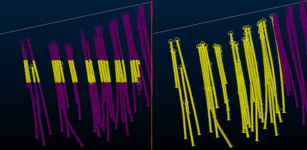

# Project Settings: Drillholes

To access this screen: 

  * In the [Project Settings](<ProjectSettings.md>) dialog, select the Drillholes tab.

  * Using the **[command line](<Command_Toolbar.md>)** , enter "toggle-drillhole-selection" to alternate between drillhole selection settings on this screen.

  * Use the quick key combination "tds".

This panel, part of the **[Project Settings](<ProjectSettings.md>)** dialog, determines how drillhole data is selected in a **3D** window.

For example, in the image below, box selection has been applied using the **Select drillhole samples** option (left) and the **Select entire drillhole** option (right). The selection scope is identical for both images:

The chosen selection method can be overridden by specific commands, for example, where independent sample selection is needed for the task at hand. Otherwise, the selection mode chosen here will be used.

**Tip** : Quickly toggle between the drillhole selection modes using the "tds" quick key combination whilst a **3D** view is active.

To change the drillhole selection method:

Choose one of the available options:

  * Select entire drillhole: when selecting data by any picking method (box selection, swipe selection, left-clicking or snapping), if a part of a drillhole is selected, all of it is selected. 
  * Select drillhole samples: if this option is enabled, only samples within the selection zone will be selected, potentially across multiple drillholes in view.

Related topics and activities

  * [toggle-drillhole-selection ("tds")](<../command_help/toggle-drillhole-selection.md>)

  * [Selecting 3D Data Interactively](<Selecting3DDataInteractively.md>)

  * [Selecting Wireframes](<selecting_wireframes.md>)