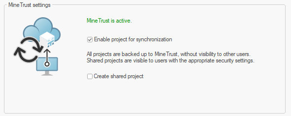
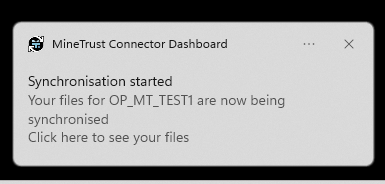
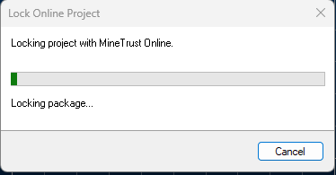

# Create a MineTrust-Enabled Project

Providing your local system is [configured to connect to a MineTrust cloud system](<../MineTrust/MineTrust-Aware-Projects.md>), you can generate a **MineTrust-Enabled** project and start data archiving and sharing straight away. A MineTrust-enabled project can provide the following benefits:

  * Project data is automatically uploaded to the cloud for secure storage as data is created and modified, protecting against unexpected data loss.

  * Other users that have access to the same MineTrust data store can see and (if permitted) access your project and data to collaborate with you.

You can utilize either one of the above (data backup or sharing), or both. You decide this on a project-by-project basis, and can change project settings at any time.

  * See [Open MineTrust Project](<Activity-Open-MT-Project.md>).

  * See [MineTrust-Enabled Projects](<../MineTrust/MineTrust-Aware-Projects.md>).

To create a new MineTrust-enabled project:

  1. Display the **New Project** wizard.

  2. If the **Welcome** screen displays, you can choose to **Skip this page in the future**. Click **Next**.

  3. On the **Project Properties** screen enter the **Name** of your project. This must be unique to the project location (see below).

**Tip** : consider using a consistent project naming convention.

  4. Either enter a **Location** for your project or browse for a local or network folder.

**Warning** : Windows folder paths cannot exceed 256 characters.

  5. Decide how file data that is already in the project folder is treated when proceeding to the next stage of the wizard:

     * If **Automatically add files currently in this directory when Next is clicked** is **checked** , project file references are added for all files in the **Location** when you click **Next**.

     * If **unchecked** , project files in the **Location** are ignored.

  6. Optionally, define more detailed **Project Settings** using the [Project Settings: General](<Project%20Settings_General.md>) screen. See [Project Wizard: Project Properties](<Project%20Wizard_Project%20Properties.md>).

  7. Click Next to display the **MineTrust Settings** screen.

  8. Review the current **MineTrust settings** service message.

     1. _MineTrust is not configured_ This can be displayed if you have installed MineTrust Connector, but there is no endpoint configured. You'll need to visit MineTrust Online as an Administrator to sort this out. Also see [MineTrust-Enabled Projects](<../MineTrust/MineTrust-Aware-Projects.md>).

     2. _MineTrust is active_ When **MineTrust Connector** is configured and is currently running, you can start synchronization.

     3. _MineTrust is not running_ **MineTrust Connector** is not running but has a configured endpoint. This is because the background service has stopped for some reason. You are also allowed to enable synchronization but will need to restart the service from the **[MineTrust Dashboard](<../MineTrust/MineTrust-Dashboard.md>)** or in Windows directly.

  9. Providing the _MineTrust is active_ status displays, **check** **Enable project for synchronization**. If **unchecked** , no data synchronization will occur during the project session.

  10. **Check** **Create Shared Project**. This allows your project and associated data to be shared with other validated users via MineTrust Online.

Note: You can adjust these settings later via the [Project Settings: MineTrust](<Project%20Settings_MineTrust.md>) screen.

For example, in the image below, the project and associated data will be hosted on the MineTrust cloud system, but won't be available for others to share (as such, when they attempt to **Open Project from MineTrust** , the project isn't listed):

;>)

  11. Click **Next** to display the [Project Wizard: Project Files](<Project%20Wizard_Project%20Files.md>) screen and continue configuring your project.

  12. Add or remove project files that you wish to associate with the project.

**Note** : you don't have to add files now. It can be done after project creation if you prefer.

Also see [Project Wizard: Project Files](<Project%20Wizard_Project%20Files.md>).

  13. Click **Next**.

The **Your project is ready to create** screen displays. See [Project Wizard: Create Project](<project%20wizard_create.md>).

  14. Review the project summary and click **Finish** to create your project.

**Tip** : access a project summary at any time using the [Project Properties: Summary](<Project%20Summary%20Dialog.md>) screen.

A new project file is created on disk and your new project opens. At this point, you will start to see data synchronization messages via the Windows tooltray, for example:

  15. Initially, your project is created in View Only Mode, meaning you can't do much other than change some 3D window visualization settings. You won't be able to create or edit data yet. To do this, click Enable Editing Mode.

A popup appears stating that project locking has started, for example:

This is an important stage of project creation as it ensures that, if you chose to share your project, other users won't be able to edit project data just yet. 

  16. Once locking completes, you have full and exclusive access to your project. Data changes are committed automatically. When you close your project (or choose to stop synchronizing data changes), the project is unlocked and becomes available to others to open.

Related topics and activities:

  * [MineTrust-Enabled Projects](<../MineTrust/MineTrust-Aware-Projects.md>)

  * [Project Wizard ](<ProjectWizard.md>)

  * Create a MineTrust-Enabled Project

  * [Project Wizard: Welcome](<Project%20Wizard-Welcome.md>)

  * [Project Wizard: Project Properties](<Project%20Wizard_Project%20Properties.md>)

  * [Project Wizard: MineTrust Settings](<Project%20Wizard_MineTrust.md>)

  * [Project Wizard: Project Files](<Project%20Wizard_Project%20Files.md>)

  * [Project Wizard: Create Project](<project%20wizard_create.md>)

  * [Project Settings: MineTrust](<Project%20Settings_MineTrust.md>)