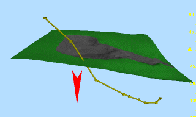
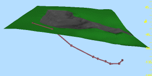
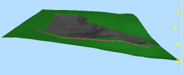

# Project Strings/Points

To access this screen:

  * **Digitize** ribbon **> > Project >> String to Wireframes**.

  * Using the **[command line](<Command_Toolbar.md>)** , enter "project-string-onto-wfs"

  * Using the **[command line](<Command_Toolbar.md>)** , enter "project-points-to-wfs"

  * Use the quick key combination "pstw".

  * Use the quick key combination "pptw".

  * Display the **[Find Command](<findcommand.md>)** screen, locate **project-string-onto-wfs** and click **Run**.

  * Display the **[Find Command](<findcommand.md>)** screen, locate **project-points-to-wfs** and click **Run**.

Project selected point or string data onto a specific wireframe surface(s) or [section](<../VR_Help/workspace_sections.md>). 

The existing string object can be updated (that is, the positions of points or string vertices are updated) or a new object can be created to store the projected data. 

All available wireframe surfaces are available for selection, as are any available section objects. A variety of options are available for controlling the projection direction.

### Projection Origin

There are two options with regards to how a projection is performed; you can either project points from their original positions in the specified direction, allowing new point/vertex positions to be determined wherever they intercept one of the surfaces described in the Project To list (using the _Point_ option), or, for vertex positions that may be distributed both in front of and behind the wireframe surface(s) to project to, points and vertices can be projected from an infinite distance away from the wireframe surfaces or section data, then transposed. 

Consider the following example. The following image represents the original positions of string vertices:

If projected using the Point option, only those points that can intercept the selected surface(s) or section(s) from their original position, in the specified direction will be 'dropped' onto the surface, resulting in the following:

If, however, the Infinity option is used, all points will be dropped onto the selected surface(s) or section(s) from an infinite distance, resulting in the following:

Activity steps:

  1. Load and display string data to be projected.
  2. Load and display section and wireframe data to act as a projection barrier.
  3. Choose how to update data, using **Output** options:
     * Choose Update Existing Positions to modify the currently selected object so that all vertices and points are projected to intercept the selected wireframe object(s) in the specified direction. Note that this will update the string object in memory, and therefore update the view of the string or points in all available views.
     * Choose Output to Object to output the results of the data projection to a loaded data object. This can either be an empty object, or one containing existing data.

**Note** : To create a _new_ object containing only projected data, create a new, empty object using the Current Objects toolbar first, then pick the **Output to Object** option.

  4. Choose the **Azimuth** and **Dip** at which string data is projected. 

**Note** : This command does not use projection settings defined by [set-face-angle ("fng")](<../command_help/set-face-angle.md>).

  5. To invert the projection angle, click **< ->**.

  6. Instead of setting an explicit **Azimuth** and **Dip** value, use a **Projection Preset** instead:

     * Up and Down represent generic directions according to the current world coordinates (corresponding to an Azimuth of 0 and a Dip of either -90 for up and 90 for down directions.
     * View Plane: to transpose the selected data in the direction dictated by the current view, select this button. The current view direction settings will then be translated into the Azimuth and Dip fields.

     * North, South, East and West: these default directions can be used to quickly reset the **Dip** value to 0 and apply an **Azimuth** value to match the selection.

     * Section: select a **Section** from which to derive projection direction values. See [3D Sections](<../VR_Help/Sections.md>).

  7. Choose a Projection Origin (see "Projection Origin", above). 

  8. Choose the data that will 'intercept' the string data during projection, using **Project To** options. 

All loaded wireframe and section data objects are listed. Check the ones you want to become a projection target.

Related topics and activities

  * [project-string-onto-wfs ("pstw")](<../command_help/project-string-onto-wfs.md>)
  * [project-to-view-plane ("ptv")](<../command_help/project-to-view-plane.md>)
  * [project-points-to-wireframe](<../command_help/project-points-to-wf.md>)

  * [project-points-to-wf-in-view](<../command_help/project-points-to-wf-angle.md>)

  * [project-points-to-wf-angle](<../command_help/project-points-to-wf-angle.md>)

  * [project-string-at-angle](<../command_help/project-string-at-angle.md>)

  * [project-string-onto-wf](<../command_help/project-string-onto-wf.md>)

  * [project-string-onto-wf-limit](<../command_help/project-string-onto-wf-limit.md>)

  * [move-string-to-view ("mtv")](<../command_help/move-string-to-view.md>)