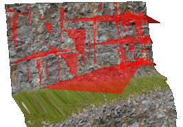

# Project Settings: Geotechnical Settings

To access this screen:

  * On the [Project Settings](<ProjectSettings.md>) screen, select the **Geotechnical Settings** tab.

Your application can use strings digitised onto wireframes to specify key planes, for example for joint space analysis.

Your application provides different methods to calculate average planes from a series of points: Projected Areas, and Least Squared Fit. Both should produce suitable approximations for a plane passing through a string, although the Least Squared Fit option may be more accurate in certain circumstances (and requires a separate Sirojoint license). 

An example of plane data oriented to highlight potential failure domains

The calculation method chosen will affect how planes are generated from strings, such as those generated in a 3Dwindow when [converting strings to planes](<../VR_Help/Sheets_strings.md>), and also how **Dip** and **Dip Direction** are calculated in the [Data Properties](<data%20properties%20control%20bar%20overview.md>) control bar, when selecting a string in a 3D window.

Related topics and activities

  * [Project Settings](<ProjectSettings.md>)

  * [Convert Strings to Planes](<../VR_Help/Sheets_strings.md>)

  * [Data Properties](<data%20properties%20control%20bar%20overview.md>)