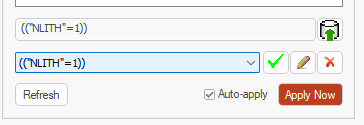
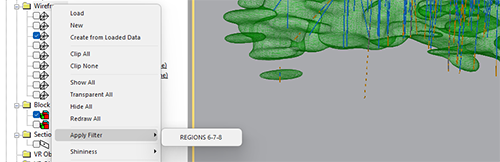

# Quick Filter Control Bar

To hide or show this control bar:

  * **Home** ribbon **> > Window >> Show >> Quick Filter Bar**.

Note: **Quick Filter** is a control bar and can be positioned wherever you like in your application. See [Customizing Control Bars](<Customizing.md>).

The **Quick Filter** control bar lets you create, save and restore "in-memory" data filters.

Importantly, filtering doesn't change the values of the loaded database table. An "in-memory filter" simply prevents certain operations from acting on certain aspects of your data, for example, the 3D display of that data. 

A filter can be cleared at any time, either by modifying the applied filter via the **Quick Filter** data bar, by using the [Data Object Manager](<Data%20Manager%20Dialog.md>), using ribbon commands, or using one of the many filtering commands, such as [filter-all-points](<../command_help/filter-all-points.md>), for example.

Filtering can be applied to show only data that matches certain conditions, such as specific attribute values, and filtering can also be restricted only to particular loaded data objects. For example, you may want to filter to show lithology values of loaded drillholes, whilst drawing the entirety of a loaded block model that comprises the same values.

Filtering can either be applied to specific (unique) values of a particular loaded data attribute (for example, rock type), or to show all data that matches a predefined legend interval.

Filters can be saved and applied to one or more data objects later via the **Sheets** or **Project Data** control bars. 

**Note** : You can access the [Quick Legend](<Quick_Legend_Dialog.md>) facility via the **Quick Filter** control bar.

[See a worked example](<Quick_Filters_Worked_Example_1.md>).

Also see [Filtering Data](<Filtering_Data.md>).

### Create a Quick Filter

To use the Quick Filter control bar to filter the view of 3D overlays:

  1. Load and display the data to be filtered. This data can be comprised of any visible 3D object type, and from one or more data objects.
  2. Review the **Overlays** tree. This sits below the **Column** and **Legend** selection controls and displays the loaded data objects to which filtering is applied.

Only checked objects are filtered.

Check all objects that can receive filtering instructions. 

  3. At the bottom of the control bar, use Auto-apply to control how filtering is applied:

     * **Check** Auto-apply to update the 3D view(s) every time a filter changes.

     * **Uncheck** Auto-apply to update the 3D view manually, using **Apply Now**.

  4. Return to the top of the **Quick Filter** control bar and choose what type of filtering you will apply:
     * ColumnChoose a legend column from which unique values are extracted and listed below. All attributes for all loaded data are listed.

**Note** : If you choose an attribute with a lot of values (more than 100) you are asked to confirm this, as it may take a while to display them all, and system performance may suffer. If you choose not to display all unique values, the [Quick Legend](<Quick_Legend_Dialog.md>) screen appears to allow a range legend to be created instead.

     * **Legend** Choose an existing legend to display its intervals below. Click the button to the right to display the **Quick Legend** screen. Also see [Legends Manager](<FormatLegendsDialog.md>).

  5. To display data represented by one listed item (either a legend interval or value), check the appropriate item. 

**Note** : If no items are selected, all data displays, behaving as if all items are selected.

To select more than one list item, ensure **Unique** is unchecked and pick multiple items. If **Unique** is checked, only one item is selectable at a time.

As items are selected, the filter expression (for example _(("NLITH"=1))_) updates further below, and if **Auto-apply** is enabled, the 3D window(s) update to show only unfiltered data items.

### Save a Filter

To save a quick filter for later use:

  1. Create a quick filter (see above).

The associated filter expression appears at the bottom of the Quick Filter control bar. If it hasn't been saved yet, it appears once, in a read-only label. If it has been saved already, it also appears in a list directly below, for example:

  2. Click  to display the **[Saved Filter](<QuickFilterExpressionDialog.md>)** screen. At this stage, only the **Name** field is editable (and is set by default to the filter expression). 

Change the name if required.

  3. Click **OK**.

The filter **Name** is added to the list below, and is automatically selected.

     * To reapply the saved filter (say, you have made adjustments above to show or hide other data elements), click the **green** tick.
     * To update the saved filter, make whatever adjustments you need, using the check boxes above, and click the Pencil icon. Then click **Use Current Filter** and click **OK** to uadate the filter.
     * Click the **red** cross to delete a saved filter. This can't be undone.

### Apply a Saved Filter

To apply a saved filter to any data object:

  1. Create a quick filter (see above).

  2. Save the quick filter (see above).

  3. Display either the **Sheets** or **Project Data** control bar.

  4. Expand the menu system to display a 3D object overlay.

  5. Right-click the overlay and expand the **Apply Filter** menu.

  6. Choose the saved filter to apply, for example:

The view of the target overlay is filtered.

**Note** : To remove the applied filter, you can either clear the filter using the [**Data Object Manager**](<Data%20Manager%20Dialog.md>) or to remove all filters from all overlays, use the **[erase-all-filters](<../command_help/erase-all-filters.md>)** command (quick keys "eaf").

Related topics and activities

  * [Quick Filters - Worked Example](<Quick_Filters_Worked_Example_1.md>)

  * [Filtering Data](<Filtering_Data.md>)

  * Filtering Troubleshooter

  * [Quick Legend](<Quick_Legend_Dialog.md>)

  * [Saved Filter](<QuickFilterExpressionDialog.md>)

  * [Data Object Manager](<Data%20Manager%20Dialog.md>)